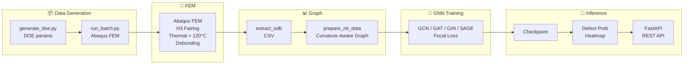

<p align="center">
  
  
  
  
</p>

<h1 align="center">🚀 GNN-SHM: Graph Neural Networks for H3 Rocket Fairing Structural Health Monitoring</h1>

<p align="center">
  <strong>Debonding detection on CFRP/Al-Honeycomb sandwich structures using Geometry-Aware GNNs</strong>
</p>

<p align="center">
  <a href="#-quick-start">Quick Start</a> •
  <a href="#-features">Features</a> •
  <a href="#-pipeline">Pipeline</a> •
  <a href="#-citation">Citation</a> •
  <a href="wiki_repo/Home.md">📚 Wiki</a> •
  <a href="#-contributing">Contributing</a>
</p>

---

## 🌟 Overview

**GNN-SHM** is a research project that combines **Graph Neural Networks (GNN)** with **Finite Element Method (FEM)** to detect and localize **skin-core debonding** in the JAXA H3 rocket's CFRP/Aluminum Honeycomb payload fairing.

> **日本語**: JAXA H3 ロケットの CFRP ハニカムサンドイッチフェアリングにおいて、GNN と FEM を統合したスキン-コア界面デボンディング位置特定システムを開発。2025年 F8 事故で顕在化した CFRP/Al-HC 接着健全性モニタリングの実用化を目指す。

### Why This Matters

| | H-IIA/B, Epsilon (Legacy) | H3 (This Project) |
|:---|:---|:---|
| **Skin** | Al 7075 | **CFRP** (T1000, AFP) |
| **CTE Mismatch** | ≈0 | **Severe** (−0.3 vs 23 ×10⁻⁶/°C) |
| **SHM Need** | Low (40yr mature) | **High** (F8 accident, 2025) |

The **H3 F8 accident (Dec 2025)** identified CFRP/Al-Honeycomb interface debonding as a likely cause. This project aims to enable **Condition-Based Maintenance (CBM)** via guided-wave SHM + GNN-based defect localization.

---

## ✨ Features

- **Geometry-Aware Graph Construction**: Surface normals, principal curvature, geodesic distance — no UV-mapping distortion
- **4 GNN Architectures**: GCN, GAT, GIN, GraphSAGE with Focal Loss for class imbalance
- **H3-Spec FEM**: Barrel + Ogive (φ5.2m), thermal load (CTE mismatch), debonding defects
- **Cutting-Edge ML Roadmap**: Graph Mamba, E(3)-Equivariant GNN, FNO surrogate, PINN
- **Multi-Class Target**: debond / delam / impact / healthy (2-year roadmap)
- **JAXA Collaboration**: Real PSS test data validation planned

---

## 🏗 Pipeline



---

## 🚀 Quick Start

```bash
# Clone
git clone https://github.com/keisuke58/Payload_gnn.git
cd Payload_gnn

# Install
pip install -r requirements.txt

# Train (existing data)
python src/train.py --arch gat --epochs 200 --cross_val 5

# Inference API
MODEL_CHECKPOINT=runs/<run>/best_model.pt uvicorn src.predict_api:app --port 8000
```

### Full Pipeline (with Abaqus)

```bash
python src/generate_doe.py --n_samples 50 --output doe.json
python src/run_batch.py --doe doe.json --output_dir dataset_output
python src/build_graph.py --data_dir dataset_output
python src/train.py --arch gat --epochs 200
```

---

## 📁 Project Structure

```
Payload2026/
├── src/                    # Core pipeline
│   ├── generate_fairing_dataset.py   # Abaqus FEM
│   ├── build_graph.py               # Curvature-aware graph
│   ├── train.py                     # GNN training
│   └── predict_api.py              # FastAPI inference
├── wiki_repo/              # 📚 Full documentation
│   ├── Home.md             # Wiki index
│   ├── Cutting-Edge-ML.md  # Graph Mamba, Equivariant GNN
│   ├── Vocabulary.md       # Technical glossary
│   └── ...
├── .github/
│   ├── ISSUES.md           # Task index
│   └── ...
└── requirements.txt
```

---

## 📊 Dataset

| Item | Value |
|------|-------|
| Graphs | 101 (train 81 + val 20) |
| Nodes/graph | ~10,897 |
| Node features | 16 (normal, curvature, stress, temp) |
| Edge features | 5 |

Defect size distribution: Small 30%, Medium 40%, Large 25%, Critical 5%.

### Dataset Progress Visualization

[**→ Full visualization (docs/DATASET_VISUALIZATION.md)](docs/DATASET_VISUALIZATION.md)

| Summary | Feature Distributions |
|:-------:|:---------------------:|
| [](docs/DATASET_VISUALIZATION.md) | [](docs/DATASET_VISUALIZATION.md) |

---

## 📚 Documentation

| Resource | Description |
|----------|-------------|
| [**Wiki Home**](wiki_repo/Home.md) | Full project index, status, navigation |
| [**2-Year Goals**](wiki_repo/2-Year-Goals.md) | 5K samples, 4-class, Sim-to-Real |
| [**Cutting-Edge ML**](wiki_repo/Cutting-Edge-ML.md) | Graph Mamba, Equivariant GNN, FNO, PINN |
| [**Vocabulary**](wiki_repo/Vocabulary.md) | Technical terms (EN↔JP) |
| [**Publication Venues**](wiki_repo/Publication-Venues.md) | IWSHM, JSASS, Structural Health Monitoring journal |

---

## 🤝 Contributing

We welcome contributions! See [CONTRIBUTING.md](CONTRIBUTING.md) for guidelines.

- 🐛 [Report a bug](https://github.com/keisuke58/Payload_gnn/issues/new?template=bug_report.md)
- 💡 [Request a feature](https://github.com/keisuke58/Payload_gnn/issues/new?template=feature_request.md)

---

## 📄 Citation

If you use this work in your research, please cite:

```bibtex
@software{payload_gnn_2026,
  title = {GNN-SHM: Graph Neural Networks for H3 Rocket Fairing Structural Health Monitoring},
  author = {Payload2026 Contributors},
  year = {2026},
  url = {https://github.com/keisuke58/Payload_gnn}
}
```

---

## 📜 License

This project is licensed under the MIT License - see [LICENSE](LICENSE) for details.

---

## 🙏 Acknowledgments

- **JAXA** — H3 specifications, collaboration
- **Open Guided Waves** — Benchmark dataset
- **PyTorch Geometric** — GNN framework

---

<p align="center">
  <b>If this project helps your research, please consider giving it a ⭐</b>
</p>
