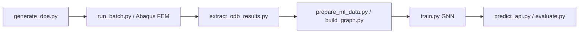

# Architecture — Payload GNN-SHM

End-to-end pipeline for **CFRP/Al-honeycomb fairing debonding** detection on JAXA H3 geometry.

## Core data flow



## Module tiers

| Tier | Path | Role |
|------|------|------|
| **Core GNN** | `src/train.py`, `src/models.py`, `src/build_graph.py` | Curvature-aware graphs + GAT/GCN training |
| **FEM generation** | `src/generate_fairing_dataset.py`, `src/run_batch.py` | Abaqus H3 fairing + thermal/debond defects |
| **GW branch** | `src/train_gw.py`, `src/build_gw_graph.py` | Guided-wave SHM graphs |
| **Surrogates** | `src/train_fno*.py`, `src/models_fno*.py` | FNO / DeepONet acceleration |
| **Scripts** | `scripts/` | Analysis, visualization, paper figures |
| **Heavy clones** | `papers/repos/` | Reference repos (gitignored internals) |

## Reproduce (local, light)

```bash
./scripts/reproduce_core.sh     # H3 spec checks + pytest
make reproduce                  # same
```

## Full pipeline (requires Abaqus + dataset)

```bash
python src/generate_doe.py --n_samples 50 --output doe.json
python src/run_batch.py --doe doe.json --output_dir dataset_output
python src/build_graph.py --data_dir dataset_output
python src/train.py --arch gat --epochs 200 --cross_val 5
```

## Outputs (gitignored)

- `runs/` — training checkpoints, TensorBoard
- `dataset_output*/` — FEM-generated samples
- `figures/` — ad-hoc plots (paper figures in `wiki_repo/images/`)