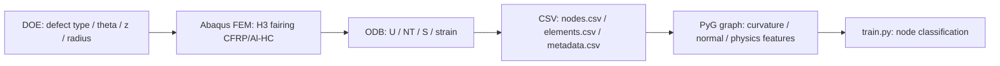

# データ生成・データセット信頼性・関連研究の徹底調査

> 作成日: 2026-06-06
> 対象: H3 フェアリング CFRP/Al-Honeycomb SHM / FEM → Graph → GNN パイプライン
> 目的: データ生成方法、データの正当性、データセット信頼性、外部データ・関連研究との接続、今後の予定を一本化する。

---

## 0. 結論サマリ

現時点の最重要課題は、モデルを増やす前に **「学習に使うデータが物理的・数値的・統計的に信用できる状態か」** を定量監査することである。特にこのレポでは、以下を短期の意思決定として推奨する。

1. **データ生成は `DOE → Abaqus FEM → ODB抽出 → CSV → graph化 → ML split` の各段階で gate を置く。** 生成に成功したかではなく、各 sample が必要 schema、非ゼロ物理量、欠陥ノード数、metadata 整合、mesh 解像度、ラベル分布を満たすかで採否を決める。
2. **現在 checkout されている小規模サンプルは、研究用 benchmark としてはまだ弱い。** `dataset_output` は 2 sample・2 schema 混在・欠陥ノード 1 個のみ、`dataset_realistic` は 2 sample とも healthy label であり、モデル比較や論文の主結果には使わず、パイプライン動作確認用として扱う。
3. **信頼性の主軸は V&V + UQ + 外部実験データ照合。** ASME V&V 10 / NASA-STD-7009A 的な「計算モデルの信用性」観点を採用し、mesh convergence、zero-physics 検出、healthy baseline、既知の外部 CFRP guided-wave dataset との cross-check を追加する。
4. **外部 validation は Open Guided Waves #4 と NASA CFRP が最優先。** OGW #4 は CFRP plate + omega stringer + fully bonded / local debond / large debond の full wavefield dataset で、本レポの CFRP debonding SHM に最も近い公開 dataset である。NASA CFRP は run-to-failure fatigue、16 PZT、strain gauge、X-ray ground truth を含むため、sim-to-real と損傷進展 validation に使える。
5. **今後の予定は「100%正しい synthetic dataset」ではなく、credibility score を上げる計画にする。** Phase 1 は strict extraction と schema 統一、Phase 2 は mesh/defect 分解能と DOE coverage、Phase 3 は OGW/NASA で cross-domain validation、Phase 4 は MAPOD/UQ に接続する。

---

## 1. このレポのデータ生成パイプライン

### 1.1 生成フロー



### 1.2 各段階で保存・検証すべき evidence

| 段階 | 主な生成物 | 最低限の検証 | 採否 gate |
|---|---|---|---|
| DOE | `doe_*.json` | seed、分布、欠陥 type、radius tier、opening overlap rejection | 位置・半径・type が設計範囲内 |
| FEM input | `.inp` | thermal patch、材料、境界条件、tie/contact、mesh seed | 想定 step と field output が含まれる |
| Abaqus solve | `.odb`, `.dat`, `.msg`, `.sta` | job completed、increment convergence、warning/error 数 | ODB に解析 step と frame が存在 |
| ODB extraction | `nodes.csv`, `elements.csv`, `metadata.csv` | schema、U/NT/S/LE の存在、非ゼロ物理量 | strict check pass |
| graph化 | `train.pt`, `val.pt`, `norm_stats.pt` | feature dim、label count、edge count、normal/curvature range | NaN/Inf なし、ラベル/feature 整合 |
| ML split | split metadata | sample-level split、class balance、healthy/defect separation | leakage なし、seed 固定 |

---

## 2. リポジトリ実装から見た現在の生成方法

### 2.1 DOE と欠陥パラメータ

`src/generate_doe.py` は複数欠陥 type と size tier を持つ層化 DOE を生成する。欠陥 type は `debonding`, `fod`, `impact`, `delamination`, `inner_debond`, `thermal_progression`, `acoustic_fatigue` の 7 種で、type fraction も定義されている。位置は `theta_deg` と `z_center`、サイズは `radius` で与え、opening overlap rejection も持つ。

**現時点の注意:** `docs/DEFECT_PLAN.md` では Small=20--50 mm, Medium=50--80 mm, Large=80--150 mm, Critical=150--250 mm だが、`src/generate_doe.py` の現在の `SIZE_TIERS` は Small=50--100, Medium=100--150, Large=150--250, Critical=250--400 mm になっている。これは「50 mm mesh で欠陥を確実に複数 node で表す」方向には妥当だが、過去 doc と数値がズレているため、今後は **DOE version** と **mesh seed version** を metadata に残すべきである。

### 2.2 ODB 抽出と label 生成

`src/extract_odb_results.py` は ODB から outer skin instance を選び、最終 frame の変位 `U`、温度 `NT11/NT`、応力 `S`、任意の strain `LE/E` を抽出する。欠陥 label は円筒面上の geodesic-like distance、すなわち周方向 arc length と軸方向距離の合成距離が `radius` 以下なら `defect_label` を付ける。

重要なのは `--strict` である。strict mode は全変位がゼロかつ温度変化がないケースを失敗扱いにし、thermal/load の欠落を検出する。これは過去に `dataset_output_100` や `dataset_output_25mm_400` で全物理量ゼロ問題が出ていたため、今後の標準実行では必須にする。

### 2.3 Graph 化

`src/build_graph.py` の `build_curvature_graph` は node feature として座標、normal、principal curvature、変位、温度、応力、thermal stress、strain、CFRP 繊維方向、layup angle、周方向角、boundary/loading flag をまとめる。edge feature は相対座標、Euclidean distance、normal angle、任意の geodesic distance である。

**信頼性上のポイント:** graph 化関数は足りない物理列をゼロ埋めするため、schema 欠落があっても `train.py` まで進んでしまう。これは実験を止めない利点がある一方、**ゼロ埋め dataset を正常 dataset と誤認する危険** がある。したがって CSV → graph の前に `scripts/audit_dataset_reliability.py` を gate として走らせる。

---

## 3. 現在 checkout で実行したデータセット監査

今回、依存関係なしで走る `scripts/audit_dataset_reliability.py` を追加した。`nodes.csv`, `elements.csv`, `metadata.csv` を走査し、schema、物理列、非ゼロ性、label count、metadata 整合、sample 数を確認する。

実行結果:

```bash
python scripts/audit_dataset_reliability.py dataset_output dataset_realistic --json /tmp/dataset_audit.json
```

| Dataset | Samples | Nodes | Defect nodes | Node schemas | Warnings | 判断 |
|---|---:|---:|---:|---:|---:|---|
| `dataset_output` | 2 | 33,117 | 1 | 2 | 2 | **パイプライン例示用。学習 benchmark には不足** |
| `dataset_realistic` | 2 | 83,519 | 0 | 1 | 0 | **healthy geometry/physics の例示用。欠陥分類には使えない** |

### 3.1 `dataset_output` の問題

| Sample | 監査結果 | リスク |
|---|---|---|
| `healthy_baseline` | displacement 列なし。stress / `dspss` は存在。 | sample_0001 と schema が違うため、graph feature のゼロ埋めが発生する。 |
| `sample_0001` | stress-equivalent 列なし。欠陥 label は 1 node のみ。 | README の「77 欠陥ノード」説明とも合わず、学習には欠陥分解能が低すぎる。 |

### 3.2 `dataset_realistic` の状態

`dataset_realistic/phase1` と `phase2` は変位・温度・応力が非ゼロで、schema は揃っている。一方、metadata も label も healthy であり、欠陥ノードは 0 である。したがって、healthy baseline、mesh/geometry validation、物理量 sanity check には有用だが、欠陥分類性能の主張には使えない。

### 3.3 過去診断との接続

既存の `docs/DATASET_DIAGNOSIS_REPORT.md` では、`dataset_output_100` と `dataset_output_25mm_400` に全物理量ゼロ問題が報告されている。この教訓から、今後は **「ファイルがある」ではなく「物理量が非ゼロで、schema が揃い、欠陥ノードが mesh 分解能に対して十分ある」** を dataset 完成条件にする。

---

## 4. データセット信頼性の評価軸

### 4.1 信頼性チェックリスト

| 軸 | 合格条件 | 現状 | 次アクション |
|---|---|---|---|
| Provenance | DOE seed、code commit、Abaqus version、material version、mesh seed が trace 可能 | 部分的 | `metadata.csv` を sample manifest へ拡張 |
| Schema | 全 sample が同一 node/element schema | `dataset_output` は NG | 旧 schema sample を再抽出または隔離 |
| Physics non-zero | U/NT/S/LE のうち必要列が非ゼロ | 既存診断で NG 例あり | `--strict` と audit を CI gate 化 |
| Label validity | metadata の defect type / radius と label count が整合 | `sample_0001` は欠陥 1 node | mesh seed と radius tier を再設計 |
| Mesh resolution | 欠陥直径に対し十分な node 数 | 不十分 sample あり | defect nodes の下限を設定 |
| Numerical V&V | mesh convergence、energy balance、境界条件 sanity | 部分的 | verification report を dataset manifest に接続 |
| Statistical coverage | theta/z/r/type が偏らない | DOE はある | coverage plot と minimum bin count を保存 |
| External validation | OGW/NASA など実験 dataset で傾向確認 | 未完 | cross-dataset benchmark を設計 |
| UQ/reliability | POD/PFA、calibration、OOD/uncertainty | 部分的 | MAPOD + Bayesian/UQ 評価を追加 |

### 4.2 defect node 数の下限案

固定 mesh の node classification では、欠陥領域が 1--2 node だけだと F1/Recall が不安定になり、境界 IoU も意味を持ちにくい。短期 benchmark では以下を gate にする。

| 目的 | 最低 defect nodes/sample | 理由 |
|---|---:|---|
| パイプライン smoke | 1 | label 生成だけ確認 |
| 初期学習 | 30 | class imbalance が極端すぎない最低限 |
| 論文用 benchmark | 100 | node-level F1、boundary error、component detection を安定評価 |
| 境界 IoU / sizing | 300 | 欠陥境界形状・サイズ推定まで評価可能 |

---

## 5. 関連研究・外部データセット調査

### 5.1 Open Guided Waves #4: CFRP omega stringer debonding

[Zenodo record 5105861](https://zenodo.org/records/5105861) は CFRP plate + omega stringer の full ultrasonic guided wavefield dataset で、fully bonded、local stringer debond、large stringer debond の 3 scenario を含む。20--500 kHz chirp と 16.5/50/100/200/300 kHz tone-burst が使われ、defect は backside impact で作り、conventional ultrasound で検証されている。これは本レポの CFRP/Al-HC debonding SHM と完全一致ではないが、**CFRP 接着/剥離、guided wave、実験 ground truth** の 3 点が近いため、外部 validation の第一候補である。

使い方:

- FEM/graph model の欠陥 heatmap と、OGW wavefield から作る damage index / tomography map の空間傾向を比較。
- まずは分類器を直接適用するのではなく、feature extractor / anomaly score の transfer を見る。
- 周波数依存、温度一定、stringer 形状差を domain gap として明示する。

### 5.2 NASA CFRP Composites dataset

[NASA PCoE CFRP Composites dataset](https://www.nasa.gov/intelligent-systems-division/discovery-and-systems-health/pcoe/pcoe-data-set-repository/) は CFRP panel の run-to-failure tension-tension fatigue 実験で、16 個の PZT sensor の Lamb wave 信号、複数 triaxial strain gage、周期的 X-ray ground truth を含む。これは本レポの「単発欠陥局在」よりも「損傷進展・寿命・sim-to-real」に近い。

使い方:

- FEM-generated 欠陥 size/severity と NASA X-ray damage growth の単調性・進展パターンを比較。
- 16 PZT sensor graph を作り、mesh graph から sensor graph への distillation / transfer を試す。
- 将来的な remaining useful life / prognosis と接続する。

### 5.3 長期 SHM dataset と環境変動

2025 年の公開 guided-wave long-term SHM dataset では、構造・材料・センサ・取得装置・環境条件の違いにより手法比較が難しいこと、reversible damage model と tomographic image reconstruction による validation が重要であることが強調されている。これは、本レポで synthetic FEM dataset だけを見ると過大評価になりやすいことを示す。

対応方針:

- 温度、ノイズ、センサばらつき、接着ばらつき、境界条件ばらつきを DOE に入れる。
- healthy baseline の seasonal / environmental variation を明示的に作る。
- model は accuracy だけでなく calibration、false alarm、OOD を評価する。

### 5.4 V&V / simulation credibility

[ASME V&V 10](https://www.asme.org/codes-standards/find-codes-standards/standard-for-verification-and-validation-in-computational-solid-mechanics) は computational solid mechanics の V&V/UQ を通じて model credibility を高めるための標準である。[NASA-STD-7009A](https://standards.nasa.gov/standard/nasa/nasa-std-7009) は modeling and simulation に uniform practices、acceptance criteria、credibility assessment を求める。したがって、本レポの synthetic FEM dataset は「Abaqus で作ったから正しい」ではなく、verification, validation, uncertainty quantification, reporting の evidence を dataset に添付する必要がある。

### 5.5 MAPOD / SHM reliability

Guided-wave SHM では、単なる分類 accuracy より、Probability of Detection (POD)、Probability of False Alarm (PFA)、localization accuracy を不確かさ込みで評価する流れがある。[Yue and Aliabadi 2021](https://journals.sagepub.com/doi/abs/10.1177/1475921720940642) は guided-wave SHM の hierarchical reliability assessment として sensor placement、noise-based threshold、damage detection/localization performance を段階的に評価している。さらに guided-wave SHM で Model-Assisted POD (MAPOD) を使う研究も進んでいる。

本レポでは、最終的に GNN の node F1 だけでなく、次の指標に移るべきである。

- POD vs defect radius / depth / type
- PFA under healthy + environmental variation
- localization error in mm / degrees
- sizing error for connected component area
- calibration curve / expected calibration error
- epistemic uncertainty for out-of-distribution geometry or defect type

---

## 6. 今後の予定に接続するロードマップ

### Phase A: すぐやる dataset gate（1--2週間）

- `scripts/audit_dataset_reliability.py` を dataset 生成後に必ず実行する。
- `run_batch.py --strict` / `extract_odb_results.py --strict` を標準化する。
- `dataset_output` の旧 schema sample と README mismatch を修正または「legacy example」として隔離する。
- sample manifest を追加し、commit hash、DOE file、Abaqus version、mesh seed、material version、strict/audit result を保存する。

合格基準:

- 全 sample が同一 schema。
- defect sample の `n_defect_nodes >= 30`、論文用 subset は `>=100`。
- U/NT/S の必要列が非ゼロで NaN/Inf なし。
- healthy と defect が sample-level split され、同一 DOE から train/val に leakage しない。

### Phase B: 数値 V&V と mesh/DOE 妥当性（2--4週間）

- mesh seed 50 mm / 25 mm / 12 mm の convergence を、欠陥 node count、最大応力、変位、connected component area で評価する。
- DOE coverage plot を自動保存する。
- defect radius tier と mesh seed の組み合わせを固定し、minimum resolvable defect を明記する。
- healthy baseline は複数 seed / 温度 / load case で作る。

合格基準:

- mesh refinement に対し主要 QoI の変化が許容範囲内。
- 各 radius/type bin に最低 sample 数がある。
- zero-physics sample が 0。

### Phase C: 外部 dataset validation（1--2か月）

- OGW #4 を最優先で取り込み、CFRP debonding の実験 wavefield と synthetic FEM/graph feature の差を整理する。
- NASA CFRP は sensor graph / fatigue progression / X-ray ground truth として使う。
- 直接 accuracy ではなく、domain adaptation 前後の anomaly AUROC、feature embedding 分離、damage severity monotonicity を見る。

合格基準:

- 少なくとも 1 つの外部 CFRP dataset で healthy vs damaged の anomaly score が有意に分離する。
- synthetic-only model の失敗例と domain gap を明示できる。

### Phase D: Reliability metric / MAPOD / UQ（2--4か月）

- POD curve を defect radius / type / sensor density / noise level ごとに作る。
- Bayesian / ensemble / conformal prediction で uncertainty map を出す。
- false alarm を healthy environmental variation で測る。
- 論文では node F1 だけでなく POD/PFA/localization/sizing/calibration を主指標にする。

---

## 7. 参考文献・関連リンク

### Public datasets

1. Kudela et al., **Dataset on full ultrasonic guided wavefield measurements of a CFRP plate with fully bonded and partially debonded omega stringer**, Zenodo, 2021 / Data in Brief 2022. https://zenodo.org/records/5105861
2. NASA Ames PCoE, **Carbon Fiber-Reinforced Polymer (CFRP) Composites dataset**, NASA Prognostics Data Repository. https://www.nasa.gov/intelligent-systems-division/discovery-and-systems-health/pcoe/pcoe-data-set-repository/
3. Dataset on guided waves from long-term SHM under uncontrolled and dynamic conditions, 2025. https://pmc.ncbi.nlm.nih.gov/articles/PMC12162875/

### V&V / credibility / reliability

4. ASME, **V&V 10 - Standard for Verification and Validation in Computational Solid Mechanics**, 2019, reaffirmed/stabilized 2025. https://www.asme.org/codes-standards/find-codes-standards/standard-for-verification-and-validation-in-computational-solid-mechanics
5. NASA, **NASA-STD-7009A Standard for Models and Simulations**. https://standards.nasa.gov/standard/nasa/nasa-std-7009
6. Yue and Aliabadi, **Hierarchical approach for uncertainty quantification and reliability assessment of guided wave-based structural health monitoring**, Structural Health Monitoring, 2021. https://journals.sagepub.com/doi/abs/10.1177/1475921720940642
7. Application of Model Assisted Probability of Detection (MAPOD) to a Guided Wave SHM System, SHM 2017. https://dpi-proceedings.com/index.php/shm2017/article/view/14038
8. Model Assisted Probability of Detection for Guided Wave Imaging SHM, SHM 2019. https://www.dpi-proceedings.com/index.php/shm2019/article/view/32190

### Repo-internal documents to keep aligned

- `docs/DATASET_DIAGNOSIS_REPORT.md`: 過去の zero-physics / schema mismatch 診断。
- `docs/DEFECT_PLAN.md`: 欠陥 type、サイズ階層、DOE 設計。
- `docs/MESH_DEFECT_ANALYSIS.md`: mesh seed と欠陥分解能。
- `docs/VERIFICATION_REPORT.md`: 生成結果の verification evidence。
- `docs/PUBLIC_DATASETS_AND_INTEGRATION.md`: OGW / NASA など外部 dataset 統合。
- `docs/NOISE_AUGMENTATION_AND_CLASS_RATIO.md`: noise augmentation と class imbalance。
