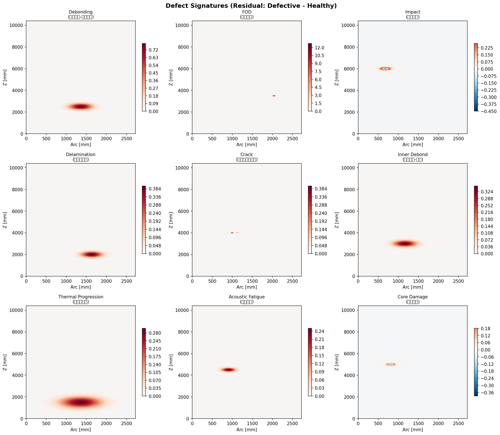
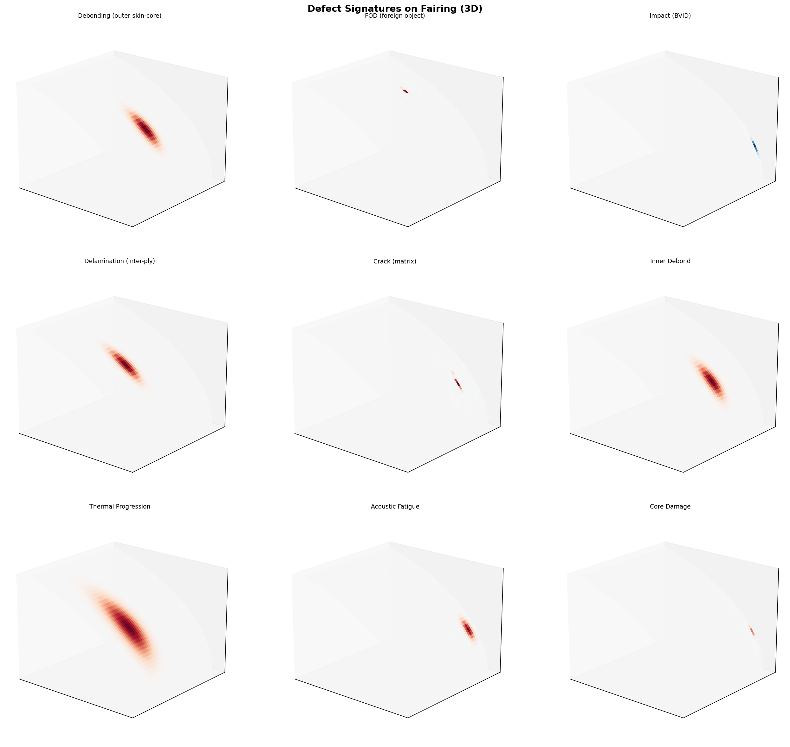
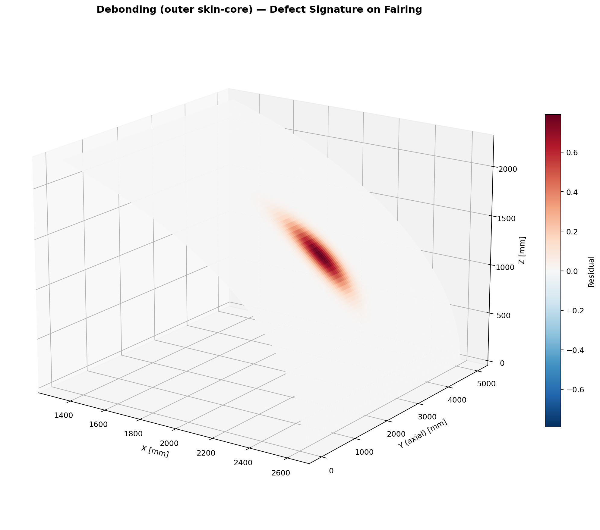
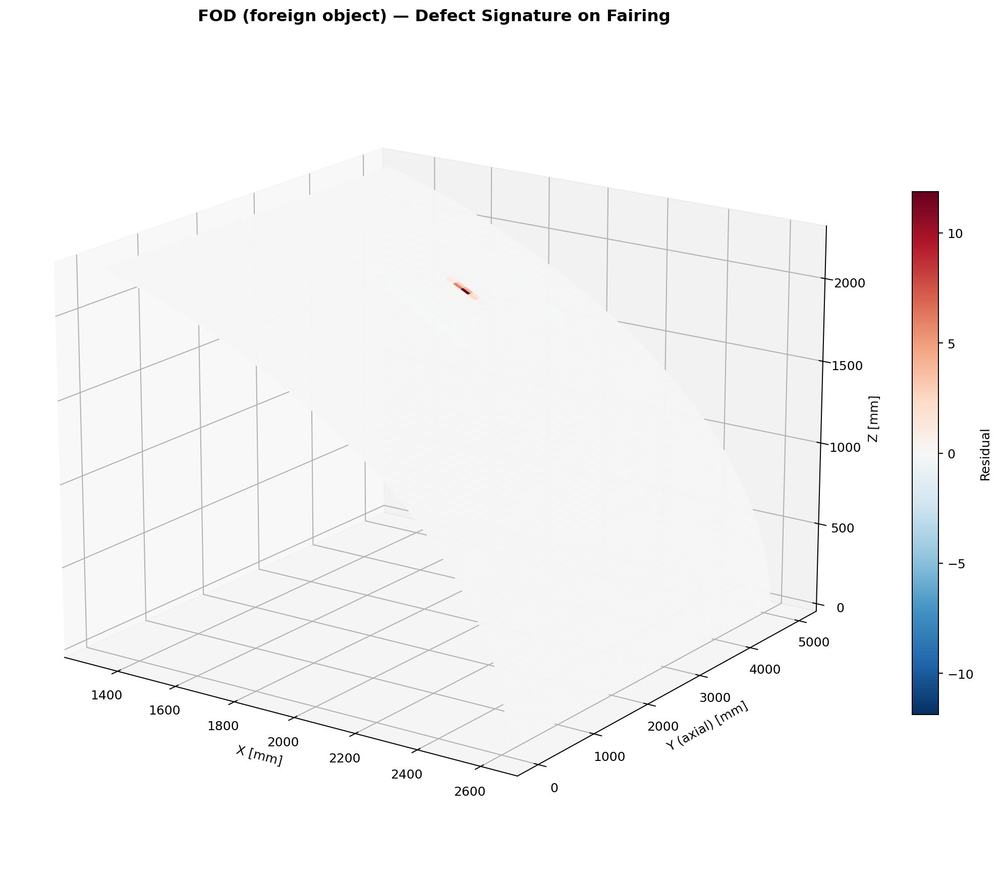
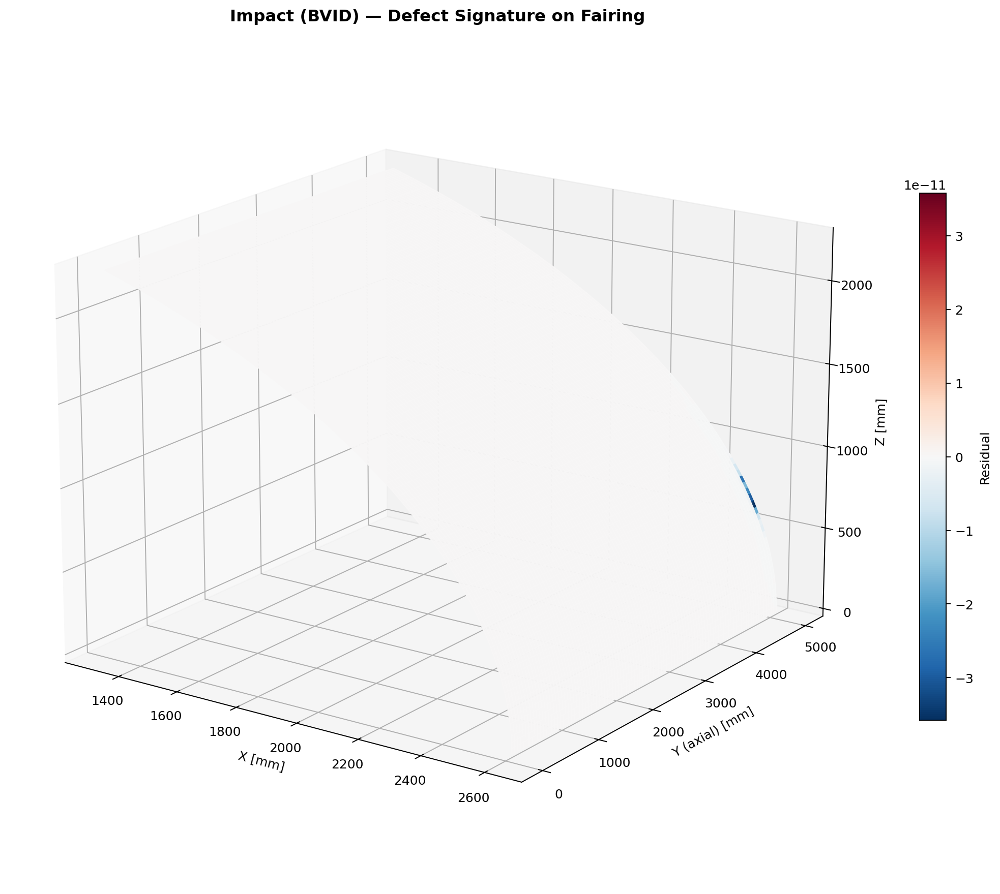
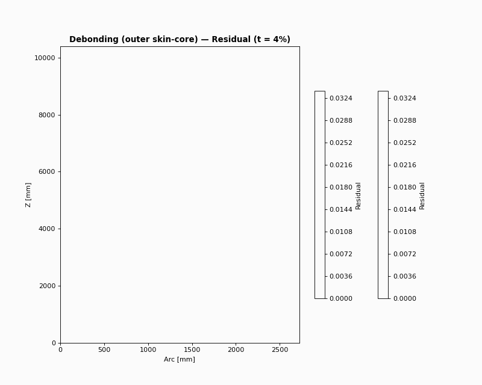
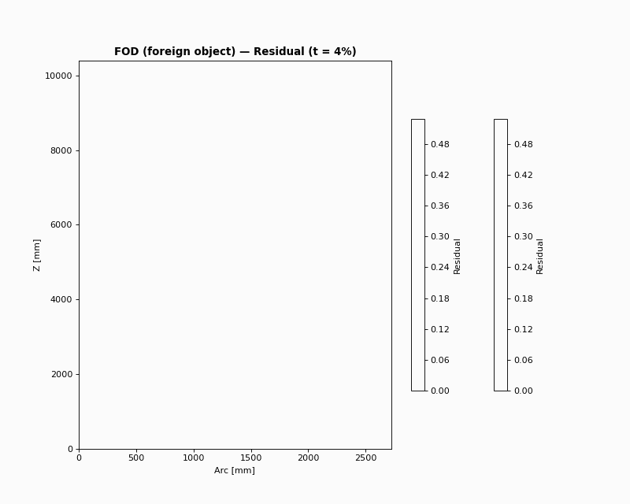
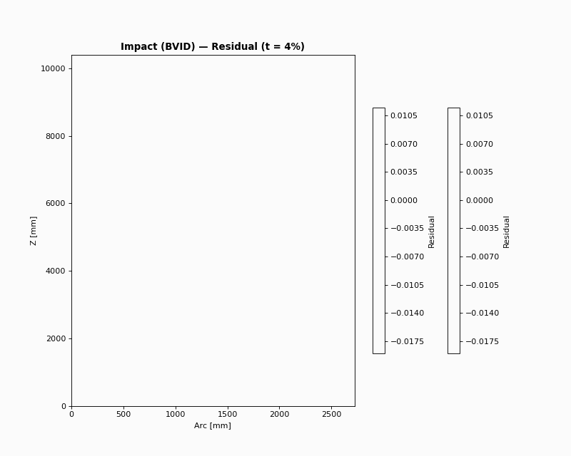

# 欠陥タイプ可視化と検出難易度考察

> 全欠陥タイプの概念可視化と、SHM（構造ヘルスモニタリング）における検出難易度の考察。

---

## 1. 可視化一覧

### 1.1 生成スクリプト

```bash
python scripts/visualize_all_defect_types.py
```

出力: `wiki_repo/images/defects/`

- `defect_*_comparison.png` — 各欠陥の Healthy / Defective / Residual 3 パネル（2D contour）
- `defect_*_3d.png` — 各欠陥の 3D 円筒フェアリング上のシグネチャ（画像風）
- `defect_*_animation.gif` — 各欠陥の時間変化（概念アニメーション、中心から広がる）
- `defect_types_overview.png` — 全 9 種の Residual シグネチャ一覧（2D）
- `defect_types_overview_3d.png` — 全 9 種の 3D 一覧

### 1.2 欠陥タイプ一覧

| 欠陥 | 界面/発生要因 | 静的 FEM シグネチャ | ガイド波対応 |
|------|---------------|---------------------|--------------|
| **Debonding** | 外スキン-コア | 滑らかな変位膨らみ | ✅ 実装済（Tie 除去） |
| **FOD** | コア内異物 | 局所応力集中（尖鋭） | ❌ 未実装 |
| **Impact** | 衝撃損傷 (BVID) | 中央凹み + 周囲盛り上がり | ❌ 未実装 |
| **Delamination** | 積層内剥離 | 広域・低振幅の変位変化 | ❌ 未実装 |
| **Crack** | マトリクス割れ | 線状の応力集中 | ❌ 未実装 |
| **Inner Debond** | 内スキン-コア | 外表面への影響が弱い | ❌ 未実装 |
| **Thermal Progression** | CTE 不整合 | 広域・低振幅 | ❌ 未実装 |
| **Acoustic Fatigue** | 音響疲労 | 局所・低振幅 | ❌ 未実装 |
| **Core Damage** | コア圧潰 | Impact に類似 | ❌ 未実装 |

---

## 2. 検出難易度の考察

### 2.1 検出しやすい（難易度: 低）

| 欠陥 | 理由 |
|------|------|
| **Debonding** | 界面剥離で荷重伝達がほぼ喪失。ガイド波の散乱が大きく、Damage Index (DI) が 0.9〜1.3 と高い。波面の乱れが明確。 |
| **FOD** | 硬質異物で局所剛性が 5〜20 倍に増加。応力集中が尖鋭で、静的 FEM では検出しやすい。ただしガイド波では散乱パターンが debonding と異なる可能性。 |
| **Impact** | スキン凹み + コア圧潰で変位・応力の変化が大きい。BVID は目視不可だが FEM シグネチャは明確。 |

### 2.2 検出がやや難しい（難易度: 中）

| 欠陥 | 理由 |
|------|------|
| **Delamination** | 積層内のせん断剛性低下。外表面への影響は debonding より弱く、シグネチャが広域・低振幅。ガイド波では A₀ モードが層間を横断するため散乱は生じうるが、debonding より弱い可能性。 |
| **Core Damage** | コアのみの損傷。外スキンが健全な場合、変位への影響は限定的。ガイド波は主にスキンを伝播するため、コア損傷の検出はセンサ配置に依存。 |
| **Crack** | マトリクス割れは線状・狭い領域。応力集中はあるが空間的に局所。センサがクラック経路から外れると検出困難。 |

### 2.3 検出が難しい（難易度: 高）

| 欠陥 | 理由 |
|------|------|
| **Inner Debond** | 内スキン-コア界面の剥離。外表面（PZT 配置面）から遠く、荷重経路の変化が外板変位に現れにくい。ガイド波も外スキンを主に伝播するため、内界面の剥離は散乱が弱い。 |
| **Thermal Progression** | CTE 不整合による界面き裂の進展。変化が緩やかで広域。シグネチャがノイズに埋もれやすい。 |
| **Acoustic Fatigue** | 打ち上げ 147〜148 dB による疲労損傷。残留剛性 0.2〜0.5 と中程度の劣化。進展が徐々で、初期段階の検出は困難。 |

### 2.4 難易度マトリクス（イメージ）

```
検出容易 ←――――――――――――――――――――――――――――――――――→ 検出困難

Debonding  FOD  Impact  Delam  Crack  Core  Inner  Thermal  Acoustic
   ●        ●     ●      ○     ○     ○     △      △        △

● 容易  ○ 中程度  △ 困難
```

---

## 3. ガイド波 SHM との関係

### 3.1 現状

- **実装済み**: Debonding のみ（Tie 拘束除去）
- **波面アニメーション**: 平板・フェアリングとも debonding のみ
- **Damage Index**: 全センサで DI > 1.0 を確認（検出に十分）

### 3.2 他タイプのガイド波対応に必要な作業

| 欠陥 | 必要な FEM 変更 | 工数目安 |
|------|----------------|----------|
| FOD | コア要素の材料を局所的に剛性増加 | 中 |
| Impact | スキン・コアの材料劣化 + メッシュ変形 | 大 |
| Delamination | 積層要素のせん断剛性低下 | 中 |
| Inner Debond | 内スキン-コア Tie 除去 | 小〜中 |

### 3.3 推奨優先順位

1. **Inner Debond** — 実装は debonding の拡張で比較的容易。検出難易度が高いため、早期に検証価値あり。
2. **Delamination** — 積層モデルの拡張。学術的関心が高い。
3. **FOD** — コア材料の局所変更。散乱パターンの違いを検証可能。
4. **Impact** — 最も工数が大きいが、BVID は実運用で重要。

---

## 4. 可視化画像

### 4.1 2D 一覧



### 4.2 3D 一覧（円筒フェアリング上に欠陥シグネチャをマッピング）



### 4.3 個別 3D（例）

| Debonding | FOD | Impact |
|-----------|-----|--------|
|  |  |  |

### 4.4 動画（概念アニメーション）

各欠陥のシグネチャが中心から広がる時間変化を GIF で表示。GW の波面アニメーションと同様の「変化」を概念的に表現。

| Debonding | FOD | Impact |
|-----------|-----|--------|
|  |  |  |

---

## 5. 参照

- [Extended-Defect-Types](../wiki_repo/Extended-Defect-Types.md)
- [DEFECT_MODELS_ACADEMIC](DEFECT_MODELS_ACADEMIC.md)
- [Guided-Wave-Simulation](../wiki_repo/Guided-Wave-Simulation.md)
