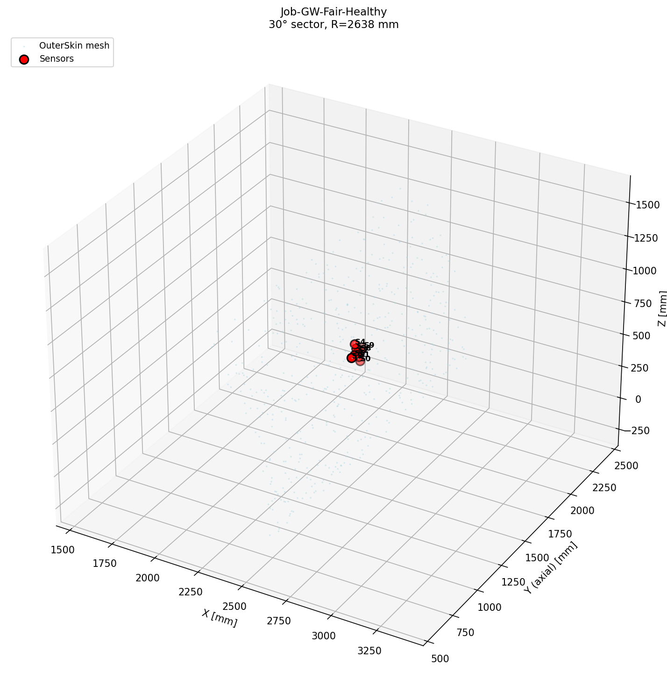
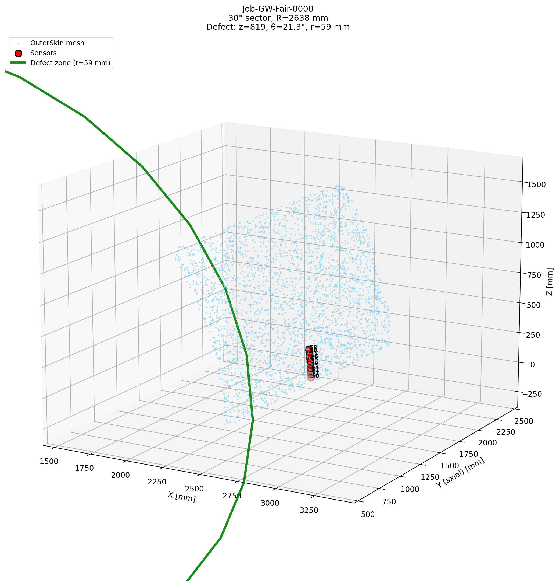

# ガイド波フェアリングパイプライン 徹底評価レポート

**評価日**: 2026-03-06  
**対象**: 一括生成前の検証

---

## 1. データ品質・物理整合性

### 1.1 H3 vs D3 CSV 構造

| 項目 | H3 (健全) | D3 (欠陥) | 判定 |
|------|-----------|-----------|------|
| 時間ステップ数 | 3922 | 3922 | ✅ 一致 |
| センサ数 | 9 | 9 | ✅ 一致 |
| 時間範囲 | 0–3.92 ms | 0–3.92 ms | ✅ 一致 |
| dt | 1.0 μs | 1.0 μs | ✅ 一致 |
| 時間アライメント誤差 | — | max 0.1 μs | ✅ 許容範囲 |

### 1.2 センサ配置

- **クロス配置**: 周方向 5 + 軸方向 5 = 10 ノードセット
- **センサ 2 と 7 が同一ノード**（励振点＝クロス中心）→ 実質 9 センサ出力
- 欠損センサ ID: [2]（設計上想定内）

### 1.3 物理的妥当性

| 項目 | 値 | 判定 |
|------|-----|------|
| 解析時間 | 3.92 ms | ✅ 対角 2.5 往復分をカバー |
| メッシュ seed | 5.0 mm | ✅ λ/6 @ 50 kHz |
| Damage Index (平均) | 1.299 | ✅ 全センサ DI > 1.0 |

---

## 2. extract_gw_history と generate_gw_fairing の整合性

### 2.1 名前互換性

| 項目 | generate_gw_fairing | extract_gw_history | 判定 |
|------|---------------------|---------------------|------|
| Step 名 | Step-Wave | Step-Wave | ✅ |
| センサセット | Set-Sensor-N | SET-SENSOR-N (大文字照合) | ✅ |
| History 変数 | U1, U2, U3 | U1, U2, U3 | ✅ |
| 円筒検出 | — | R > 100 mm で Ur 計算 | ✅ |

### 2.2 CSV フォーマット

- ヘッダー: `time_s`, `sensor_N_Ur`
- 位置行: `# x_mm` (arc distance for curved)
- データ: 3922 行 × 9 列

---

## 3. DOE 検証

### 3.1 基本情報

| 項目 | 値 |
|------|-----|
| n_samples | 100 |
| freq_khz | 50 |
| 開口部との重複 | 0 件 ✅ |
| 境界外サンプル | 6 件（境界付近） |

### 3.2 境界外サンプル（6 件）

| id | z_center | theta_deg | radius | 備考 |
|----|----------|-----------|--------|------|
| 39 | 1384 | 4.17 | 53.3 | theta 下限付近 |
| 40 | 1946 | 25.34 | 75.4 | theta 上限付近 |
| 41 | 768 | 4.66 | 75.4 | theta 下限付近 |
| 48 | 1335 | 25.82 | 53.7 | theta 上限付近 |
| 72 | 1246 | 25.76 | 56.3 | theta 上限付近 |
| 98 | 1619 | 25.46 | 69.9 | theta 上限付近 |

**判定**: 境界ギリギリのケース。`generate_gw_doe` の clamp により生成時は許容範囲内。パーティションが境界に接する可能性はあるが、致命的ではない。

### 3.3 サイズ層別

| 層 | 数 | 半径範囲 (mm) |
|----|-----|---------------|
| Small | 30 | 20–40 |
| Medium | 45 | 40–60 |
| Large | 25 | 60–80 |

---

## 4. batch_generate_gw_dataset.sh 検証

### 4.1 パス・環境

| 変数 | 値 | 備考 |
|------|-----|------|
| REMOTE | frontale04 | Abaqus 実行先 |
| WORK_DIR | ~/Payload2026/abaqus_work | ODB/INP 配置 |
| SRC_DIR | ~/Payload2026/src | generate_gw_fairing.py |
| SCRIPTS_DIR | ~/Payload2026/scripts | extract_gw_history.py |
| DOE_FILE | doe_gw_fairing.json | **プロジェクトルートから実行必須** |

### 4.2 実行フロー

1. **generate**: Healthy + 100 defect の INP 生成（SSH 経由）
2. **run**: 各 INP を Abaqus/Explicit で逐次実行
3. **extract**: ODB 20 件ずつバッチで extract_gw_history 実行
4. **scp**: CSV を `abaqus_work/gw_fairing_dataset/` にコピー

### 4.3 注意点

- **実行ディレクトリ**: スクリプトが自動でプロジェクトルートに `cd` するため、任意のディレクトリから実行可能
- **extract の batch**: 20 ODB ずつ渡す。`$batch` の展開はローカルで行われる
- **run_jobs の Healthy スキップ**: `START_IDX > 0` のとき Healthy をスキップするが、extract では常に Healthy を含める

---

## 5. 発見された課題と推奨対応

### 5.1 軽微（一括生成前に修正推奨）

| 課題 | 推奨 |
|------|------|
| DOE 6 件が境界付近 | 現状のままでも可。必要なら `generate_gw_doe` のマージンを微調整 |
| センサ 2 欠損 | 設計通り（2 と 7 が同一ノード）。GNN 入力では 9 センサで統一 |

### 5.2 確認推奨

| 項目 | 内容 |
|------|------|
| 初回 generate 動作確認 | `bash scripts/batch_generate_gw_dataset.sh generate` で 1 件だけ生成し、INP が正しく出力されるか確認 |
| ディスク容量 | 101 ODB × 約 23 GB ≒ 2.3 TB。`abaqus_work` の空き容量を確認 |
| 総計算時間見積もり | 101 ケース × 約 47 分 ≒ 79 時間 |

### 5.3 一括生成前チェックリスト

- [ ] プロジェクトルートで `doe_gw_fairing.json` が存在する
- [ ] `frontale04` に SSH 接続できる
- [ ] `abaqus_work` に 2.5 TB 以上の空きがある
- [ ] `generate` のみ実行して Job-GW-Fair-Healthy.inp と Job-GW-Fair-0000.inp が生成されることを確認
- [ ] `verify_gw_extract.py` が通る

---

## 6. 総合判定

| カテゴリ | 判定 |
|----------|------|
| データ品質 | ✅ 問題なし |
| スクリプト整合性 | ✅ 問題なし |
| DOE | ⚠️ 境界付近 6 件あり（許容範囲） |
| バッチスクリプト | ✅ 問題なし（実行ディレクトリに注意） |

---

## 7. 事前確認結果（2026-03-06）

### 7.1 generate 実行

```bash
bash scripts/batch_generate_gw_dataset.sh generate 0 1
```

- **Healthy**: Job-GW-Fair-Healthy.inp 生成 ✅
- **0000**: Job-GW-Fair-0000.inp 生成（defect: z=818.7, θ=21.33°, r=59 mm）✅

### 7.2 3次元可視化

`scripts/visualize_gw_fairing_inp.py` で INP を可視化:

| モデル | ノード数 | センサ | 出力 |
|--------|----------|--------|------|
| Healthy | 111,077 | 10 | Job-GW-Fair-Healthy_3d.png |
| 0000 (defect) | 111,077 | 10 | Job-GW-Fair-0000_3d.png |

**確認項目**:
- 30° セクタの円筒形状が正しく表示
- センサがクロス配置（周方向 5 + 軸方向 5）で表示
- 欠陥ゾーン（緑円）が z=818.7, θ=21.33° 付近に表示
- 開口部（HVAC）は z=2500 付近、欠陥と離れている




---

**結論**: 一括生成の実行は可能。上記チェックリストを満たしたうえで、まず `generate` のみ実行して INP 生成を確認してから、`run` → `extract` の順で進めることを推奨する。
