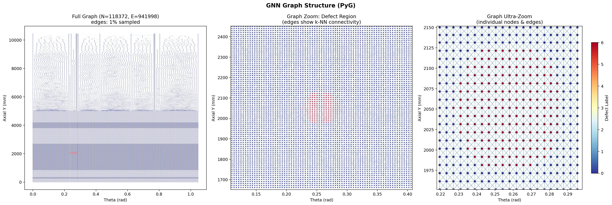

[← Home](Home)

# Architecture: H3 フェアリング GNN-SHM パイプライン

> **日本語概要**: FEM (Abaqus) → CSV 抽出 → 曲率対応グラフ構築 (build_graph.py) → PyG Data → GNN 4 種 (GCN/GAT/GIN/SAGE) 学習 → 推論 API。Shell-Solid-Shell サンドイッチ構造、熱解析 (CTE 不整合) を含む。用語は [用語集](Vocabulary) を参照。

---

## 全体パイプライン

### データ生成パイプライン（FNO スクリーニングあり）

DOE 250 ケースの学習データ生成時は、FNO サロゲートで事前スクリーニングし FEM 計算コストを **約 56% 削減** する。

```
┌──────────────────────────────────────────────────────────────────────────┐
│              DATA GENERATION PIPELINE (with FNO Screening)              │
├──────────────────────────────────────────────────────────────────────────┤
│                                                                          │
│  250 INP (DOE 全ケース)                                                  │
│         │                                                                │
│         ▼                                                                │
│  ┌──────────────┐                                                        │
│  │ FNO Surrogate│  ~0.1秒/ケース (FFT ベース解演算子学習)                  │
│  │ + MC-Dropout │  → μ(応力場), σ(不確実性)                              │
│  └──────┬───────┘                                                        │
│         │                                                                │
│         ├─── 確信度 高 (50-70%) ──→ FEM スキップ → FNO 予測で代替         │
│         │                                                                │
│         ▼                                                                │
│  ┌──────────────┐     ┌──────────────┐     ┌────────────┐               │
│  │ Abaqus FEM   │ CSV │  PyG Graph   │ .pt │   GNN      │               │
│  │ (選択された  │────→│  Curvature-  │────→│  Training  │               │
│  │  30-50%のみ) │     │  Aware Graph │     │            │               │
│  └──────────────┘     └──────────────┘     └────────────┘               │
└──────────────────────────────────────────────────────────────────────────┘
```

**FNO の位置づけ**: FNO は **GNN の前段ではなく、FEM のサロゲート（代理モデル）**。
大量ケースの中から「明らかに健全」「明らかに欠陥」を高速に仕分け、
閾値近傍の判断が難しいケースだけ FEM で精密解析する。
詳細: [Two-Stage-Screening](Two-Stage-Screening)

### 学習データの増強（健全データ生成）

FNO・GNN ともに、既存の欠陥データから **健全データをデータ増強で生成** している。
FEM を追加実行せずに学習データのバランスを取る手法。

| 対象 | 手法 | スクリプト |
|---|---|---|
| **FNO 用** (64×64 grid) | defect_mask → 0、応力を健全ベースラインで補間 + ノイズ | `augment_fno_healthy.py` |
| **GNN 用** (PyG graph) | 欠陥ノード特徴量を健全隣接ノードから補間 + ノイズ | `augment_healthy.py` |

```
欠陥 200 サンプル ──┬──→ そのまま学習データ (defect)
                   └──→ augment_*_healthy.py ──→ 健全 200 サンプル (synthetic)
                                                  ↓
                                            混合 400 サンプルで FNO/GNN 学習
```

**注意**: これは FNO が健全データを「予測・生成」するのではなく、
既存 FEM 結果を加工して健全データを**増強**する前処理。
FNO 自体はあくまでスクリーニング用の推論モデルとして機能する。

### 推論パイプライン（FNO 不要）

学習済み GNN による推論時は FNO を使わない。FEM 結果 or センサーデータから直接 GNN で判定する。

```
┌─────────────────────────────────────────────────────────────────────┐
│                       INFERENCE PIPELINE                            │
├─────────────────────────────────────────────────────────────────────┤
│                                                                     │
│  Phase 1: FEM              Phase 2: Graph           Phase 3: GNN   │
│  ┌───────────────┐         ┌──────────────┐        ┌────────────┐  │
│  │ Abaqus/Standard│         │  PyG Graph   │        │  Training  │  │
│  │               │  CSV    │              │  .pt   │            │  │
│  │ Shell-Solid-  │───────→│ Curvature-   │──────→│ GCN / GAT  │  │
│  │ Shell Sandwich│  nodes  │ Aware Graph  │ Data   │ GIN / SAGE │  │
│  │ + Thermal     │  elems  │ Construction │        │            │  │
│  └───────────────┘         └──────────────┘        └─────┬──────┘  │
│         ↑                                                │         │
│         │                                                ↓         │
│  JAXA Literature                                  ┌────────────┐   │
│  (Thermal BCs,                                    │ Inference  │   │
│   Acoustic 147dB,                                 │ FastAPI    │   │
│   Separation Shock)                               │ predict_api│   │
│                                                   └────────────┘   │
└─────────────────────────────────────────────────────────────────────┘
```

### FNO と GNN の使い分け

| フェーズ | パイプライン | FNO の役割 |
|---|---|---|
| **データ生成** (DOE 250ケース) | FNO → スクリーニング → FEM（必要分のみ）→ GNN | FEM サロゲート（56% コスト削減） |
| **GNN 学習** | FEM 結果 → グラフ構築 → GNN 学習 | 不要 |
| **運用（推論）** | FEM or センサーデータ → GNN 直接 | 不要 |

FNO が PDE 解演算子をフーリエ空間で学習する仕組みの詳細は [Two-Stage-Screening](Two-Stage-Screening) を参照。

## ファイル構成

```
src/
├── generate_fairing_dataset.py   # Abaqus マクロ: FEM モデル生成 + 熱解析 + CSV出力
├── build_graph.py                # 曲率対応グラフ構築 (法線・主曲率・測地線距離)
├── preprocess_fairing_data.py    # FEM CSV → PyG Data 変換 + 正規化 + 分割
├── models.py                     # GNN アーキテクチャ定義 (4種)
├── train.py                      # 学習ループ (Focal Loss, CV, Early Stopping)
├── evaluate.py                   # 評価指標・ヒートマップ・比較
└── predict_api.py                # 推論 API (Python callable + FastAPI REST)
```

## FEM モデル: Shell-Solid-Shell Sandwich

**積層構造（17層）** — 詳細: [Layup-Structure](Layup-Structure)

| 部位 | 層数 | 厚さ | 構成 |
|------|------|------|------|
| Outer Skin | 8 plies | 1.0 mm | CFRP [45/0/-45/90]s (0.125 mm/ply) |
| Core | 1 | 38 mm | Al-5052 ハニカム |
| Inner Skin | 8 plies | 1.0 mm | CFRP [45/0/-45/90]s (0.125 mm/ply) |
| **合計** | **17層** | **40 mm** | |


```
     Outer Skin (S4RT)          CFRP [45/0/-45/90]s  1.0 mm (8 plies)
     ══════════════════
     ┃  Honeycomb Core  ┃       Al-5052 Orthotropic  38 mm
     ┃   (C3D8RT)       ┃
     ══════════════════
     Inner Skin (S4RT)          CFRP [45/0/-45/90]s  1.0 mm (8 plies)

     接続: Tie Constraints (Skin ↔ Core 接合面)
     温度: 外板 120℃ / 内板 20℃ / コア勾配 / 基準 25℃
```

### 解析ステップ

| Step | Type | 内容 |
|------|------|------|
| Initial | — | 変位BC（下端固定）+ 初期温度 T_REF=25℃ |
| Thermal | CoupledTempDisplacement (Steady) | 温度場適用 → CTE不整合による熱応力 |
| Load | Static | 軸圧縮 + 外圧 30kPa (Max Q) |

### 材料物性

**CFRP T300/914（温度依存）**:

| T (℃) | E1 (GPa) | E2 (GPa) | G12 (GPa) | CTE1 (/℃) | CTE2 (/℃) |
|--------|----------|----------|-----------|-----------|-----------|
| 25 | 135 | 10 | 5.0 | -0.3e-6 | 28e-6 |
| 100 | 133 | 9 | 4.5 | — | — |
| 150 | 130 | 7 | 3.8 | — | — |
| 200 | 125 | 5.5 | 3.2 | — | — |

**ハニカムコア (Al-5052)**: E3=1380 MPa, G13=310 MPa, CTE=23e-6 /℃

## GNN アーキテクチャ

4種のアーキテクチャを実装・比較:

| Model | 特徴 | 適用場面 |
|-------|------|---------|
| **GCN** | シンプルなスペクトル畳み込み | ベースライン |
| **GAT** | Attention機構で隣接ノードの重み付け | 欠陥境界の検出 |
| **GIN** | トポロジ識別力が最も高い | グラフ構造の活用 |
| **GraphSAGE** | サンプリングベース、大規模対応 | スケーラビリティ |

### 共通設定

- **損失関数**: Focal Loss (α=0.25, γ=2.0) — 健全ノード>>欠陥ノードの不均衡対策
- **Optimizer**: Adam (lr=1e-3, weight_decay=1e-5)
- **Scheduler**: CosineAnnealingLR
- **Early Stopping**: patience=20 (validation F1 based)
- **入力次元**: 動的検出（データから自動判定）

### ノード特徴量

**build_graph.py（曲率対応）: 34次元**

| Index | Feature | Dim | 説明 |
|-------|---------|-----|------|
| 0-2 | Position | 3 | x, y, z |
| 3-5 | Normal | 3 | nx, ny, nz |
| 6-9 | Curvature | 4 | κ1, κ2, H, K |
| 10-13 | Displacement | 4 | ux, uy, uz, u_mag |
| 14 | Temperature | 1 | temp |
| 15-20 | Stress | 6 | s11, s22, s12, smises, principal_stress_sum, thermal_smises |
| 21-23 | Strain | 3 | le11, le22, le12 |
| 24-26 | Fiber orientation | 3 | 周方向単位ベクトル |
| 27-31 | Layup | 5 | layup [0,45,-45,90]°, circum_angle |
| 32-33 | Node Type | 2 | boundary, loaded |

詳細: [Node-Features](Node-Features)

**preprocess_fairing_data.py（簡易版）: 12次元**

| Index | Feature | Dim |
|-------|---------|-----|
| 0-2 | Position | 3 |
| 3-6 | Stress | 4 |
| 7-9 | Node Type | 3 |
| 10-11 | **Thermal** | **2** |

### グラフ構造の可視化



- 左: 全体グラフ（N=118K nodes, E=942K edges, 1% サンプル表示）— 開口部・フレーム位置の構造が見える
- 中: 欠陥周辺ズーム — k-NN エッジ接続とノード密度の違い（欠陥ゾーン 10mm vs グローバル 25mm）
- 右: 超ズーム — 個々のノードとエッジが識別可能。赤=欠陥ノード、青=健全ノード

### エッジ特徴量

| Feature | Dim | 説明 |
|---------|-----|------|
| Relative position | 3 | Δx, Δy, Δz |
| Euclidean distance | 1 | ||Δr|| |
| Normal angle | 1 | 法線間角度 |
| Geodesic distance | 1 | メッシュ上最短経路（オプション） |

## 推論 API

```
POST /predict
  Input:  nodes.csv + elements.csv
  Output: {
    "defect_nodes": [node_id, ...],
    "center": [x, y, z],
    "confidence": 0.95,
    "heatmap": [prob_per_node]
  }

GET /health → {"status": "ok"}
```
