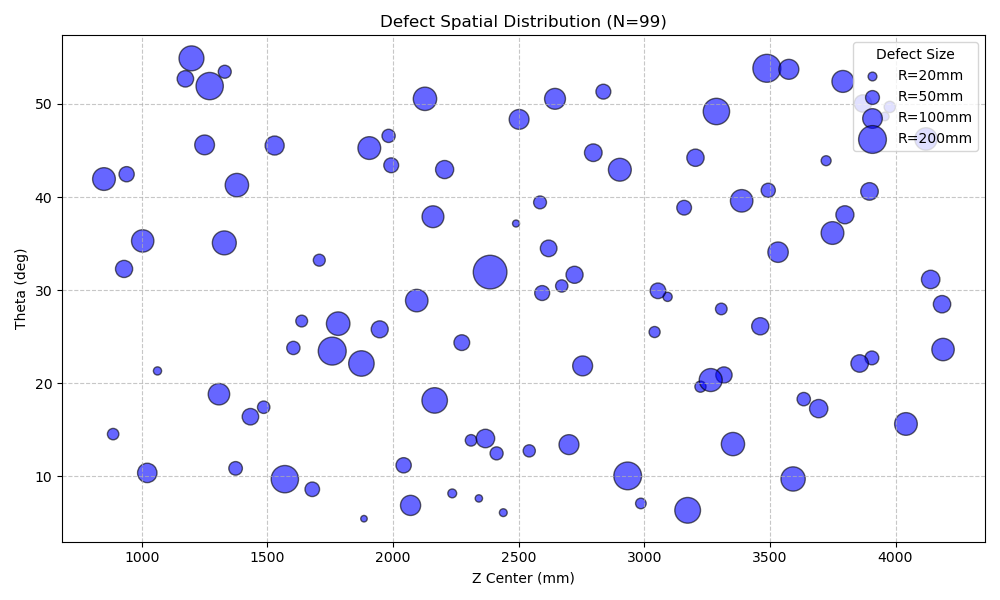
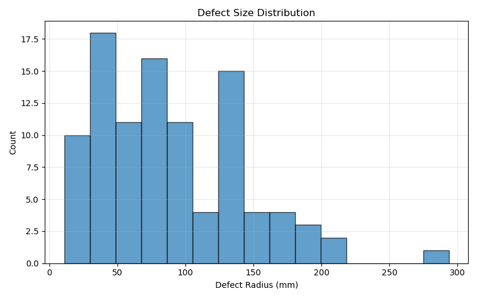
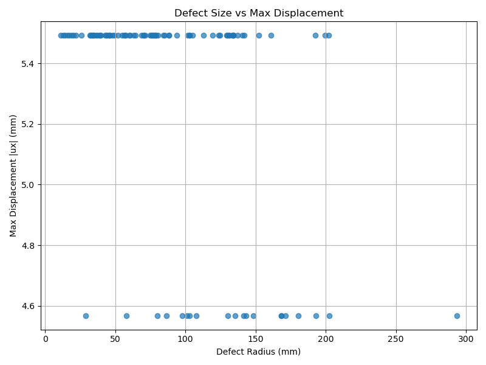

# Dataset Generation Status

**Status**: Nearly Complete (99/100 Validated)  
**Completeness Score**: **99/100**  
**Date**: 2026-02-28

## Overview
This page tracks the generation progress of defective datasets for H3 Fairing debonding defects.

## Progress Summary
| Dataset | Valid Samples | Total Samples | Status | Notes |
|---------|---------------|---------------|--------|-------|
| `dataset_output` | 99 | 100 | ✅ Ready | Standard dataset |
| `dataset_output_12mm_20` | 0 | 20 | ❌ Failed | Mesh OK, Physics Missing (Disp=0) |
| `dataset_output_100` | 0 | 100 | ❌ Failed | Mesh OK, Physics Missing (Disp=0) |
| `dataset_output_25mm_400` | 5 | 55 | ⚠️ Partial | Low success rate (9.1%) |
| `dataset_output_ideal_12mm` | 0 | 1 | ❌ Failed | Mesh OK (193k nodes), Physics Missing |

## Dataset Distributions
Visual summary of the valid `dataset_output` (N=99).

### 1. Spatial Distribution
Distribution of defects across the fairing surface (Theta vs Z).

### 2. Defect Size Distribution
Histogram of defect radii.

### 3. Physical Response
Correlation between defect size and maximum displacement magnitude.

## Quality Verification
- **Displacement Check**: Verified > 0.001 mm for valid samples.
- **Temperature Check**: Verified non-zero distribution.
- **Mesh Integrity**: Verified element types (S4R/S3) and connectivity.

## Next Steps
1. Investigate simulation failure for `12mm` and `100` datasets (likely job submission or ODB extraction error).
2. Improve success rate for `25mm` dataset.
3. Proceed with GNN training using the 99 valid samples from `dataset_output`.
