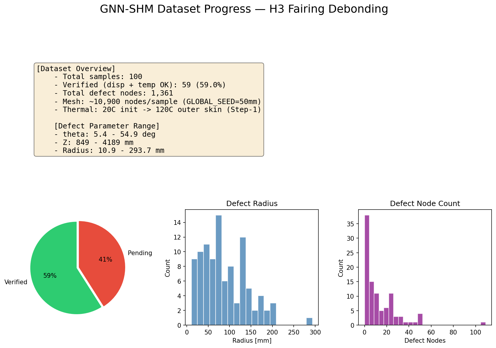
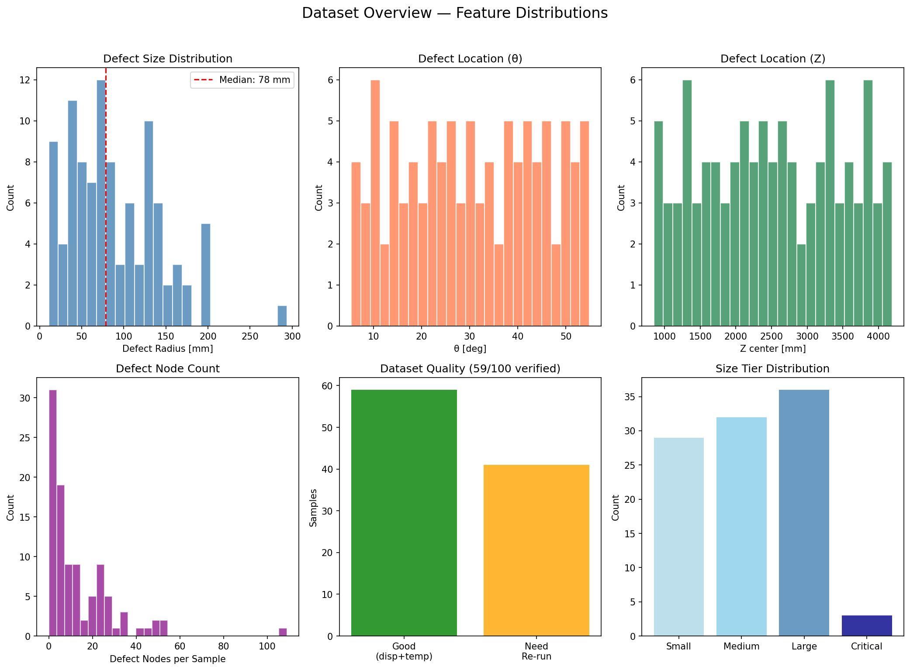
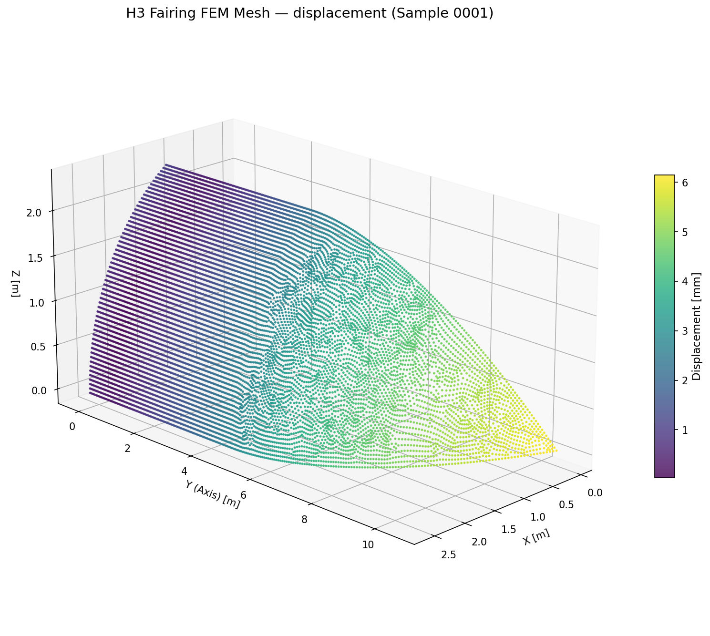
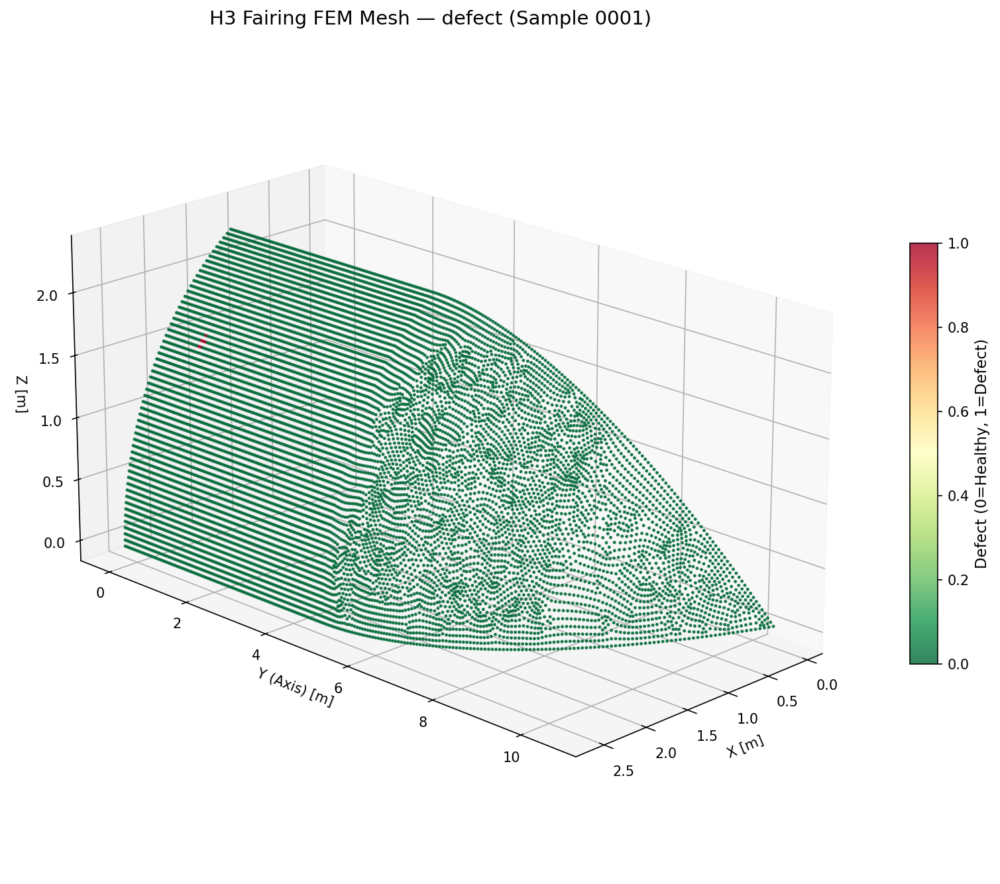
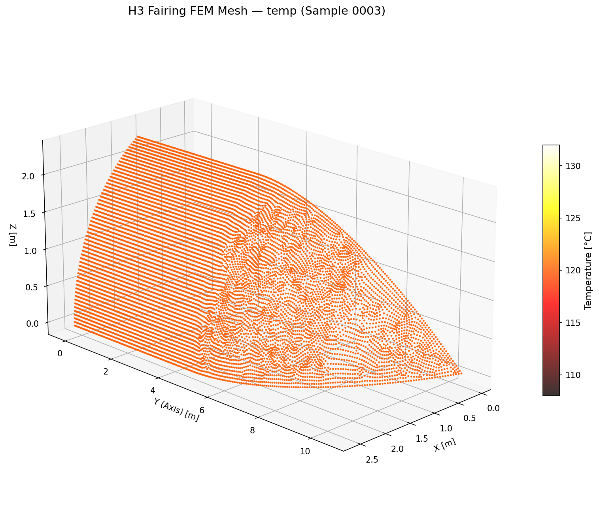
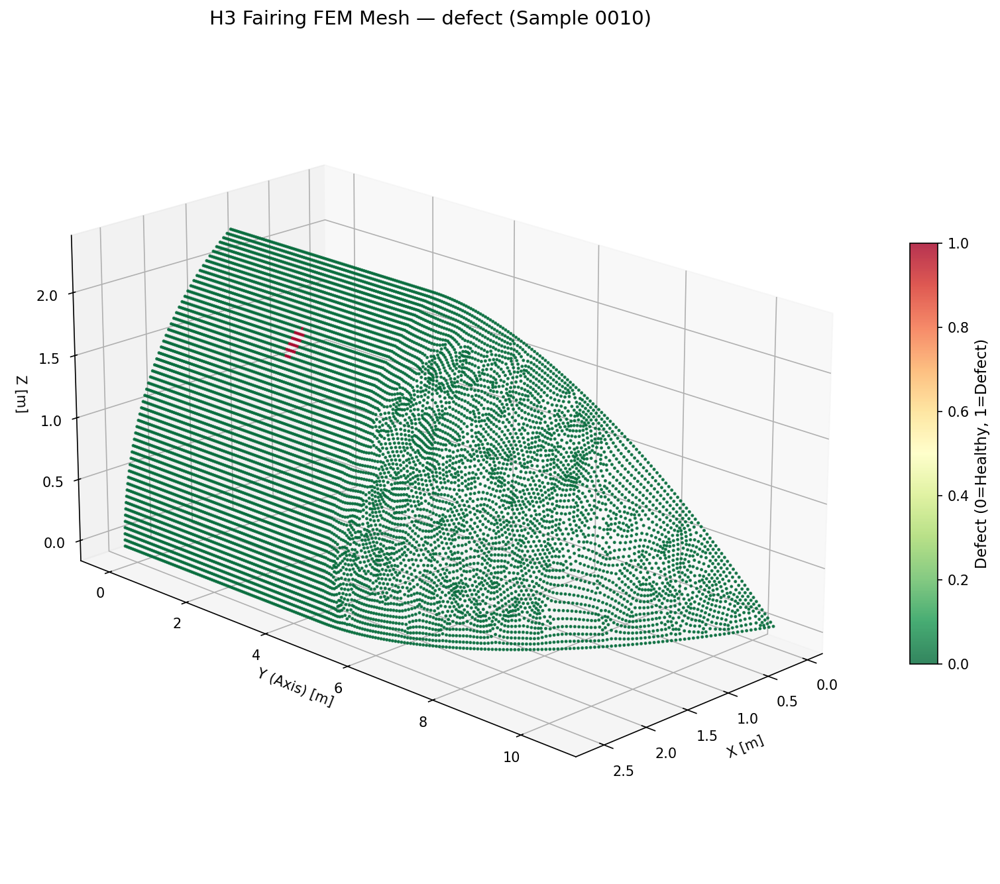
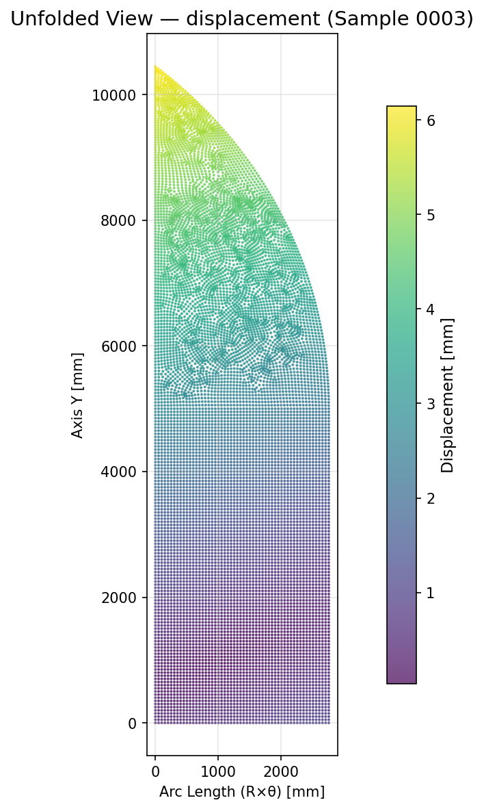
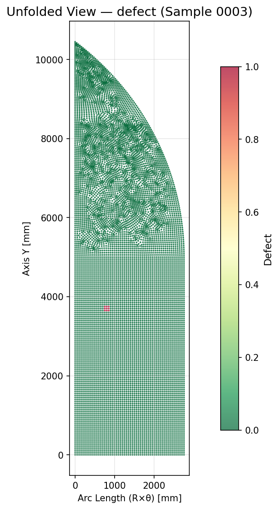

[← Home](Home)

# Dataset Generation Status

**Status**: In Progress (63/100 品質検証済み)  
**完璧度スコア**: **70/100** → 詳細は [Dataset-Perfect-Score](Dataset-Perfect-Score)  
**Date**: 2026-02-28

## 生成中のデータ

**H3 フェアリングのデボンディング欠陥 FEM データ**（100 サンプル）

| 項目 | 内容 |
|------|------|
| **出力先** | `dataset_output/` |
| **メッシュ** | GLOBAL_SEED = 50 mm |
| **欠陥** | 外スキン-コア界面の円形デボンディング |
| **サンプル数** | 100（欠陥ありのみ） |
| **熱荷重** | 初期 20°C、Step-1 外板 120°C（熱パッチ適用済み） |

### 欠陥サイズ階層

| 階層 | 半径 (mm) | 割合 |
|------|-----------|------|
| Small | 20–50 | 30% |
| Medium | 50–80 | 40% |
| Large | 80–150 | 25% |
| Critical | 150–250 | 5% |

### 各サンプルの出力

- `nodes.csv` — 座標 (x,y,z)、変位 (ux,uy,uz)、**温度 (NT11)**、**defect_label**
- `elements.csv` — 要素接続、Mises 応力
- `metadata.csv` — theta_deg, z_center, radius, n_defect_nodes

### 進捗

| 状態 | 件数 | 備考 |
|------|------|------|
| **品質検証済み** | 63/100 | 変位・温度ともに正しく抽出 |
| **未完了** | 37/100 | ODB 破損または再実行待ち |

### 品質検証

```bash
python scripts/verify_dataset_quality.py   # データセット品質スコア
python scripts/verify_odb_thermal.py       # ODB 熱・変位の個別検証
```

### 残り 37 サンプルの再実行

```bash
python scripts/re_run_thermal_only.py --doe doe_100.json --start 0 --end 100   # 熱パッチ + Abaqus + 抽出
# または
python src/run_batch.py --doe doe_100.json --output_dir dataset_output --force
```

---

## データセット可視化（進捗確認用）

`scripts/visualize_dataset_progress.py` で 3D メッシュ・特徴量分布・サマリを生成。教授との進捗確認で使用。

### サマリダッシュボード



### 特徴量分布



### 代表サンプル 3D 可視化（変位・温度・欠陥ラベルで色分け）

**Sample 0001** — 変位 / 温度 / 欠陥





**Sample 0003** — 変位 / 温度 / 欠陥





**Sample 0010** — 変位 / 温度 / 欠陥




### 展開図（円筒を平面に展開、欠陥位置が直感的）

**Sample 0003** — 変位 / 欠陥




### 再生成コマンド

```bash
python scripts/visualize_dataset_progress.py
# 特定サンプルを指定
python scripts/visualize_dataset_progress.py --samples "1,2,3,10,15,20"
```
