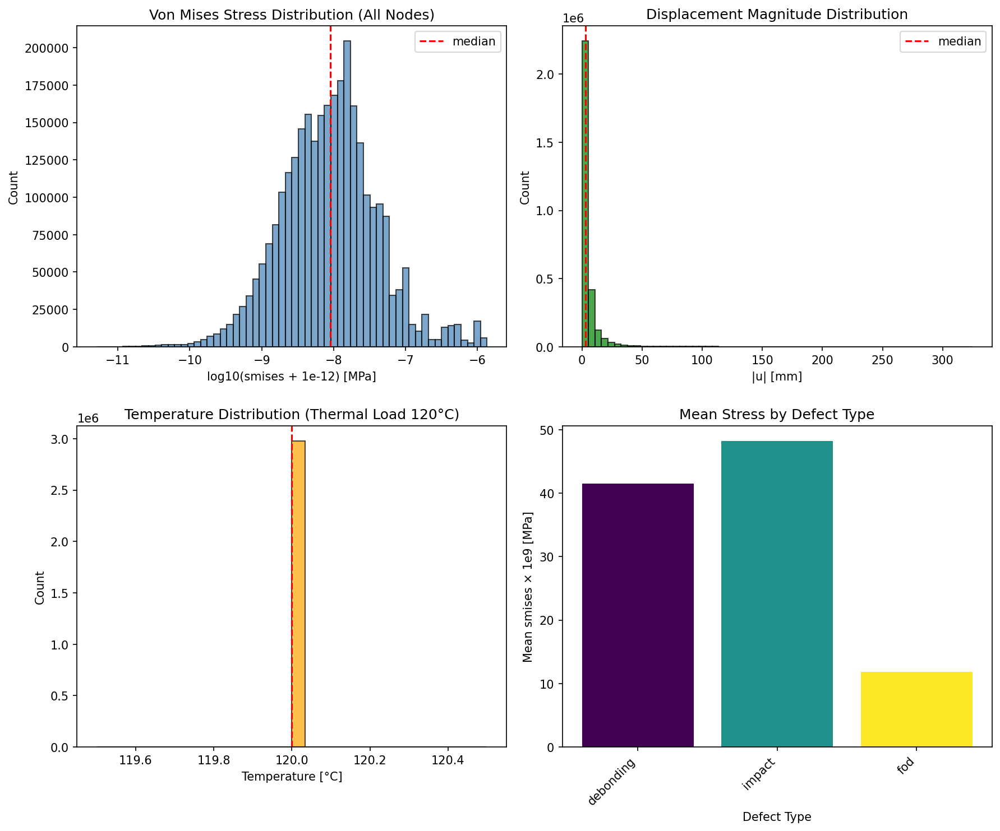
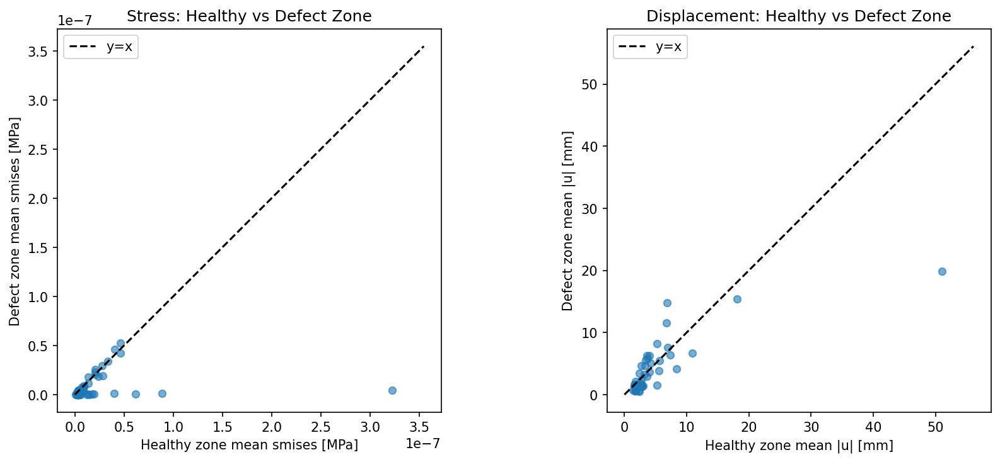
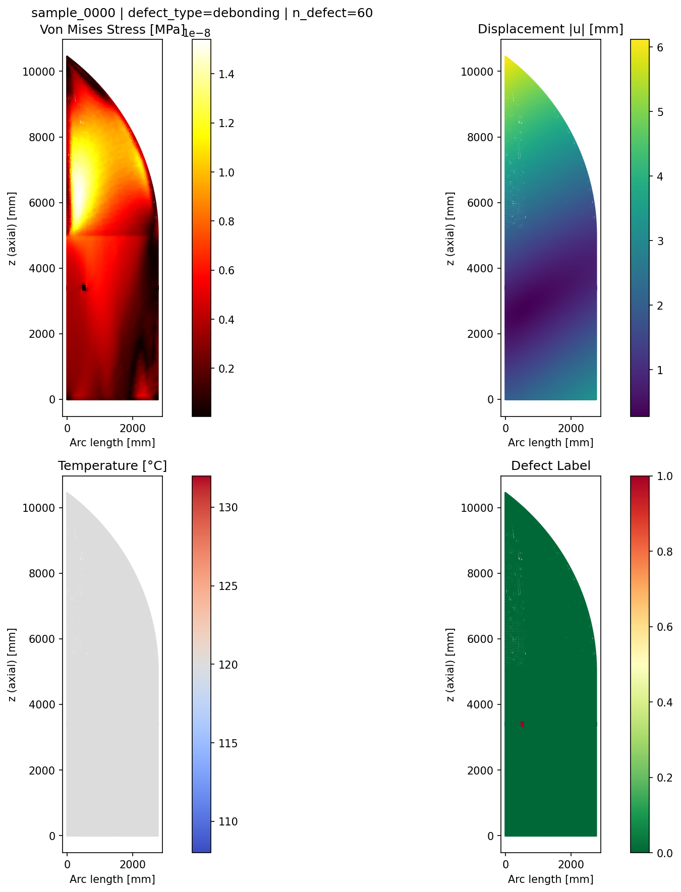
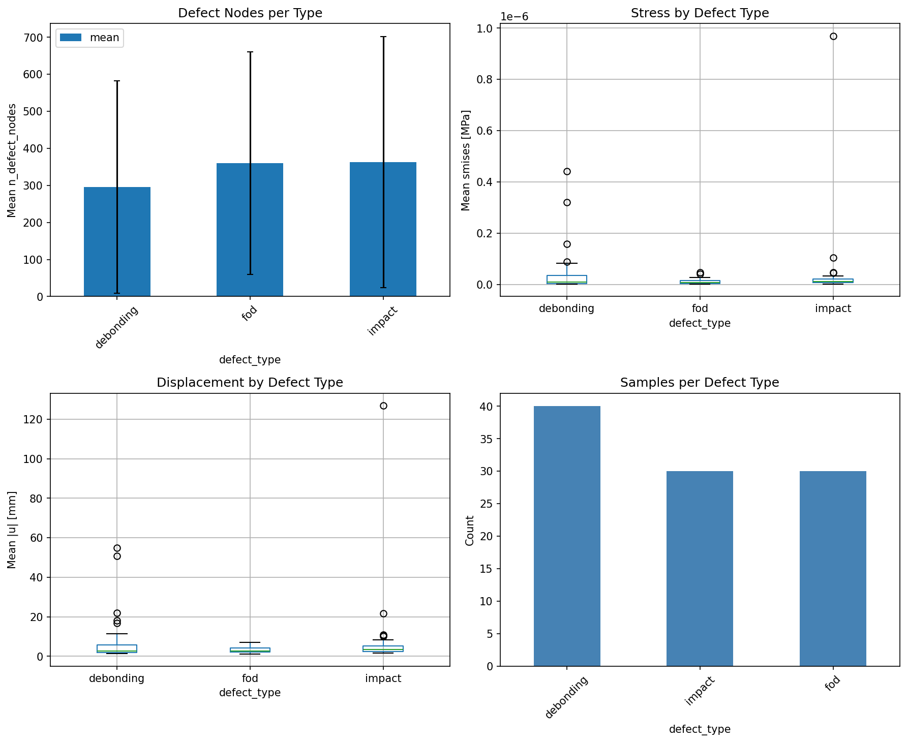
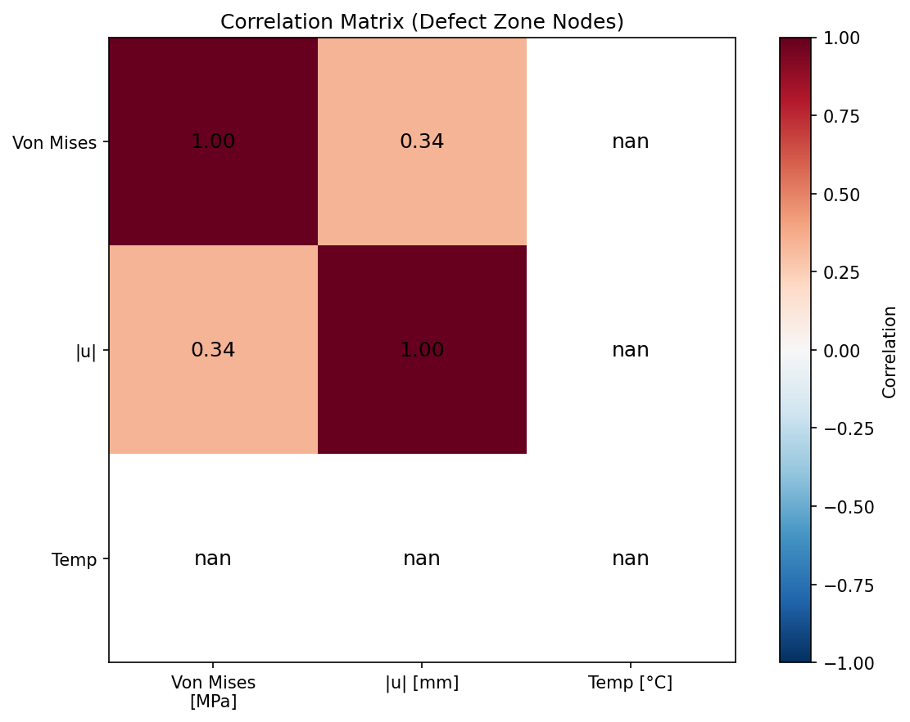
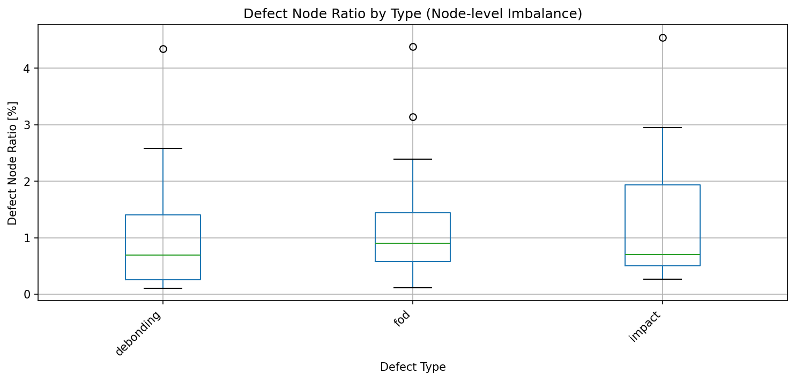

[← Home](Home)

# 欠陥データの物理量検証 — Defect Physics Validation

> 最終更新: 2026-02-28  
> 応力・変位・温度の数値的・物理的妥当性を検証。可視化・数値分析結果を掲載。

---

## 1. 概要

欠陥データセット（nodes.csv）について以下を検証する:

- **温度**: 熱荷重 20→120°C の適用確認
- **変位**: 熱膨張による変位が妥当な範囲
- **応力**: von Mises 応力が有限・妥当範囲
- **欠陥コントラスト**: 欠陥ゾーンと健全ゾーンで応力・変位に差異
- **メタデータ整合**: n_defect_nodes が実際の defect_label と一致

**数値分析**: 欠陥タイプ別の統計量、応力・変位の欠陥/健全比、相関行列を算出。

---

## 2. 実行方法

```bash
# 物理量検証
python scripts/validate_defect_physics.py --data dataset_multitype_100

# レポート保存
python scripts/validate_defect_physics.py --data dataset_multitype_100 --output docs/defect_physics_validation_report.json

# 数値分析（統計サマリ・Markdown テーブル）
python scripts/analyze_defect_validation.py --data dataset_multitype_100 --output docs/defect_analysis_report.json --markdown docs/defect_analysis_table.md

# 可視化生成（figures + wiki）
python scripts/visualize_defect_validation.py --data dataset_multitype_100 --wiki
```

---

## 3. 可視化

### 3.1 物理量分布



- 左上: von Mises 応力の分布（log スケール）
- 右上: 変位の大きさ |u| の分布
- 左下: 温度分布（熱荷重 120°C）
- 右下: 欠陥タイプ別の平均応力

### 3.2 欠陥ゾーン vs 健全ゾーン



欠陥ゾーンと健全ゾーンの平均応力・変位の比較。対角線から外れるほど差異が大きい。

### 3.3 空間分布（サンプル例）



1サンプルの展開図（θ-z）: 応力・変位・温度・欠陥ラベル。

### 3.4 欠陥タイプ別統計



欠陥タイプごとのノード数・応力・変位の統計。

### 3.5 相関行列（欠陥ゾーンノード）



応力・変位・温度の相関。欠陥ゾーンのノードのみで算出。

### 3.6 欠陥ノード比率（タイプ別）



欠陥タイプごとのノードレベル欠陥比率（%）。クラス不均衡の可視化。

---

## 4. 数値分析サマリ

`scripts/analyze_defect_validation.py` で算出する統計量の例:

| 指標 | 説明 |
|------|------|
| **グローバル** | 総サンプル数、総ノード数、総欠陥ノード数、ノードレベル欠陥比率 |
| **応力比** | 欠陥ゾーン平均 / 健全ゾーン平均（smises） |
| **変位比** | 欠陥ゾーン平均 / 健全ゾーン平均（\|u\|） |
| **タイプ別** | 各欠陥タイプのサンプル数、平均欠陥ノード数、応力比・変位比 |

実行例:
```bash
python scripts/analyze_defect_validation.py --data dataset_multitype_100 --markdown docs/defect_analysis_table.md
```
→ `docs/defect_analysis_table.md` に Markdown テーブルが出力される。

**出力例** (dataset_multitype_100 の場合):

| 指標 | 値 |
|------|-----|
| サンプル数 | 100 |
| ノードレベル欠陥比率 | 約 1.1% |
| 応力比 (欠陥/健全) | 約 0.44 |
| 変位比 (欠陥/健全) | 約 0.84 |

---

## 5. 期待範囲（物理的根拠）

| 量 | 期待範囲 | 根拠 |
|----|----------|------|
| 温度 | 20–125°C | 熱荷重（外板 120°C） |
| 変位 \|u\| | 0–500 mm | 熱膨張、クランプ拘束 |
| von Mises | 1e-12–1000 MPa | 熱応力、数値ゼロ回避 |
| n_defect | ≥1（欠陥サンプル） | 欠陥ゾーンにノードが含まれる |

---

## 6. 関連

| ページ | 内容 |
|--------|------|
| [Extended-Defect-Types](Extended-Defect-Types) | 欠陥タイプ一覧 |
| [Defect-Types-Validation](Defect-Types-Validation) | 整合性検証 |
| [Defect-Occurrence-Probability-and-Dataset-Ratio](Defect-Occurrence-Probability-and-Dataset-Ratio) | 発生確率・データセット割合 |
| [Node-Features](Node-Features) | ノード特徴量の詳細・追加候補 |
| docs/DEFECT_MODELS_ACADEMIC.md | 学術的根拠 |
