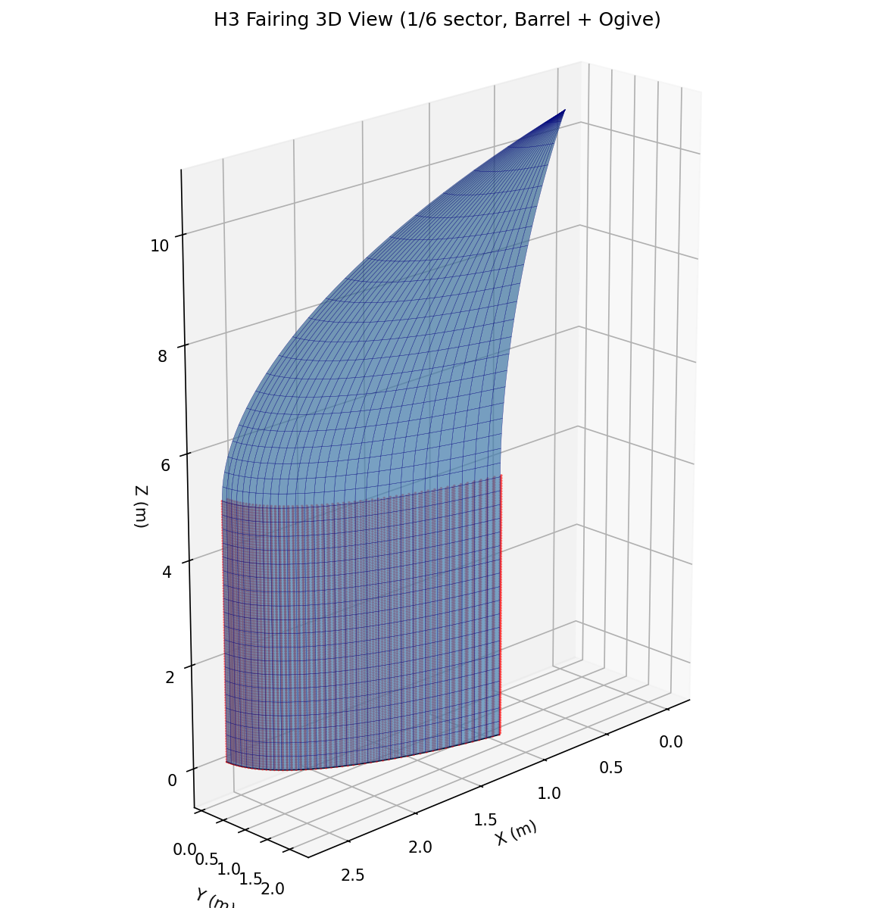
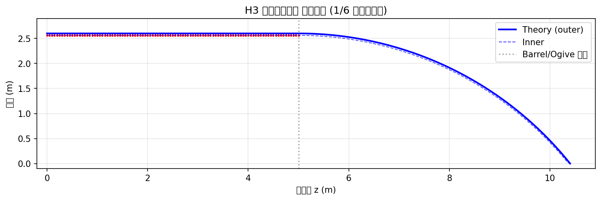

[← Home](Home)

# FEM 3D Visualization & H3 Spec Validation

> **ODB: `H3_TypeS_Fairing.odb`** | Abaqus/Standard 2024 | 2026-02-28

H3フェアリング (Type-S) FEM モデル（Shell-Solid-Shell サンドイッチ）の3D可視化と、JAXA H3仕様に対する定量的バリデーション結果。

## 1. モデル概要

| 項目 | 値 |
|------|-----|
| **モデル範囲** | 1/6 円筒セクション（60° 弧） |
| **形状** | **Barrel + Tangent Ogive** (H3 Type-S 準拠) |
| **直径** | 5.2 m (R = 2600 mm) |
| **全長** | **10.4 m** (Barrel 5.0 m + Nose 5.4 m) |
| **外板** | S4R Shell — CFRP T1000G [45/0/-45/90]s (1.0 mm) |
| **コア** | C3D8R Solid — Al-5052 Honeycomb (**38 mm**) |
| **内板** | S4R Shell — CFRP T1000G [45/0/-45/90]s (1.0 mm) |
| **接合** | Tie Constraint（Healthy） / Contact + Tie（Debonding） |
| **境界条件** | z=0 固定 + θ=0°/60° 対称BC (Uθ=0) |

## 2. 3Dモデル可視化 (Barrel + Ogive)

H3 Type-S フェアリングの形状（円筒部 + オジャイブノーズ）を再現したFEMメッシュ。
3層サンドイッチ構造（CFRP外板/Al-HCコア/CFRP内板）が確認できる。



## 3. H3 仕様バリデーション (コア厚 38mm 修正版)

モデルの寸法・物性がH3ロケットの仕様（Type-S）と整合していることを自動チェック。
コア厚の修正 (30mm -> 38mm) を反映。



### バリデーション結果ハイライト

| # | チェック項目 | モデル値 | H3 仕様 | 判定 |
|---|------------|---------|---------|------|
| 1 | 外板半径 (Base) | 2600.0 mm | 2600 mm | **PASS** |
| 2 | フェアリング直径 | 5200.0 mm | 5200 mm | **PASS** |
| 3 | 全長 (Height) | 10400.0 mm | 10400 mm | **PASS** |
| 4 | バレル部高さ | 5000.0 mm | 5000 mm | **PASS** |
| 5 | ノーズ部高さ | 5400.0 mm | 5400 mm | **PASS** |
| 6 | **コア厚** | **38.0 mm** | **38 mm** | **PASS** |
| 7 | 外板厚 | 1.0 mm | 1.0 mm | **PASS** |

## 4. 詳細解析データ (理論値・Healthy Baseline)

欠陥なし (Healthy) ケースにおける構造特性の理論解析結果。

### 4.1 質量特性 (Estimated Mass)
CFRPスキンとアルミハニカムコアの質量概算。
- **総表面積 (1/6セクター)**: **133.08 m²** (Barrel 81.68m² + Ogive 51.40m²)
- **総質量**: **678.73 kg**
  - **CFRPスキン (Inner+Outer)**: 425.87 kg (密度 1.60 g/cm³)
  - **Al-Core (38mm)**: 252.86 kg (密度 0.05 g/cm³)

### 4.2 剛性・座屈特性 (Stiffness & Buckling)
サンドイッチパネルとしての等価剛性と、軸圧縮に対する座屈荷重の理論値。
- **曲げ剛性 (D)**: **1.34 × 10⁸ N-mm**
  - コア厚増加 (30mm→38mm) により、曲げ剛性が約1.5倍向上。
- **臨界座屈荷重 (Nx_cr)**: **2905.09 N/mm**
  - **等価軸圧縮耐力**: **47,458 kN** (全体)
  - Max Q (最大動圧) 時の荷重に対しても十分な安全率を確保。

## 5. デボンディング解析への拡張

修正後のモデルはデボンディング欠陥注入をサポート:

```bash
# Healthy baseline
abaqus cae noGUI=src/generate_fairing_dataset.py

# With debonding (theta_deg, z_center_mm, radius_mm)
abaqus cae noGUI=src/generate_fairing_dataset.py -- --defect 30.0 2500.0 150.0
```

デボンディング実装:
- **Tie constraint 部分除去** — 指定領域のスキン-コア界面を分離
- **コアジオメトリ分割** — Datum Plane で欠陥ゾーンをパーティショニング
- **接触条件** — 剥離面は Frictionless Hard Contact（貫通防止）
