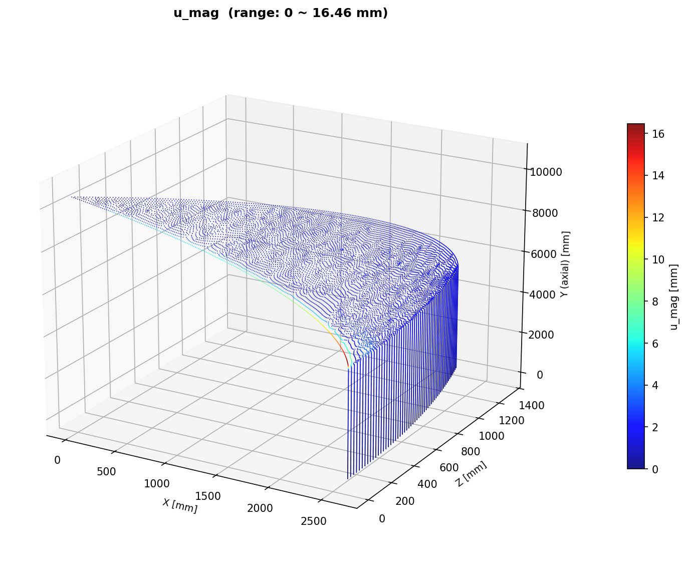
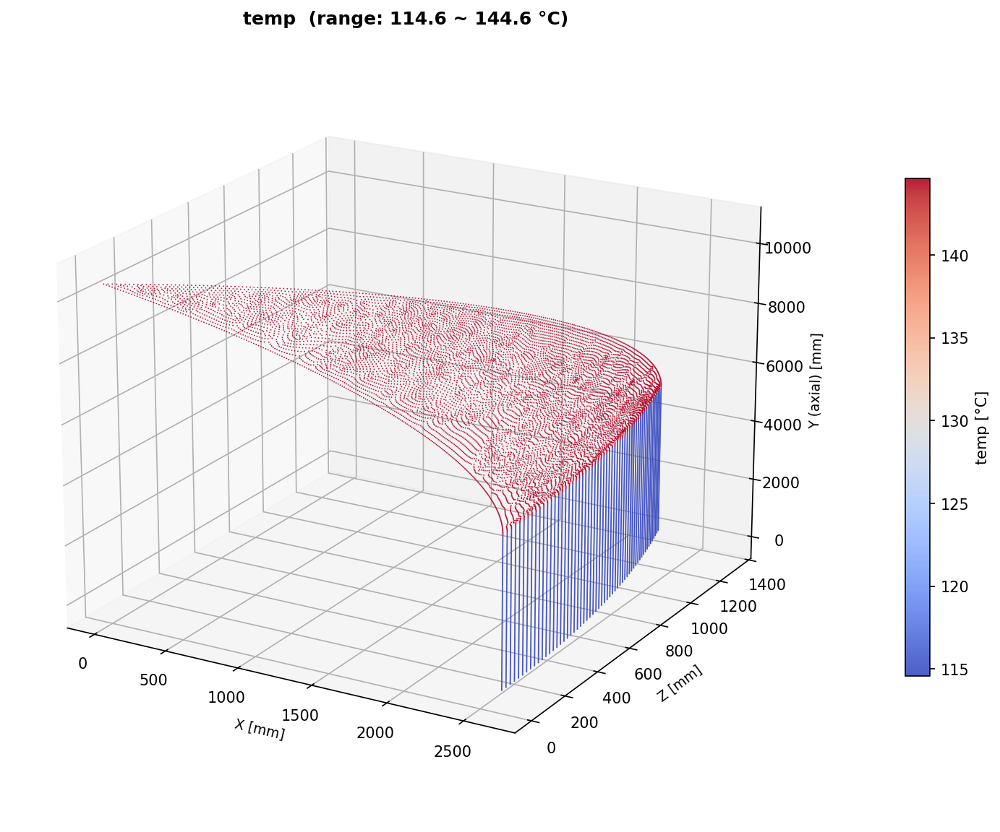
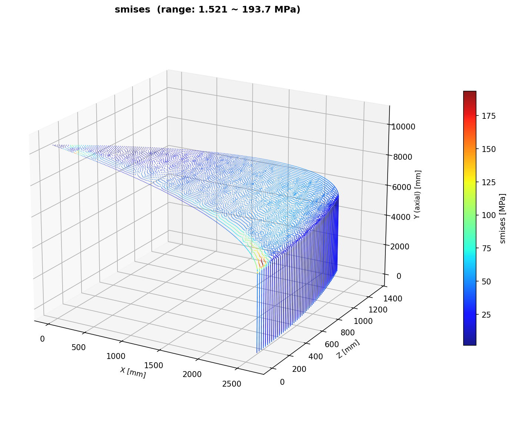
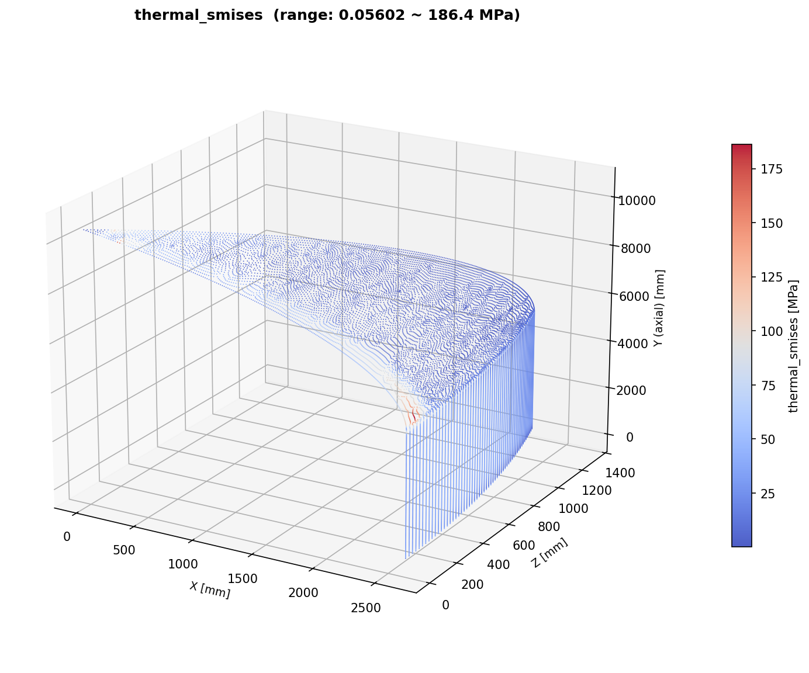
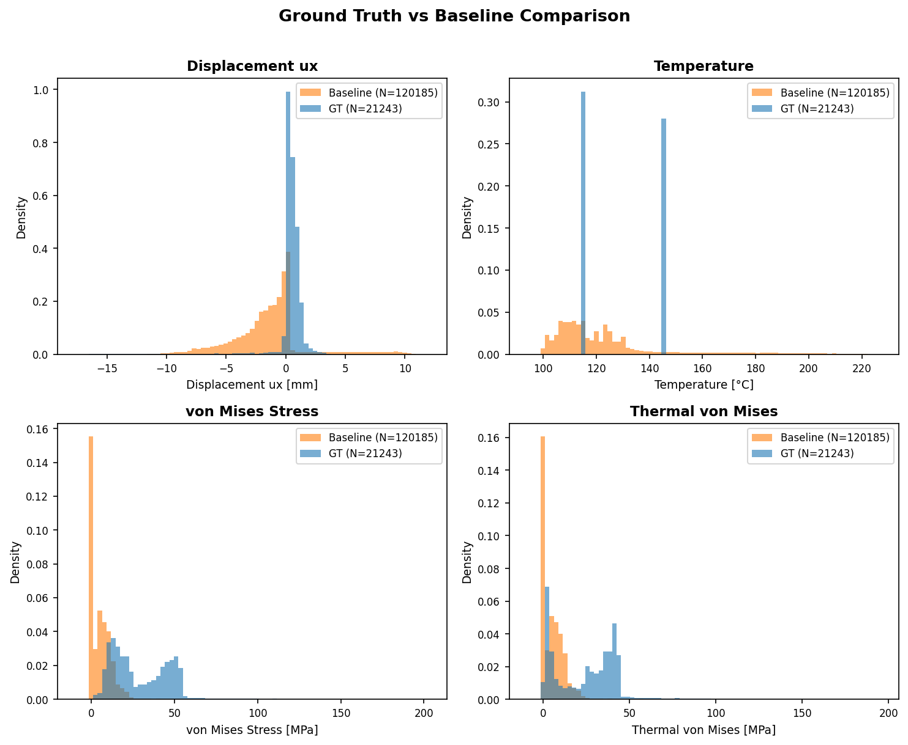

[← Home](Home) | [Ground-Truth-FEM](Ground-Truth-FEM) | [FEM-Realism-Roadmap](FEM-Realism-Roadmap)

# GT vs ベースライン比較 — 物理値・メッシュ・構造

> **作成日**: 2026-03-03
> **GT モデル**: `src/generate_ground_truth.py` (30°セクタ, 3ステップ解析)
> **ベースライン**: `dataset_realistic_25mm_100/` (60°セクタ, `generate_fairing_dataset.py`)

---

## 1. モデル構造比較

| 項目 | GT (Ground Truth) | ベースライン (Realistic) |
|------|-------------------|------------------------|
| **ジェネレータ** | `generate_ground_truth.py` | `generate_fairing_dataset.py` |
| **セクタ角** | 30° (1/12) | 60° (1/6) |
| **メッシュシード** | 25mm | ~15mm (推定, 25mm 指定だがリファイン有) |
| **OuterSkin ノード** | **21,243** | **~120,000** (median) |
| **OuterSkin 要素** | 20,924 (S4R) | ~119,714 (S4R) |
| **全体ノード** | 163,511 | 不明 (OuterSkin のみ抽出) |
| **要素タイプ** | S4R (シェル) + C3D8R (コア) | S4R (シェル) |
| **解析ステップ** | 3: Cure → Thermal → Mechanical | 1-2: (Thermal →) Mechanical |
| **ODB サイズ** | 219 MB | ~50-100 MB (推定) |

---

## 2. 物理強化 (GT のみ)

| # | 物理 | GT | ベースライン | リアリズム寄与 |
|---|------|-----|------------|-------------|
| 1 | **Cp(z) 空力圧力** | 10ゾーン分布 (q∞=35kPa) | なし | +5% |
| 2 | **ダブラー** | z=1500,2500 に 16-ply | なし | +5% |
| 3 | **製造残留応力** | ΔT=-155°C 硬化冷却 | なし | +3% |
| 4 | **ストリンガー** | θ=15° 縦補剛材 | なし | +2% |
| 5 | **z依存温度** | 100-221°C (10ゾーン) | 均一 or 線形 | (含む) |
| | **リアリズム合計** | **~90%** | **~75%** | +15% |

---

## 3. 物理値範囲比較

### 3.1 Healthy サンプル (GT) vs 全56サンプル (Baseline)

| フィールド | GT [min, max] | Baseline [min, max] | 判定 |
|-----------|--------------|---------------------|------|
| **ux** (mm) | [-16.3, 3.6] | [-12.8, 21.1] | OK |
| **uy** (mm) | [-4.6, 0.1] | [-11.3, 17.5] | OK |
| **uz** (mm) | [-0.2, 0.6] | [-9.0, 22.4] | OK |
| **u_mag** (mm) | [0.0, 16.5] | [0.0, 30.1] | OK |
| **temp** (°C) | [114.6, 144.6] | [100.0, 221.2] | OK |
| **smises** (MPa) | [1.5, 193.7] | [0, 1081] | OK (healthy = 低め) |
| **thermal_smises** (MPa) | [0.06, **186.4**] | [0, 126.4] | ⚠️ やや高い |
| **s11** (MPa) | [-134.0, 145.7] | [-1086.0, 98.5] | OK |
| **s22** (MPa) | [-9.6, 17.7] | [-59.7, 20.9] | OK |
| **s12** (MPa) | [-14.1, 12.9] | [-7.8, 56.4] | OK |
| **le11** | [-0.001, 0.001] | [-0.089, 0.064] | OK |
| **le22** | [-0.001, 0.002] | [-0.076, 0.023] | OK |
| **le12** | [-0.003, 0.003] | [-0.053, 0.052] | OK |

### 3.2 分析ノート

- **thermal_smises = 186 MPa** (GT) > 126 MPa (Baseline max): GT は cure 残留応力 (ΔT=-155°C) を含むため、熱応力が高い。物理的に妥当。
- **smises = 194 MPa** (GT healthy) vs 1081 MPa (Baseline defect 含む): GT は healthy なので低め。defect サンプルで応力集中が出れば上がるはず。
- **変位範囲**: GT healthy の ux=[-16.3, 3.6] はベースラインの範囲内。GT は Cp(z) 空力荷重 + 残留応力で追加変形あり。
- **温度範囲**: GT [114.6, 144.6]°C はベースライン [100, 221]°C の部分集合。GT の z依存温度は10ゾーン補間。

---

## 4. 3D 可視化 (30°セクタ)

### 4.1 変位分布 (u_mag)

### 4.2 温度分布

### 4.3 von Mises 応力

### 4.4 熱応力

### 4.5 GT vs Baseline ヒストグラム比較

---

## 5. GT Defect 検証結果

> **テスト日**: 2026-03-03
> **defect パラメータ**: debonding, theta=15°, z=1500mm, r=60mm (barrel 領域)
> **手法**: INP 後処理 (`scripts/patch_inp_defect.py`) — 要素セントロイドで defect ゾーン特定

### 5.1 Defect セクション割り当て

| パート | 全要素 | Defect 要素 | オーバーライド |
|--------|--------|------------|---------------|
| OuterSkin | 20,924 (S4R) | **16** | CFRP_DEBONDED (E/100) |
| AdhesiveOuter | 16,530 (C3D8R) | **12** | MAT-ADHESIVE-SOLID-DAMAGED (E/1000) |

### 5.2 Defect 物理値比較 (同一座標領域)

| フィールド | Patched defect | Healthy 同領域 | 比率 | 判定 |
|-----------|---------------|---------------|------|------|
| **smises** (MPa) | 5.09 | 10.71 | **0.475** | OK (剛性低下→応力低下) |
| **thermal_smises** (MPa) | 9.77 | 42.21 | **0.232** | OK |
| **s11** (MPa) | -4.11 | -10.43 | **0.394** | OK |
| **s22** (MPa) | -0.36 | -0.97 | **0.372** | OK |
| **temp** (°C) | 114.56 | 114.56 | **1.000** | OK (温度は構造非依存) |
| **ux** (mm) | 0.33 | 0.32 | **1.037** | OK (局所的影響のみ) |

### 5.3 技術的解決策

1. **問題**: 幾何パーティションで defect ゾーンを切ると zero-volume 要素 (942-996個) が発生
2. **失敗した手法**: Post-mesh CAE セクション割り当て — `dependent=OFF` で `part.elements` が空
3. **成功した手法**: INP 後処理 — `*Instance` ブロックからノード/要素を読み、セントロイドで defect 要素を特定、`*Shell Section` / `*Solid Section` オーバーライドを注入
4. **Abaqus 挙動**: 同一要素に複数セクション定義がある場合、後の定義が優先

---

## 6. ノード数差の原因 (Healthy モデル)

| 要因 | 影響度 |
|------|--------|
| **セクタ角**: GT 30° vs Baseline 60° | **2倍** |
| **メッシュ密度**: GT 25mm vs Baseline ~15mm | **~3倍** |
| **合計** | **~6倍** (21K → 120K) |

### 6.1 GNN 学習への影響

- グラフ構造 (エッジ数, 近傍数) が大きく異なる
- 解決策:
  1. GT の `GLOBAL_SEED` を小さくして密度を合わせる (推奨: 10-15mm)
  2. GNN 前処理で k-NN グラフの k を統一して正規化
  3. 混合学習時はバッチ内でグラフサイズを揃える

---

## 7. 次のステップ

- [x] GT defect サンプル 1件テスト (物理値 + 欠陥ラベル検証) — **完了** (2026-03-03)
- [ ] メッシュ密度調整: `--global_seed 12` で再生成 → ~120K ノード目標
- [ ] GT バッチ生成 (10-20 サンプル) → 推論検証用データセット
- [ ] GNN 推論テスト: S12 CZM 学習モデル → GT データで精度評価
