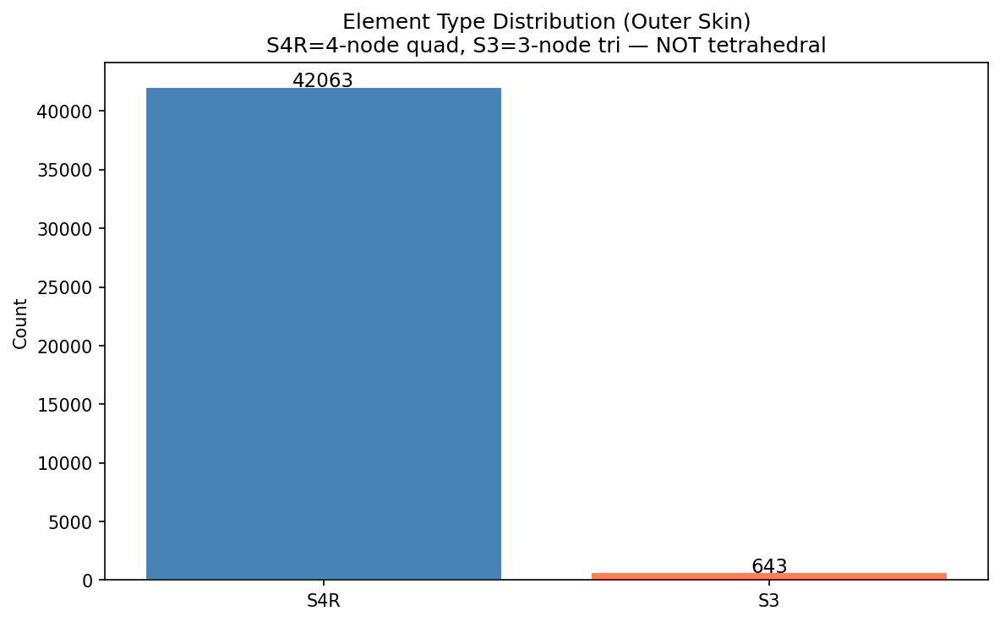
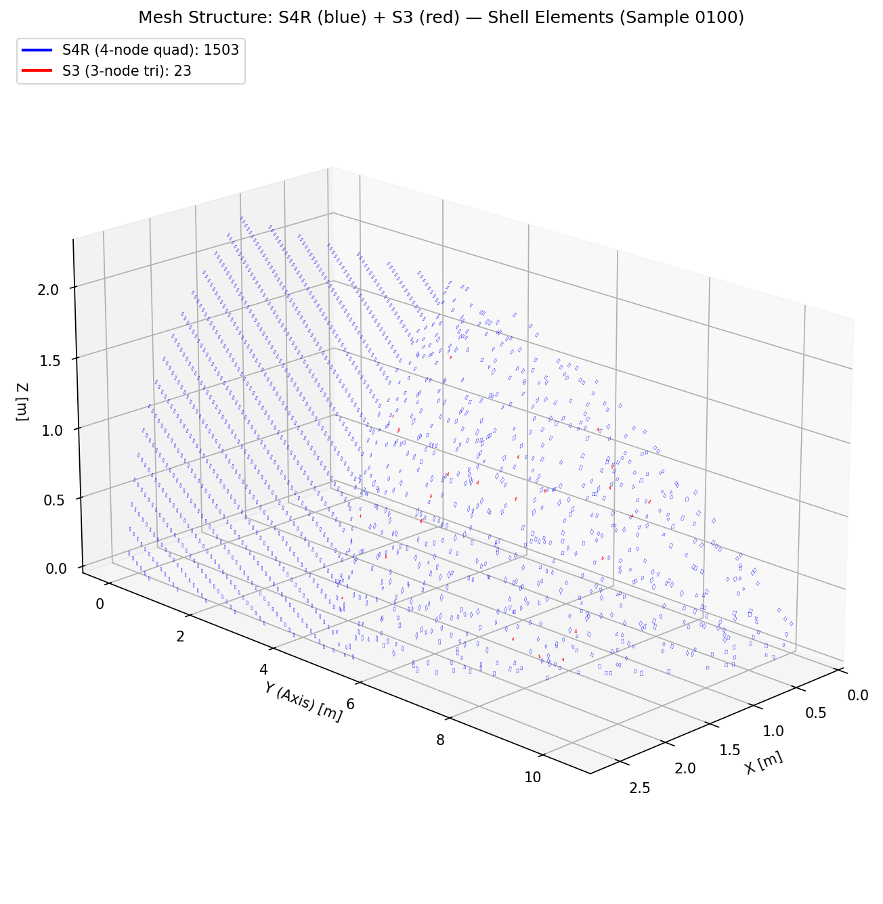
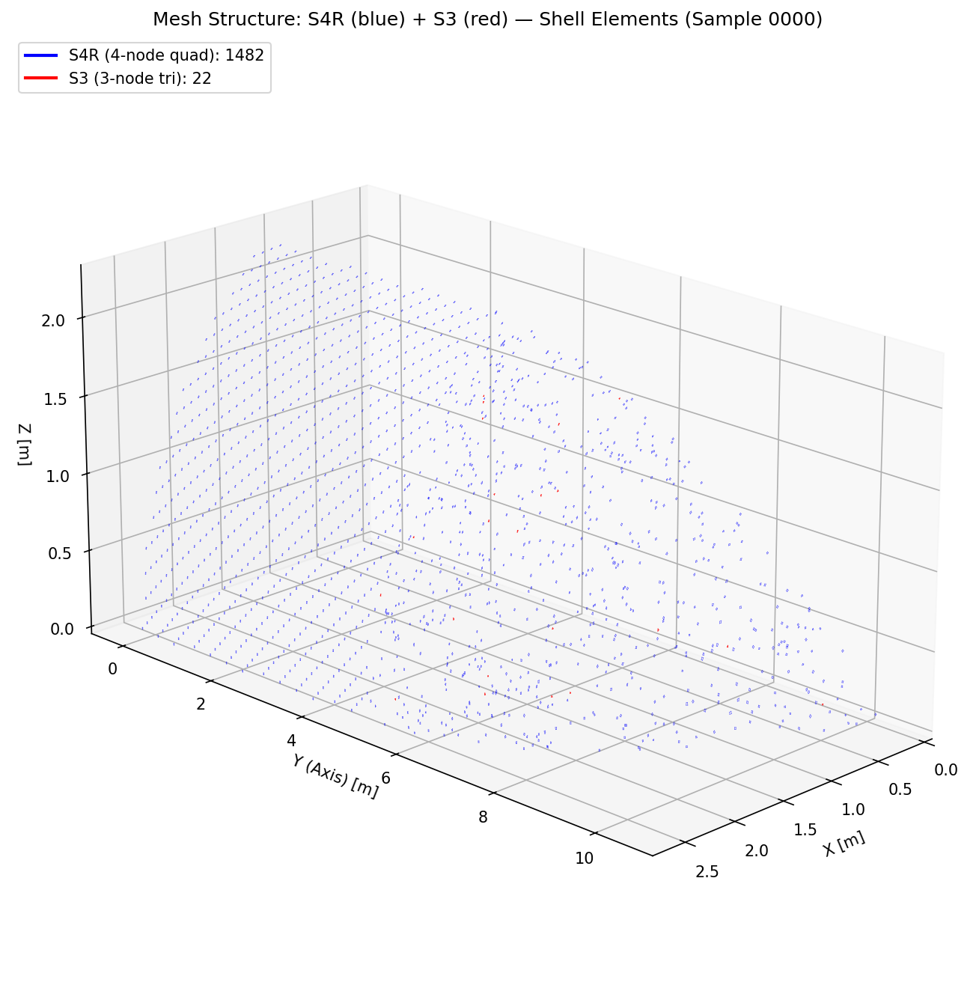
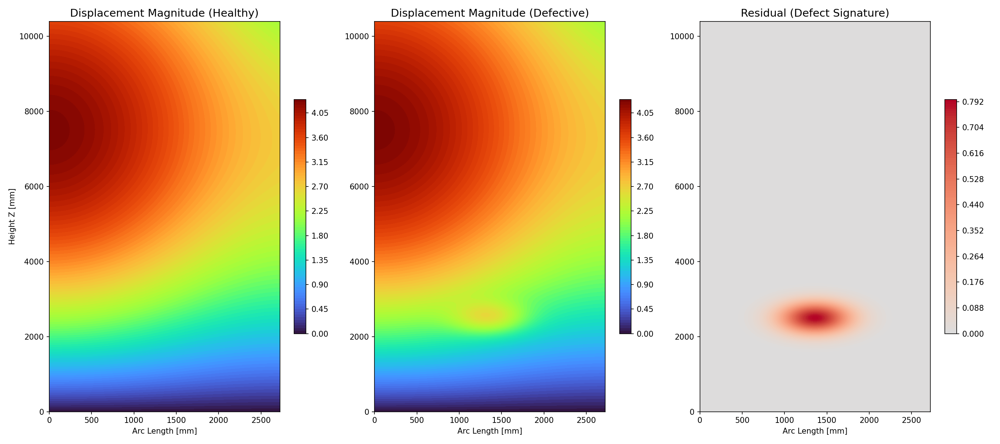
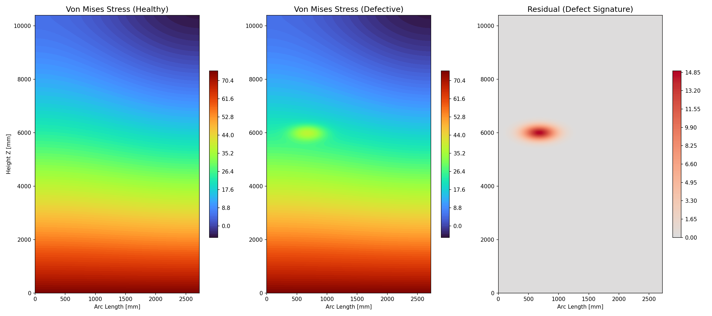
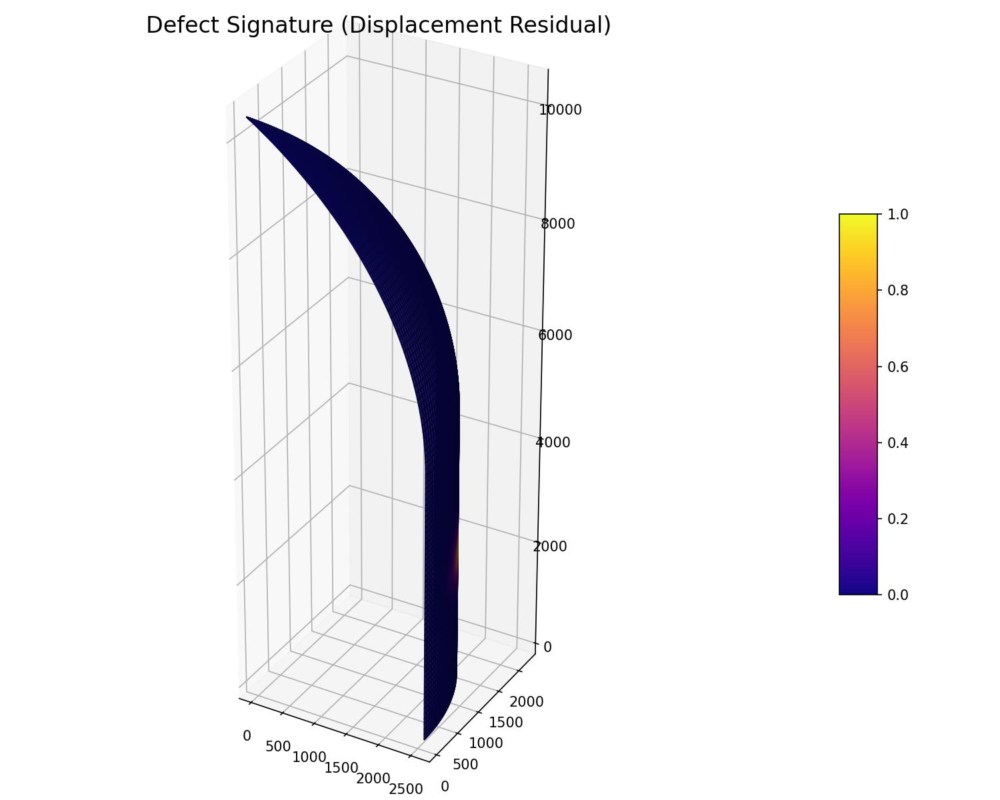

# Mesh and Defect Visualization

This page visualizes the mesh structures used in the simulation and the characteristics of defects.

## Mesh Structures

We use different mesh sizes for convergence analysis and model training.

### 25mm Mesh (Standard Coarse)
Used for large-scale dataset generation (training data).
- **Approx. Nodes**: ~43,000
- **Element Type**: S4R (Quadrilateral) + S3 (Triangular)
- **Usage**: Main training dataset for GNNs.

### 12mm Mesh (Fine)
Used for high-fidelity validation and convergence checks.
- **Approx. Nodes**: ~194,000
- **Usage**: Validation baseline, high-frequency defect resolution.

### 10mm Mesh (Ultra-Fine)
Used for extreme convergence testing.
- **Status**: Data generation pending / In progress.
- **Target Nodes**: ~280,000+

## Defect Characteristics

We simulate debonding defects (separation between face sheet and core) using Gaussian perturbations in the displacement/stress fields.

### Defect Signatures
Visual comparison of Healthy vs. Defective states.

#### Displacement Magnitude
Defects cause local bulging (increased displacement) under internal pressure.

#### Von Mises Stress
Defects cause stress concentrations at the edges of the debonded area.

### 3D Defect Visualization
A 3D view of the defect signature (residual displacement).

