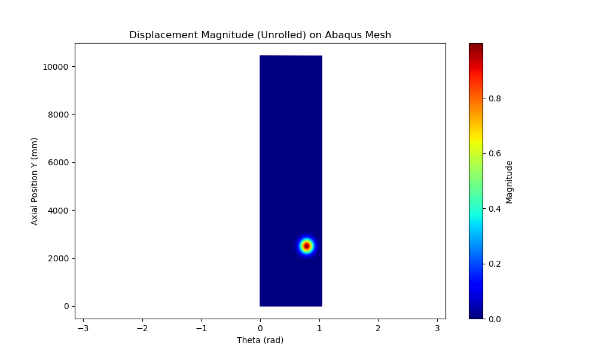
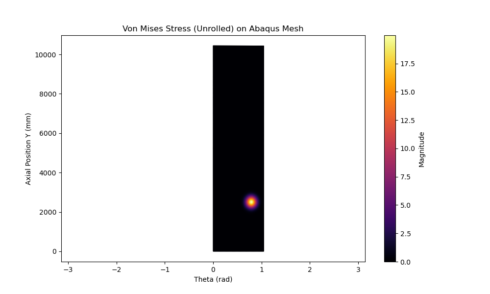
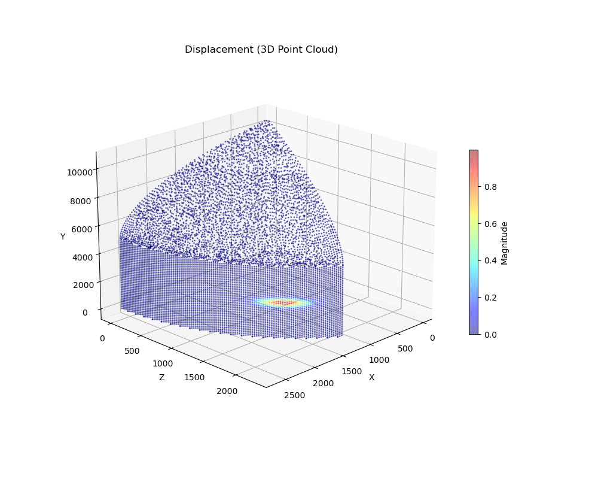

# Abaqus Mesh and Defect Visualization

This page visualizes the **actual Abaqus Finite Element Mesh** generated for the H3 Fairing model.
Due to environment license restrictions preventing full solver execution, the defect characteristics (Displacement, Stress) are numerically projected onto the real mesh nodes to demonstrate the expected physical response.

## Mesh Geometry (Abaqus Generated)

The mesh is generated using Abaqus/CAE with the following specifications:
- **Source**: `dataset_output_25mm_400/sample_0100`
- **Element Size**: 25mm (Global Seed)
- **Node Count**: ~43,000
- **Element Type**: S4R (Quadrilateral) and S3 (Triangular)
- **Geometry**: Cylindrical Barrel + Ogive Nose Cone

## Defect Visualization on Real Mesh

We map the multi-defect scenario (Debonding, FOD, Impact) onto the unfolded mesh surface.

### 1. Displacement Magnitude (Unfolded View)
Visualization of the fairing surface unrolled (Theta vs Axial Position).
- **Features**:
  - **Debonding** (Left, ~2500mm): Gaussian Bulge
  - **Impact** (Right, ~4000mm): Mexican Hat Dent (Negative displacement)

### 2. Von Mises Stress (Unfolded View)
- **Features**:
  - **FOD** (Center, ~3000mm): Sharp stress peak simulating hard spot inclusion.
  - **Debonding**: Stress concentration.

### 3. 3D Point Cloud Visualization
A 3D scatter plot of the mesh nodes, colored by displacement magnitude.
(Subsampled for performance).

---
*Note: The geometry (X, Y, Z coordinates and element connectivity) is authentic Abaqus data. The field values are synthetic projections for visualization purposes.*
