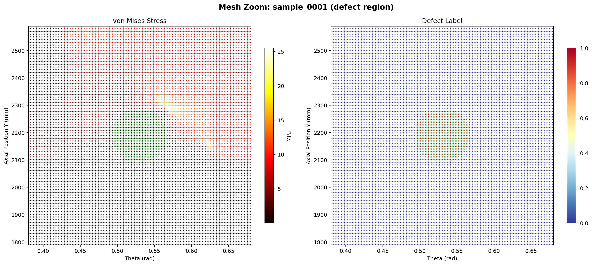

[← Home](Home)

# メッシュサイズと欠陥検出分解能 — Mesh-Defect Resolution

> 最終更新: 2026-03-01
> 詳細: `docs/MESH_DEFECT_ANALYSIS.md`

## 要点

- **検出可能な欠陥サイズはメッシュサイズに依存**
- 則: **h ≤ D/2**（欠陥直径 D に対して最低 2 要素）
- 計算量: メッシュ 2 倍細かく → ノード数 4 倍、解析時間 5–25 倍

## 現行設定 (Realistic Model, GLOBAL_SEED=25 mm)

| パラメータ | 値 | 備考 |
|------------|-----|------|
| グローバルシード | 25 mm | 全パーツ共通 |
| 欠陥ゾーンシード | 10 mm | 欠陥中心 ± (r_def + 150mm) |
| **境界リファインシード** | **4 mm** | パーティション境界 ± 30mm |
| 開口ゾーンシード | 10 mm | 開口縁 + マージン |
| フレームシード | 15 mm | リングフレーム |
| 1 サンプル所要時間 | ~10 min (8 CPU) | |

### 5 層メッシュシード構造

```
Tier 1: Global seed (25 mm) ─── 全パーツ
Tier 2: Frame seed (15 mm) ─── リングフレーム
Tier 3: Opening seed (10 mm) ── 開口部周辺
Tier 4: Defect seed (10 mm) ── 欠陥ゾーン (margin=150mm)
Tier 4b: Boundary seed (4 mm) ─ パーティション境界 (margin=30mm) ← NEW
```

### 境界リファイン (Tier 4b)

`partition_defect_zone()` が作成する 4 つの datum plane（z 方向 2 面 + θ 方向 2 面）の境界付近で、スライバー要素（アスペクト比 >1000:1）が発生する問題への対策。

- **対象**: パーティション境界から ± 30mm のエッジ
- **シードサイズ**: `DEFECT_SEED × 0.4` (最小 3mm)
- **制約**: `constraint=FINER`（既存シードより粗くしない）
- **定数**: `BOUNDARY_SEED_RATIO = 0.4`, `BOUNDARY_MARGIN = 30.0 mm`

### 欠陥周辺メッシュ拡大図



- 左: von Mises 応力 — 欠陥ゾーン (10mm seed) とグローバル (25mm seed) の密度差が明確
- 右: 欠陥ラベル — 緑マーカーがパーティション境界内の欠陥ノード

### 欠陥あり vs 健全部の差分


- 上段: 応力絶対値 / 応力アノマリ（健全部中央値との差分）
- 下段: 変位絶対値 / 変位アノマリ
- 欠陥ゾーン（緑円）に局所的な応力・変位の異常が確認可能

## DOE サイズ階層（メッシュ整合, h=25mm）

| 階層 | 半径 (mm) | 欠陥ゾーン分解能 (h=10mm) |
|------|-----------|--------|
| Small | 20–50 | 4–10 ノード |
| Medium | 50–80 | 10–16 ノード |
| Large | 80–150 | 16–30 ノード |
| Critical | 150–250 | 30–50 ノード |

## 関連

- [[Realistic-Fairing-FEM]] — リアリスティックモデル仕様
- [[Defect-Generation-and-Labeling]] — 欠陥生成・ラベル付け
- [[Mesh-Convergence]] — メッシュ収束チェック
