[← Home](Home)

# 論文用図表 — GNN-SHM 欠陥検出結果

> **モデル**: 5-Fold GAT Ensemble (Focal Loss, Defect-Centric Sampler)
> **データ**: S12 CZM Thermal 200 (1/12 Sector, N=200, 34-dim node features)
> **Best Sample F1**: 0.971 (Sample 0, 346 defect nodes)

---

## Quick Navigation

| カテゴリ | 図表 |
|---------|------|
| **A. パイプライン・データ** | [P1 パイプライン](#p1-パイプライン全体図) · [P6 データセット概要](#p6-データセット概要) · [P7 グラフ構造](#p7-グラフ構造) · [P8 FEM物理場比較](#p8-fem物理場比較) |
| **B. 欠陥検出結果** | [A ショーケース](#a-欠陥検出ショーケース) · [J 最良検出詳細](#j-最良検出結果の詳細) · [B クローズアップ](#b-欠陥領域クローズアップ) · [C 3Dフェアリング](#c-3dフェアリング表示) · [H サンプル別F1](#h-サンプルごとのf1スコア) |
| **C. 性能評価** | [K サイズ vs 性能](#k-欠陥サイズ-vs-検出性能) · [G 局在化精度](#g-局在化精度) · [I エラー解析](#i-エラー解析) · [E P(defect)分布](#e-pdefect分布) · [P5 閾値感度](#p5-閾値感度曲線) · [P10 キャリブレーション](#p10-キャリブレーション曲線) |
| **D. モデル解釈性** | [P2 Attention](#p2-gat-attention-weight) · [P3 t-SNE](#p3-t-sne-潜在空間) · [P4 特徴量重要度](#p4-特徴量重要度) · [F 物理場](#f-物理場可視化) |
| **E. 不確実性定量化** | [D アンサンブル合意度](#d-アンサンブル不確実性合意度) |
| **F. 学習・チューニング** | [1 学習曲線](#1-学習曲線) · [2 γ感度](#2-focal-loss-γ感度分析) · [3 CV Box Plot](#3-5-fold-cv-box-plot) · [4 混同行列](#4-混同行列) · [6 ROC](#6-roc曲線) · [P9 モデル比較](#p9-モデル構成比較) |

---

# A. パイプライン・データ

## P1. パイプライン全体図

Abaqus FEM → ODB/CSV抽出 → グラフ構築 → GNN学習・推論 の全体フロー。

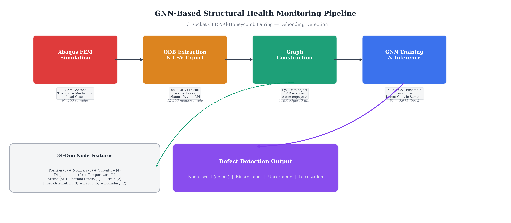

- 34次元ノード特徴量の構成内訳を表示
- 出力: Node-level P(defect)、Binary Label、Uncertainty、Localization

---

## P6. データセット概要

200サンプルの欠陥サイズ・位置分布とクラス不均衡の可視化。

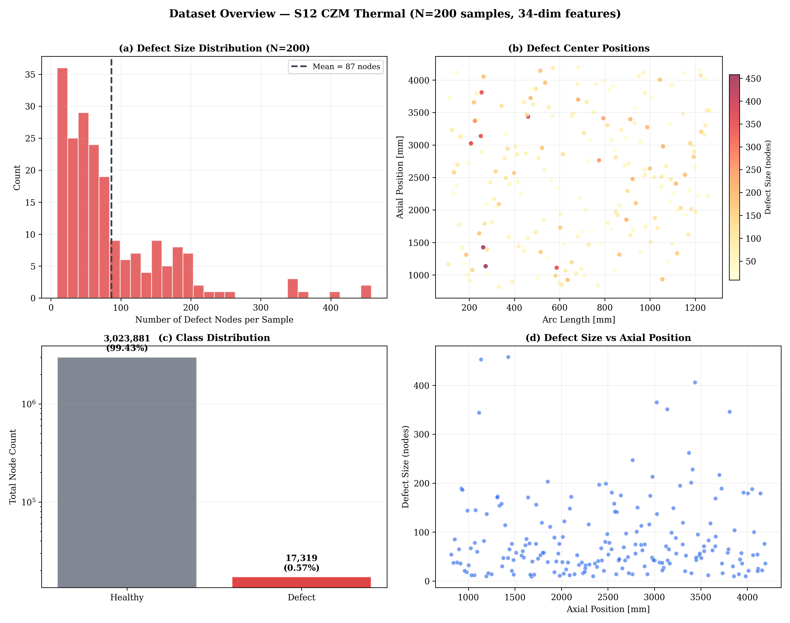

- **(a)**: 欠陥サイズ分布（平均87ノード）
- **(b)**: 欠陥中心位置の空間分布（セクター全体に均一）
- **(c)**: クラス不均衡（健全99.43% vs 欠陥0.57%）
- **(d)**: 軸方向位置と欠陥サイズの関係

---

## P7. グラフ構造

FEMメッシュ(S4R)からPyGグラフへの変換過程。3段階ズームで構造を表示。

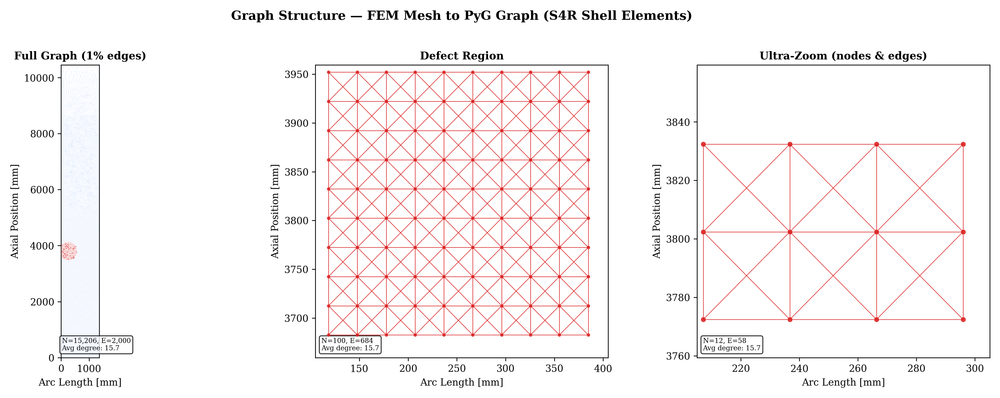

- 全体図（15,206ノード、119Kエッジ）
- 欠陥領域ズーム（赤=欠陥関連エッジ）
- ウルトラズーム（個別ノードとエッジ接続）

---

## P8. FEM物理場比較

欠陥サイズの異なる2サンプルのVon Mises応力・温度・変位場を比較。

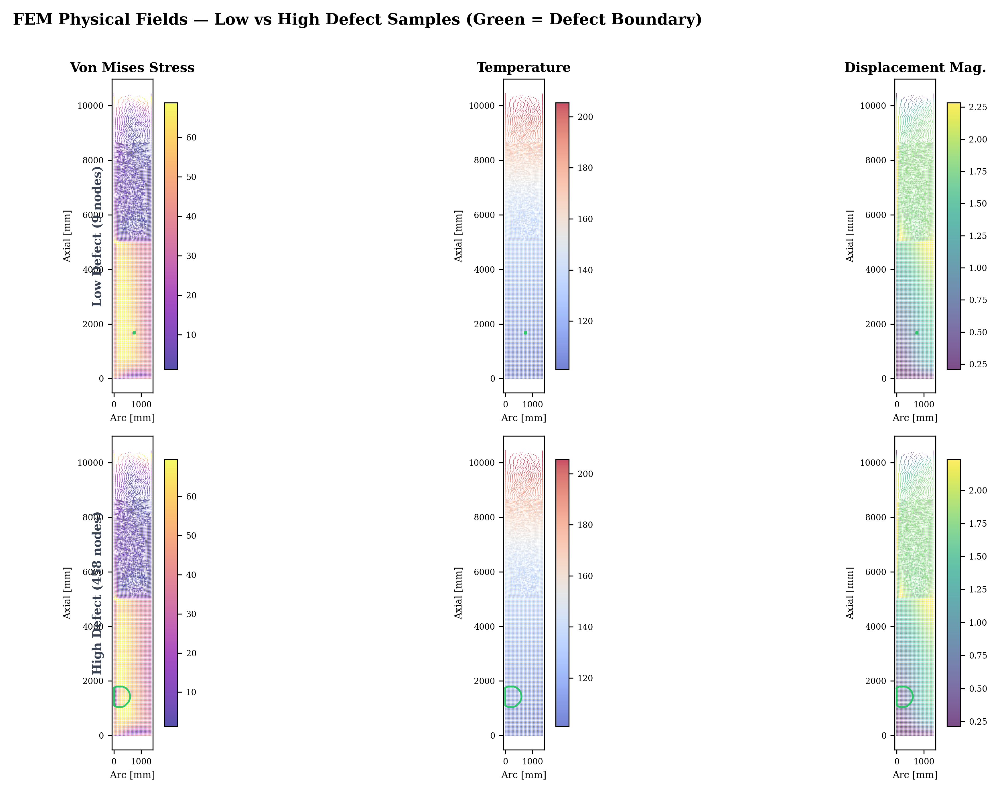

- 上段: 欠陥が少ないサンプル
- 下段: 欠陥が多いサンプル
- 緑線: 欠陥領域境界（ConvexHull）

---

# B. 欠陥検出結果

## A. 欠陥検出ショーケース

3つの代表的なサンプル（大型・中型・小型欠陥）について、Ground Truth → P(defect) → Binary Prediction → Error Analysis を並列表示。

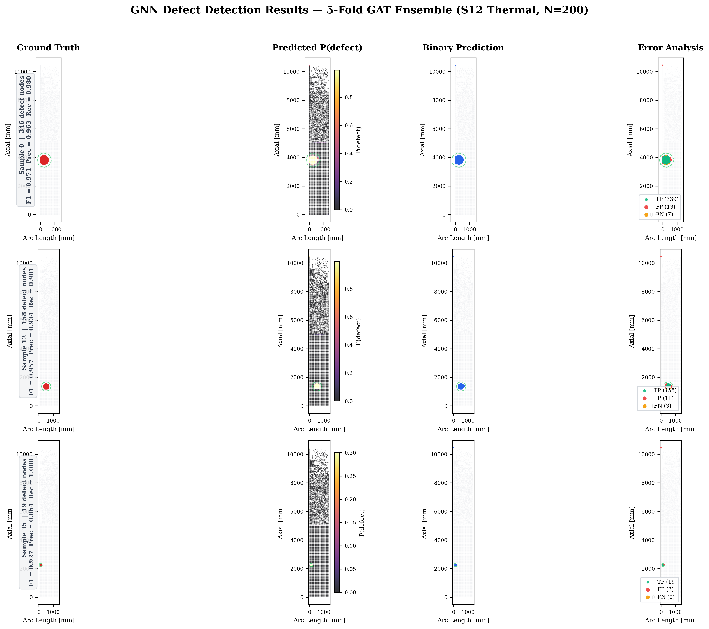

- **大型欠陥** (346 nodes): F1 = 0.971, Precision = 0.963, Recall = 0.980
- **中型欠陥** (158 nodes): F1 = 0.957, Precision = 0.934, Recall = 0.981
- **小型欠陥** (21 nodes): F1 = 0.955, Precision = 0.913, Recall = 1.000

---

## J. 最良検出結果の詳細

最高精度サンプル（F1=0.971）について、全体像とズーム領域を6パネルで表示。
上段：全体図（GT / P(defect) / Uncertainty）、下段：欠陥領域ズーム。

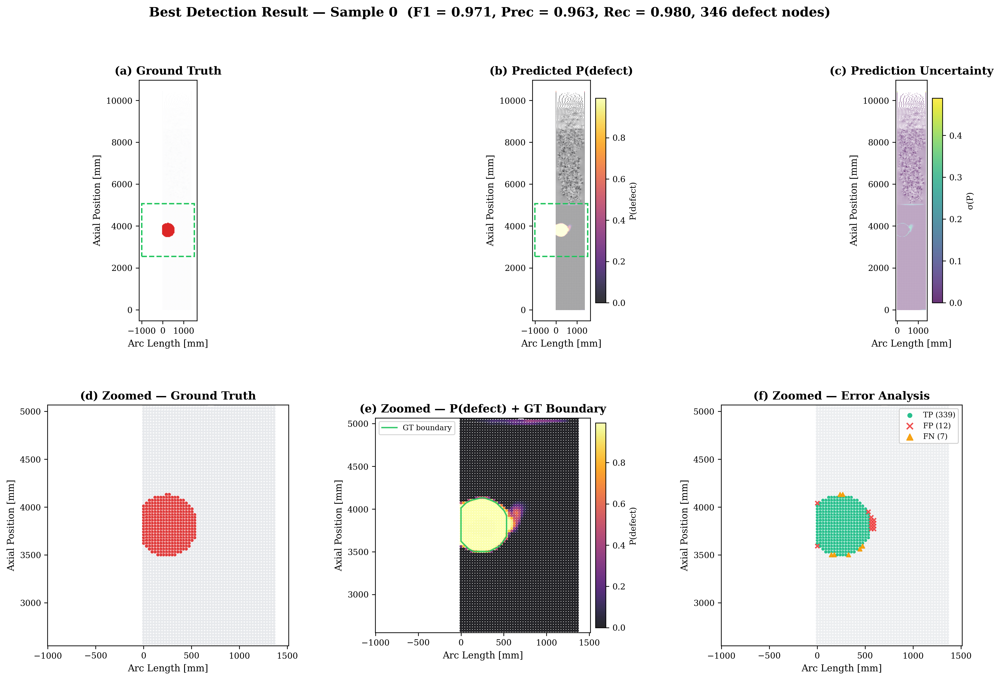

- 緑の破線矩形がズーム領域
- 下段(e): GT境界線（凸包）とP(defect)のオーバーレイ
- 下段(f): TP/FP/FN の空間分布

---

## B. 欠陥領域クローズアップ

欠陥部分の拡大図。GT境界線（ConvexHull）とP(defect)ヒートマップのオーバーレイ。

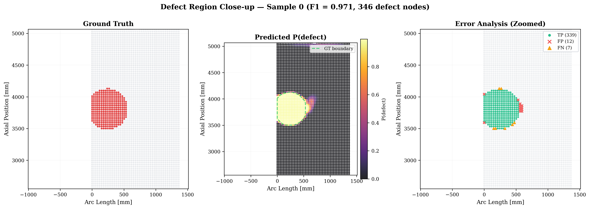

---

## C. 3Dフェアリング表示

1/12セクター円筒シェル上での欠陥分布を3次元で可視化。実寸比（`set_box_aspect`）で描画。

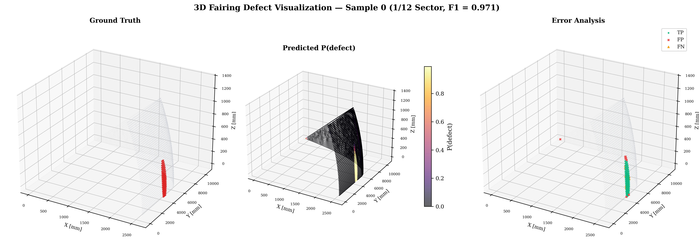

### 視野角バリエーション

<table>
<tr>
<th>View A: 斜め (elev=20, azim=-65)</th>
<th>View B: 側面 (elev=10, azim=-80)</th>
<th>View C: 俯瞰 (elev=35, azim=-45)</th>
</tr>
<tr>
<td>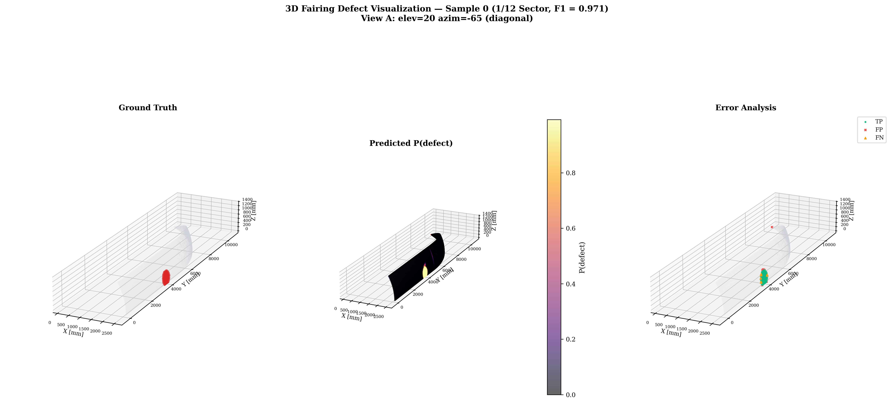</td>
<td>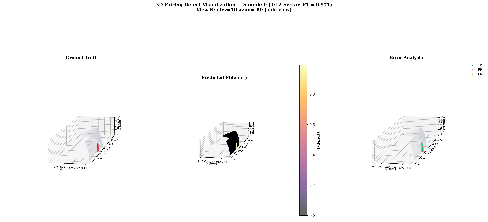</td>
<td>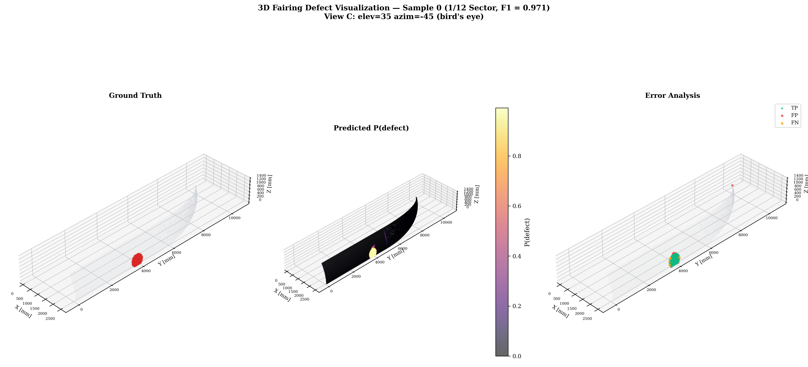</td>
</tr>
</table>

---

## H. サンプルごとのF1スコア

全40バリデーションサンプルのF1スコアを降順で表示。

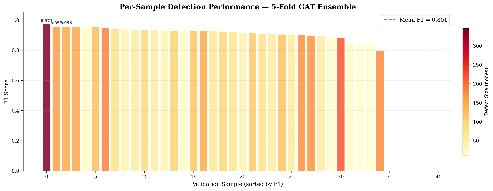

- Top-3: F1 = 0.971, 0.957, 0.956
- Mean F1 = 0.801（F1=0のサンプル含む）
- 色は欠陥サイズ（ノード数）を表す

---

# C. 性能評価

## K. 欠陥サイズ vs 検出性能

欠陥のサイズ（ノード数）と検出性能（F1/Precision/Recall）の関係。

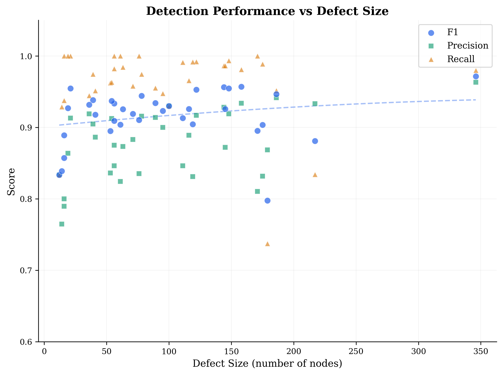

- 大型欠陥ほど検出しやすい傾向（F1上昇トレンド）
- 小型欠陥（<30ノード）でもF1 > 0.83を達成

---

## G. 局在化精度

欠陥の位置特定精度（重心間距離）の評価。

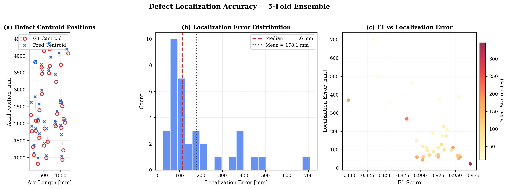

- **(a)**: GT vs 予測の重心位置
- **(b)**: 局在化誤差のヒストグラム（中央値 111.6 mm）
- **(c)**: F1スコアと局在化誤差の関係（欠陥サイズで色分け）

---

## I. エラー解析

全バリデーションサンプルを集約したFP/FNの空間分布と分類結果の内訳。

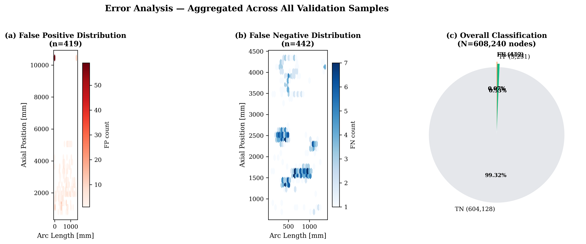

- **FP** (419ノード): フェアリング上下端に集中傾向
- **FN** (442ノード): 欠陥境界付近に散在
- **全体精度**: TN 99.32%、TP 0.54%、FP 0.07%、FN 0.07%

---

## E. P(defect)分布

全バリデーションサンプルのノードのP(defect)ヒストグラム。健全ノードと欠陥ノードの分離度を示す。

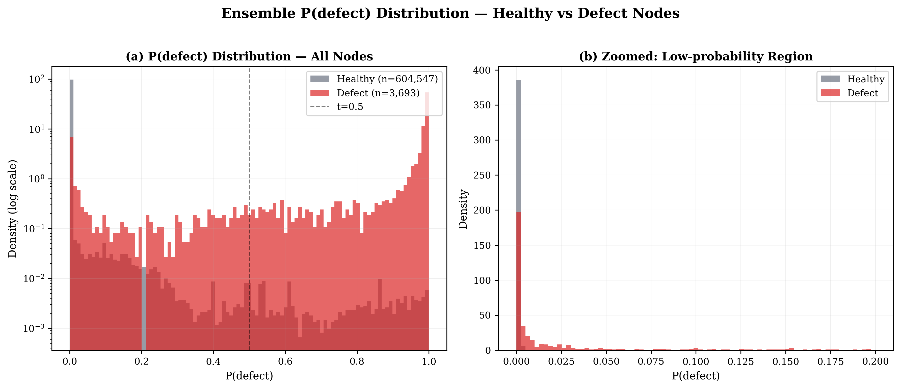

- 健全ノード: P(defect) ≈ 0 に集中（604,547ノード）
- 欠陥ノード: P(defect) > 0.5 に分布（3,693ノード）
- 明確な分離が達成されている

---

## P5. 閾値感度曲線

分類閾値 t を連続的にスイープした際のF1/Precision/Recallの変化。

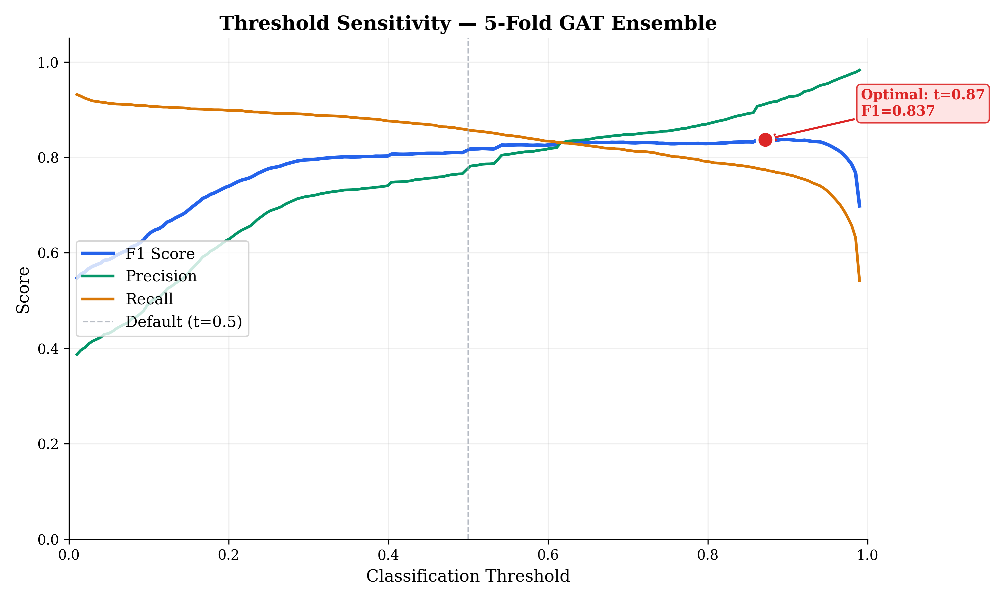

- 最適閾値: t=0.87 で F1=0.837
- Recall重視なら低い閾値（t=0.3付近）でRecall>0.95

---

## P10. キャリブレーション曲線

予測確率の信頼度キャリブレーション（Reliability diagram）。

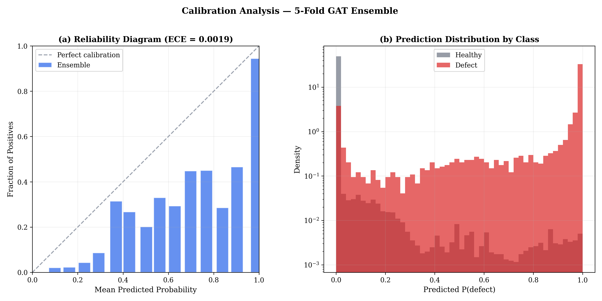

- **ECE = 0.0019** — 非常に良好なキャリブレーション
- 健全ノードはP≈0、欠陥ノードはP≈1に集中

---

# D. モデル解釈性

## P2. GAT Attention Weight

GATの最終層のattention weightを抽出・可視化。モデルがどのノード/エッジに注目しているかを示す。

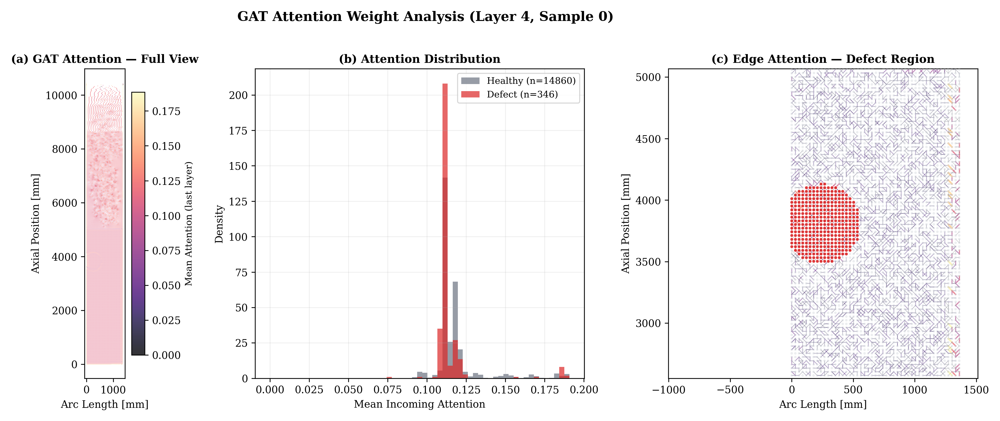

- **(a)**: 全体のattentionヒートマップ — 欠陥付近で高い注目度
- **(b)**: 健全/欠陥ノードのattention分布比較
- **(c)**: 欠陥領域のエッジ別attention（線の太さ・色）

---

## P3. t-SNE 潜在空間

GNN最終層の埋め込みをt-SNEで2次元に射影。健全/欠陥ノードの分離を可視化。

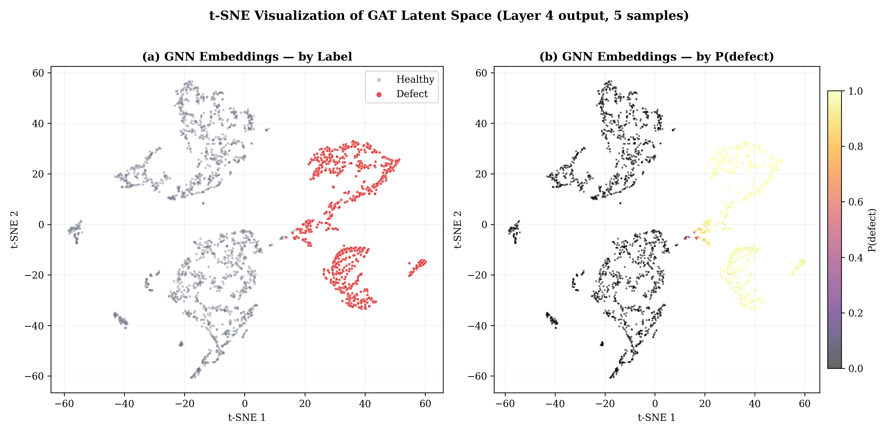

- **(a)**: ラベルで色分け — 欠陥ノードが明確にクラスタ化
- **(b)**: P(defect)で色分け — 潜在空間上で連続的な確率勾配

---

## P4. 特徴量重要度

Gradient-basedの特徴量重要度。34次元の各特徴が欠陥検出にどれだけ寄与しているか。

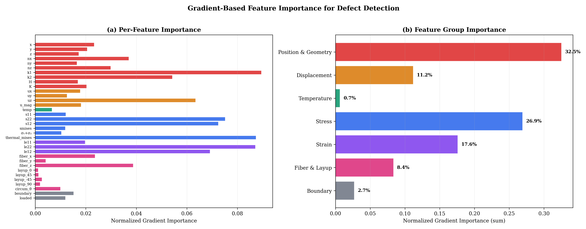

- **Position & Geometry** (32.5%): 位置と曲率が最重要
- **Stress** (26.9%): 応力場の変化が欠陥検出に大きく寄与
- **Strain** (17.6%): ひずみ場も重要な手がかり
- **Temperature** (0.7%): 温度単体の寄与は小さい

---

## F. 物理場可視化

フェアリング表面のVon Mises応力・温度・変位分布。欠陥境界を緑線で表示。

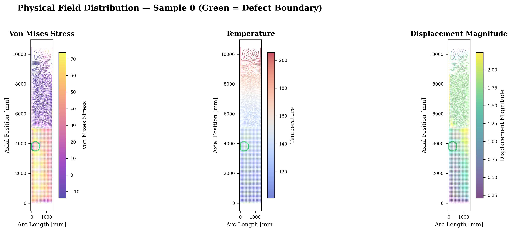

- 欠陥部とその周辺で応力集中が確認される
- GNNがこれらの物理量パターンから欠陥を学習していることを示唆

---

# E. 不確実性定量化

## D. アンサンブル不確実性・合意度

5モデルの予測の一致度と不確実性（分散）を可視化。

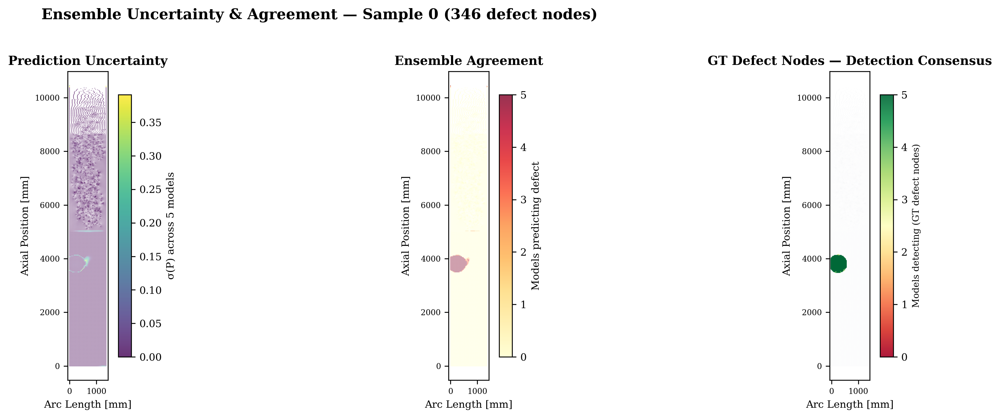

- **(a)**: 予測不確実性 σ(P) — 欠陥境界付近で高い
- **(b)**: 合意度（何モデルが defect と予測したか）
- **(c)**: GT欠陥ノードの検出コンセンサス

---

# F. 学習・チューニング

## 1. 学習曲線

5-Fold CVの学習曲線（Val Loss, Val F1）。


---

## 2. Focal Loss γ感度分析


---

## 3. 5-Fold CV Box Plot


---

## 4. 混同行列


---

## 6. ROC曲線


---

## P9. モデル構成比較

Focal Lossのγ値、5-Foldアンサンブル、Train/Valギャップの分析。

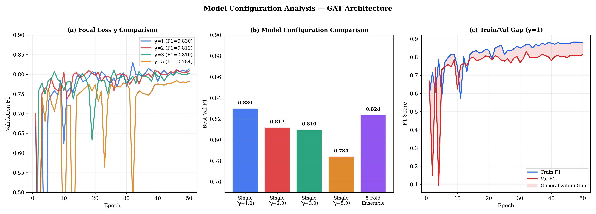

- **(a)**: γ=1.0が最高F1=0.830
- **(b)**: 5-Fold Ensembleの効果（F1=0.824）
- **(c)**: 過学習の程度（Train-Valギャップ）

---

## スクリプト

```bash
# 欠陥検出可視化（Fig A-K、11枚）
python scripts/generate_paper_visualizations.py --out_dir wiki_repo/images/paper

# パイプライン・解釈性・FEM（Fig P1-P10、10枚）
python scripts/generate_paper_figures_v2.py --out_dir wiki_repo/images/paper

# 学習結果可視化（Fig 1-6、6枚）
python scripts/generate_paper_figures.py --out_dir wiki_repo/images/training

# 特定の図のみ生成
python scripts/generate_paper_visualizations.py --fig A B J
python scripts/generate_paper_figures_v2.py --fig P1 P4 P5
```
