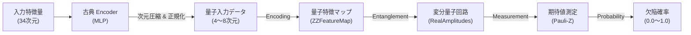

# 量子機械学習 (QML) モデル: 欠陥検出への応用

> 本ドキュメントは、現在開発・実験中の **ハイブリッド量子古典ニューラルネットワーク (Hybrid Quantum-Classical Neural Network)** について、その仕組みと実装詳細を解説します。

## 1. なぜ量子機械学習 (QML) なのか？

従来の深層学習（ディープラーニング）は強力ですが、フェアリングのような複雑な物理現象を含むデータに対して、さらなる性能向上や新たな視点での解析が求められています。

量子コンピュータを活用した機械学習 (QML) には、以下の潜在的なメリットがあります。

1.  **高い表現力 (Expressibility)**: 量子もつれ（Entanglement）や重ね合わせを利用することで、古典的なニューラルネットワークでは捉えにくい複雑なデータの相関やパターンを学習できる可能性があります（量子カーネル法的な視点）。
2.  **パラメータ効率**: 比較的少ないパラメータ数で複雑な関数を近似できることが理論的に示唆されています。
3.  **将来の拡張性**: 将来的には、量子センシングデータ（量子状態そのもの）を直接入力したり、組合せ最適化問題（QAOA）と連携させたりする道が開けます。

---

## 2. モデルアーキテクチャ: ハイブリッド構成

現在の量子コンピュータ（NISQデバイス）は、扱える量子ビット数や回路の深さに制限があります。そこで、**古典コンピュータと量子コンピュータの良いとこ取り** をする「ハイブリッド構成」を採用しています。

### データフロー図



### 各コンポーネントの役割

#### (1) 古典 Encoder (Classical Neural Network)
*   **役割**: 34次元の物理特徴量（応力、変位、温度など）を、量子回路に入力できるサイズ（例：4量子ビット）に圧縮します。
*   **構成**: `Linear` → `ReLU` → `Linear` → `Tanh`
*   **重要ポイント**: 量子回路への入力は $[-\pi, \pi]$ の範囲（角度）に収める必要があるため、最終層に `Tanh` 活性化関数とスケーリング係数（$\times \pi$）を使用しています。

#### (2) 量子特徴マップ (Quantum Feature Map)
*   **手法**: **`ZZFeatureMap`**
*   **役割**: 古典データを量子状態（ヒルベルト空間）にマッピングします。
*   **仕組み**: 入力データ $x$ に応じて回転ゲートを適用し、さらに量子ビット間をもつれさせます（$e^{i(\pi - x)(\pi - y)Z \otimes Z}$ など）。これにより、データ間の非線形な関係を量子状態で表現します。

#### (3) 変分量子回路 (Ansatz / Variational Circuit)
*   **手法**: **`RealAmplitudes`**
*   **役割**: 学習可能なパラメータ $\theta$ を持つ量子回路です。古典ニューラルネットワークの「重み」に相当します。
*   **仕組み**: 回転ゲート $R_y(\theta)$ と CNOT ゲートを層状に重ねることで、量子状態を操作し、目的の分類ができるように学習します。
*   **特徴**: ハードウェア効率が高く（実機でも実行しやすい）、表現力も十分にある標準的な回路構成です。

#### (4) 測定 (Measurement)
*   **手法**: Pauli-Z 演算子の期待値 $\langle Z \rangle$
*   **役割**: 量子状態を古典的な数値（確率）に戻します。
*   **解釈**: 測定結果が $+1$ に近ければ「健全 (Healthy)」、$-1$ に近ければ「欠陥 (Defect)」といった具合に判定します（実装ではSoftmax等で確率化）。

---

## 3. 実装の詳細 (`src/models_quantum.py`)

PyTorch と Qiskit を連携させるために、`TorchConnector` を使用しています。これにより、PyTorch の学習ループ（Backpropagation）の中で量子回路のパラメータを更新できます。

```python
# コードのイメージ（簡略化）

class HybridQNN(nn.Module):
    def __init__(self, n_qubits=4):
        super().__init__()
        
        # 1. 古典部: 34次元 → 4次元
        self.encoder = nn.Sequential(
            nn.Linear(34, 16),
            nn.ReLU(),
            nn.Linear(16, n_qubits),
            nn.Tanh() # -1〜1 に正規化
        )
        
        # 2. 量子部: Qiskit回路の構築
        feature_map = ZZFeatureMap(n_qubits, reps=1)
        ansatz = RealAmplitudes(n_qubits, reps=2)
        
        qc = QuantumCircuit(n_qubits)
        qc.compose(feature_map, inplace=True)
        qc.compose(ansatz, inplace=True)
        
        # 3. PyTorchレイヤー化
        self.qnn = TorchConnector(
            EstimatorQNN(
                circuit=qc,
                input_params=feature_map.parameters,
                weight_params=ansatz.parameters,
                input_gradients=True # 勾配計算を有効化
            )
        )

    def forward(self, x):
        x_latent = self.encoder(x) * torch.pi # -π〜π にスケーリング
        return self.qnn(x_latent)
```

## 4. 実験結果

### 4.1 実験設計

2つのアプローチを検証した:

| アプローチ | 入力 | 出力 | 結果 |
|-----------|------|------|------|
| **グラフレベル分類** | GNN → グラフ統計量 → VQC | グラフ全体に欠陥あり/なし | 失敗（信号消失） |
| **ノードレベル分類** | 物理特徴量 → MLP → VQC | 各ノードが欠陥/健全 | 成功 |

### 4.2 グラフレベル分類の失敗原因

`processed_50mm_100` データセット（81 train, 20 val）で検証。全モデルが Val AUC = 0.50 に収束。

**原因**: 欠陥ノードは全体の 0.06%（~7/11,000ノード）であり、グラフレベルの統計量（mean, max, std）で欠陥の有無を区別することは統計的に不可能であった。16次元全特徴について欠陥/健全グラフ間の差異を比較した結果、全特徴で差 < 0.001% と確認。

### 4.3 ノードレベル分類の成功

`processed_s12_czm_thermal_200_binary` データセット（34次元特徴量）で検証。応力・変位・ひずみ等の16次元物理特徴を選択し、ノード単位で分類。

| モデル | パラメータ数 | Val F1 | Val AUC | 速度 |
|-------|----------:|-------:|--------:|-----:|
| **Classical MLP** | 454 | **0.985** | **0.999** | 0.2 s/epoch |
| Quantum VQC (1 epoch 時点) | 352 | 0.521 | 0.786 | 601 s/epoch |

**古典 MLP は43エポックで F1 = 0.985 に到達**。量子 VQC も学習傾向を示し（AUC が 0.786 まで上昇）、量子回路が物理特徴から欠陥信号を学習可能であることを確認。

### 4.4 判明した知見

1. **欠陥ノードは物理特徴で明確に区別可能** — 応力（dim 15-19）、変位（dim 10-13）で健全/欠陥ノード間に大きな差異
2. **グラフレベル分類は0.06%の欠陥比率では不成立** — global pooling で信号が埋没
3. **VQC の backward が律速** — parameter-shift rule により 1サンプルあたり ~0.6秒、3200サンプルで601秒/epoch

---

## 5. 学習と評価

*   **学習方法**: 通常のPyTorchモデルと同じです。損失関数（CrossEntropyなど）を計算し、`optimizer.step()` でパラメータを更新します。
*   **勾配計算**: 量子回路の勾配は「パラメータシフトルール (Parameter Shift Rule)」などの手法を用いて、シミュレータ上で計算されます。
*   **現状の課題**:
    *   **計算コスト**: 量子シミュレーションは計算量が大きく、3200サンプルのノードレベル分類で ~601秒/epochかかる。
    *   **Barren Plateaus**: 回路が深くなりすぎると、勾配が消えて学習が進まなくなる現象。4 qubit / reps=2 では問題なく学習が進行。

## 6. 使い方

```bash
# ノードレベル: 古典 vs 量子の比較（推奨）
python src/train_quantum_node.py --mode stats --epochs 100 --n_defect_per_graph 5

# 古典のみ（高速確認）
python src/train_quantum_node.py --mode classical --epochs 100

# 量子のみ（時間がかかる）
python src/train_quantum_node.py --mode quantum --epochs 100

# グラフレベル（参考: 現データでは未収束）
python src/train_quantum.py --mode both --epochs 100
```

## 7. 今後の展望

*   **VQC 学習の完走**: GPU シミュレータ (cuStateVec) や夜間バッチで100エポック走破 → 古典 MLP との公平な比較
*   **GNN + VQC 統合**: 事前学習済み GNN encoder の特徴量を VQC に入力するハイブリッド構成
*   **実機 (QPU) 検証**: IBM Quantum などの実機でのノイズ耐性評価
*   **量子カーネル法**: SVM + 量子カーネルによるアプローチも検討
