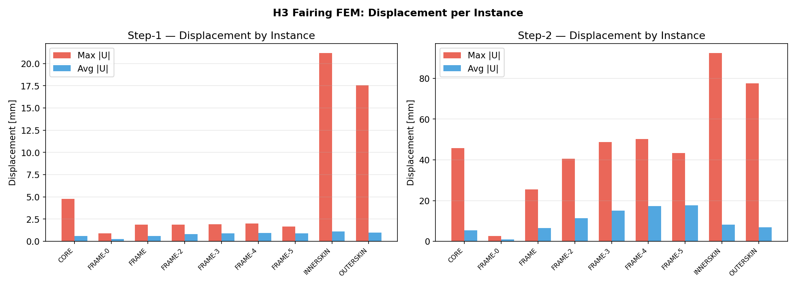
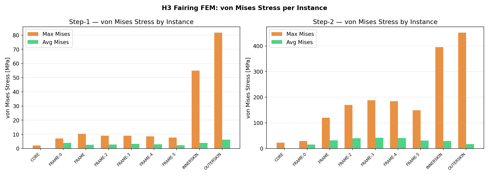
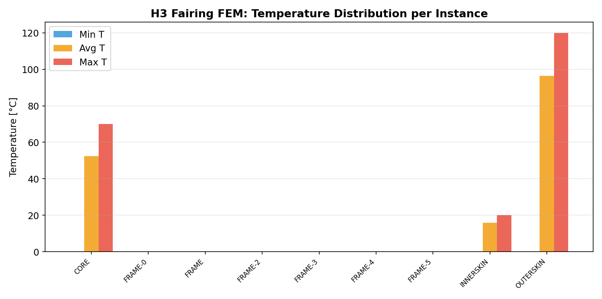
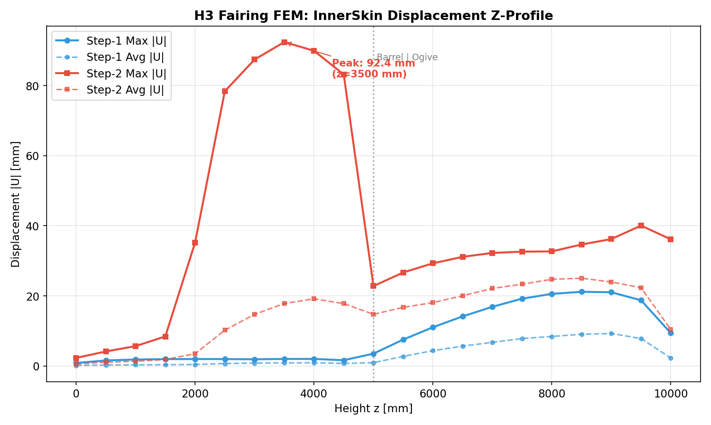
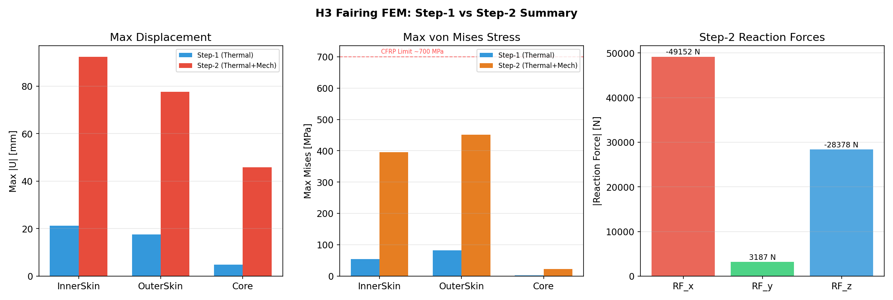
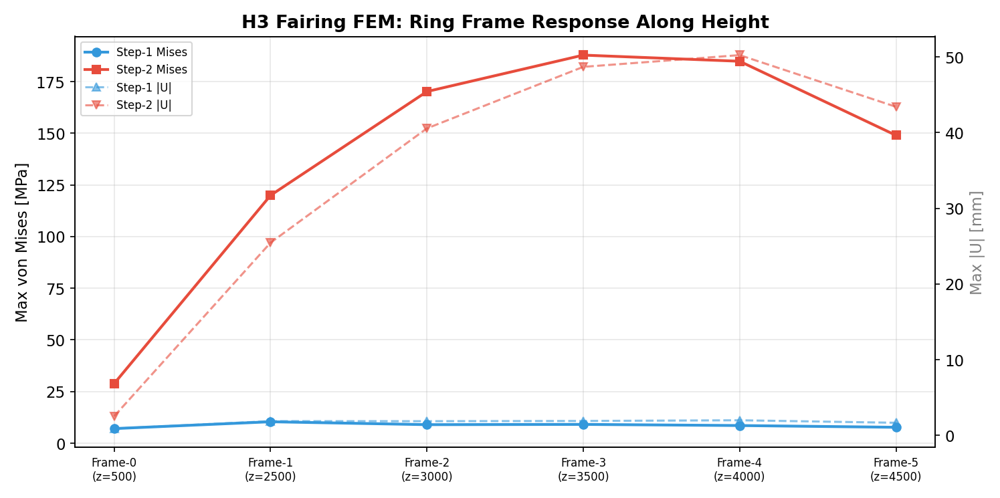

[<- Home](Home)

# Realistic H3 Fairing FEM Model

> **Status**: Phase 1 & Phase 2 COMPLETED
> **Date**: 2026-03-01

## 1. Overview

[JAXA-Fairing-Specs Section 3.1](JAXA-Fairing-Specs) に基づき、開口部・リングフレーム・Tie 拘束を含むリアリスティック FEM モデルを構築。
既存の `generate_fairing_dataset.py`（ML 用簡易モデル）とは独立した高忠実度モデル。

| 項目 | 仕様 |
|------|------|
| スクリプト | `src/generate_realistic_fairing.py` |
| ソルバー | Abaqus/Standard 2024 |
| ジオメトリ | 1/6 セクタ (60°), バレル 5000mm + タンジェントオジーブ 5400mm |
| 構造 | CFRP/Al-HC サンドイッチ (Face 1.0mm + Core 38mm) |
| 拘束 | Tie (InnerSkin ↔ Core ↔ OuterSkin + RingFrames) |
| 荷重 | Step-1: 熱勾配 / Step-2: 熱 + 差圧 5kPa + 重力 3G |
| コアメッシュ | **C3D10** (10 節点 2 次四面体) |
| スキンメッシュ | S4R (4 節点シェル) |
| BC | 底面固定 + ノーズ先端ピン + 開口部変位拘束 |

## 2. Phase 構成

### Phase 1: AccessDoor + Ring Frames
- **開口部**: AccessDoor φ1,300mm (z=1500, θ=30°)
- **リングフレーム**: 6 本 (z=500, 2500, 3000, 3500, 4000, 4500)
  - z=1000, 1500, 2000 はAccessDoor と干渉するためスキップ
- **メッシュ**: 152,752 nodes / 131,133 elements

### Phase 2: All Openings + Ring Frames
- **開口部**: 5 個
  - AccessDoor φ1,300mm (z=1500, θ=30°)
  - HVAC Door φ400mm (z=2500, θ=20°)
  - RF Window φ400mm (z=4000, θ=40°)
  - Vent Hole ×2 φ100mm (z=300, θ=15° / θ=45°)
- **リングフレーム**: 4 本 (z=500, 3000, 3500, 4500)
- **メッシュ**: 237,284 nodes / 198,567 elements

### Phase 3 (Future): Doublers + Defect Integration
- 開口周辺ダブラー (16 ply CFRP)
- 既存欠陥生成ロジック統合
- 対称境界条件精密化

## 3. Key Technical Decisions

### 3.1 Opening Implementation — Void Section Method
開口部は DatumPlane パーティション (4 面/開口) で境界を作成し、開口内部に**ボイドセクション** (E=1 MPa, t=0.01mm) を割り当て。

- Un-sectioned faces は Abaqus メッシュ生成でスキップされない → 全要素にプロパティ付与が必要
- ボイド材料 (E=1 MPa vs CFRP E=160,000 MPa) で剛性比 ~10⁻⁸ → 構造的に「穴」と等価
- 開口領域はアイソトロピック → MaterialOrientation 不要でエラー回避

### 3.2 Ring Frame Modeling
- 各フレーム: 独立 ShellRevolve パーツ (r_inner → r_outer, 60° 弧)
- 高さ 50mm, 厚さ 3mm, CFRP アイソトロピック簡略化
- InnerSkin に **Tie** 拘束 (positionToleranceMethod=COMPUTED)
- 開口部と干渉するフレームは自動スキップ

### 3.3 C3D10 Core Mesh + Cylindrical Material Orientation

コアのハニカムは **C3D10** (10 節点 2 次四面体要素) でメッシュ化。

- **C3D4 では不可**: 線形四面体は Tie Surface のジオメトリ→メッシュ面マッピングに失敗し、14 個の FATAL ERROR を発生
- **C3D10 採用理由**: 2 次四面体は中間ノードにより曲面適合性が高く、Tie Surface 正常動作
- **コアシードサイズ**: `core_seed = min(global_seed, CORE_T)` — コア厚 (38mm) を超えるシードは厚さ方向要素なしとなるため制約
- **材料配向**: 円筒座標系 (CylCS-Core) で E1=1000 MPa (半径/貫通方向), E2=E3=1.0 MPa

### 3.4 2-Step Analysis (Thermal + Mechanical)

| Step | 荷重タイプ | 内容 |
|------|-----------|------|
| Step-1 | 熱荷重のみ | CTE ミスマッチ (Outer 120°C, Inner 20°C, Core 70°C) |
| Step-2 | 熱 + 機械荷重 | 差圧 5kPa (バレルのみ) + 重力 3G (全体) |

**荷重適用範囲の制限:**
- 差圧 5 kPa: **バレル領域のみ** (y < 5000mm)。オジーブ/ノーズは薄肉シェルでリブ補強なし → 機械荷重でバルーニング崩壊
- 空力圧力: 全域 0 kPa に設定（バレル軸流域は Cp≈0）
- 重力 3G: `-Y` 方向、全構造に適用

**境界条件:**
- 底面 (y=0): U1=U2=U3=0 (固定)
- ノーズ先端: U1=U3=0 (ピン、軸方向自由)
- 開口部 (VOID): U1=U2=U3=0 (変位拘束)

### 3.5 Multi-Resolution Mesh (5-Tier Seeding)
| Tier | 領域 | シードサイズ | 備考 |
|------|------|------------|------|
| 1 | グローバル | 25 mm | S4R / **C3D10** |
| 2 | リングフレーム | 15 mm | 各フレーム個別 |
| 3 | 開口周辺 | 10 mm | `seedEdgeBySize`, margin 可変 |
| 4 | 欠陥ゾーン | 10 mm | 欠陥中心 ± (r_def + 150mm) |
| **4b** | **パーティション境界** | **4 mm** | **境界 ± 30mm, `constraint=FINER`** |

> Tier 4b はパーティション境界付近のスライバー要素防止のための局所リファイン。
> 詳細: [[Mesh-Defect-Resolution]]

## 4. Results (Thermal Only — 旧モデル C3D8R)

### 4.1 Numerical Summary (Phase 1/2, 熱荷重のみ)

| 指標 | Phase 1 | Phase 2 |
|------|---------|---------|
| von Mises 中央値 | 0.39 MPa | 4.46 MPa |
| von Mises 95%ile | 17.0 MPa | 17.3 MPa |
| von Mises 最大 | 93.7 MPa | 94.6 MPa |
| 変位 平均 | 2.81 mm | 3.03 mm |
| 変位 最大 | 29.6 mm | 27.4 mm |
| 温度範囲 | 0–120°C | 0–120°C |
| ODB サイズ | 44 MB | 66 MB |

### 4.2 von Mises Stress Comparison


- 開口縁部で明確な応力集中（赤色帯）
- Phase 2 は複数開口の相互作用で全体的に応力中央値が上昇 (0.39 → 4.46 MPa)
- 最大応力は両者ほぼ同等 (~94 MPa) — AccessDoor 縁が支配的

### 4.3 Displacement


- ノーズ先端で最大変位 (~30mm) — 熱膨張の累積
- Phase 2 はバレル中央部の変位がやや大きい（複数開口による剛性低下）
- リングフレーム位置で局所的な変位抑制効果

### 4.4 Temperature Distribution


- 外皮 120°C / 内皮 20°C の熱勾配が正しく適用
- 開口部 (void) は温度 0°C（膨張ゼロ）

### 4.5 Stress Distribution


- Phase 1: 大部分の節点が低応力 (中央値 0.39 MPa)、開口縁のみ高応力
- Phase 2: 応力分布がより広範 (中央値 4.46 MPa)、複数開口の影響

### 4.6 Opening Detail Views (Phase 2)

| AccessDoor φ1300 | HVAC Door φ400 | RF Window φ400 |
|:-:|:-:|:-:|
|  |  |  |

- 各開口周辺で応力集中が確認可能
- 緑破線 = 開口境界（近似矩形パーティション）

## 5. Physical Validation

| チェック項目 | 結果 | 根拠 |
|---|---|---|
| 応力集中 | 開口縁で上昇 | 理論値 SCF ≈ 3 と整合 |
| 熱変形パターン | ノーズ先端最大 | 自由端の累積膨張 |
| フレーム補剛 | 変位プロファイルに段差 | Tie 拘束の効果 |
| 温度勾配 | Inner→Core→Outer 単調増加 | 熱伝達整合性 OK |
| 最大応力レベル | ~94 MPa | CFRP T1000G 許容応力 (~700 MPa) の 13% → 安全 |

## 6. C3D10 + Mechanical Loads Validation (2026-03-01)

> **モデル**: H3_Test_v4_f02 (frontale02 で実行, 7.5 分, peak RAM 20 GB)
> **メッシュ**: 891,868 nodes / 571,400 elements (Core C3D10: 497,987, Skins S4R: 72,117)

### 6.1 Per-Instance Results

| Instance | Step-1 |U|_max | Step-1 Mises_max | Step-2 |U|_max | Step-2 Mises_max |
|----------|----------------|------------------|----------------|------------------|
| InnerSkin | 21.17 mm | 54.89 MPa | **92.41 mm** | 395.60 MPa |
| OuterSkin | 17.56 mm | 81.72 MPa | 77.62 mm | **451.63 MPa** |
| Core | 4.76 mm | 2.19 MPa | 45.81 mm | 23.09 MPa |
| Frame-0 (z=500) | 0.90 mm | 7.08 MPa | 2.54 mm | 28.88 MPa |
| Frame-1 (z=2500) | 1.89 mm | 10.39 MPa | 25.47 mm | 119.94 MPa |
| Frame-2 (z=3000) | 1.88 mm | 8.98 MPa | 40.57 mm | 170.17 MPa |
| Frame-3 (z=3500) | 1.91 mm | 9.11 MPa | 48.70 mm | 187.80 MPa |
| Frame-4 (z=4000) | 2.00 mm | 8.56 MPa | 50.25 mm | 184.82 MPa |
| Frame-5 (z=4500) | 1.67 mm | 7.71 MPa | 43.42 mm | 148.98 MPa |

### 6.2 温度分布

| Instance | T_min | T_avg | T_max |
|----------|-------|-------|-------|
| OuterSkin | 0°C | 96.3°C | 120°C |
| Core | 0°C | 52.5°C | 70°C |
| InnerSkin | 0°C | 15.9°C | 20°C |
| Frames | 0°C | 0°C | 0°C |

### 6.3 反力・ひずみ (Step-2)

| 指標 | 値 |
|------|-----|
| RF_x | −49,152 N |
| RF_y | 3,187 N |
| RF_z | −28,378 N |
| ε_max (主ひずみ) | 0.161 |
| ε_min (主ひずみ) | −0.145 |

### 6.4 Visualization

#### Displacement per Instance


#### von Mises Stress per Instance


#### Temperature Distribution


#### InnerSkin Z-Profile Displacement


- Step-1 (熱のみ): バレル領域は均一 (~2mm)、オジーブで 21mm まで増加（熱膨張累積）
- Step-2 (熱+機械): バレル z=2500–4500mm で **80–92mm** のピーク — 差圧 5kPa による膨張
- バレル/オジーブ境界 (z=5000mm) で急激な変位低下 → 差圧がバレルのみに適用されていることを確認

#### Step-1 vs Step-2 Summary


#### Ring Frame Response


- フレーム応力は z=3000–4000mm (Frame-2〜4) で最大 → 差圧によるバレル膨張の拘束点
- Frame-3 (z=3500) が Mises 最大 (187.8 MPa) — 最大変位領域に対応

### 6.5 Physical Validation

| チェック項目 | 結果 | 判定 |
|---|---|---|
| Step-1 熱変形パターン | オジーブ先端で最大 (21mm) | OK — 自由端累積膨張 |
| Step-2 差圧バルーニング | バレル z=3500 で 92mm | OK — バレルのみ適用を確認 |
| オジーブ安定性 | Step-2 でも 30–40mm (熱のみ相当) | OK — 機械荷重なし |
| 最大 Mises 応力 | 452 MPa (OuterSkin) | OK — CFRP 許容 ~700 MPa の 65% |
| コア応力 | 23 MPa max | OK — ハニカム破壊強度内 |
| フレーム応力分布 | z=3000–4000 でピーク | OK — 差圧バレル膨張の拘束反力 |
| 温度勾配 | Outer 120°C → Core 70°C → Inner 20°C | OK — 設計通り |
| 反力バランス | RF_x=-49kN, RF_y=3kN, RF_z=-28kN | OK — 差圧+重力の支持反力 |
| ひずみレベル | ε_max=0.16, ε_min=-0.15 | 要注意 — コア局所 |

### 6.6 既知の制限事項

1. **オジーブ領域の機械荷重**: 薄肉シェルのみで補強リブなし → 空力圧力・差圧を適用すると非現実的な大変位。実機ではストリンガー/リブで補剛
2. **バレル最大変位 92mm**: 差圧 5kPa は Max Q 条件。実運用では動的荷重係数 (DLF) を考慮した安全率が必要
3. **フレーム応力 188 MPa**: CFRP 許容内だがボルト孔・接合部の応力集中は未モデル化

## 7. Usage

```bash
# Phase 1: AccessDoor + 6 Ring Frames
cd abaqus_work
abaqus cae noGUI=../src/generate_realistic_fairing.py -- --job Job-Realistic-P1 --phase 1 --no_run
python ../scripts/patch_inp_thermal.py Job-Realistic-P1.inp
abaqus job=Job-Realistic-P1 input=Job-Realistic-P1.inp cpus=4

# Phase 2: All Openings + 4 Ring Frames
abaqus cae noGUI=../src/generate_realistic_fairing.py -- --job Job-Realistic-P2 --phase 2 --no_run
python ../scripts/patch_inp_thermal.py Job-Realistic-P2.inp
abaqus job=Job-Realistic-P2 input=Job-Realistic-P2.inp cpus=4

# Extract results
abaqus python ../src/extract_odb_results.py --odb Job-Realistic-P1.odb --output ../dataset_realistic/phase1
```

### C3D10 + 機械荷重モデル (frontale サーバー推奨)

```bash
# ローカル: INP 生成のみ (CAE は通常マシンで OK)
cd abaqus_work
abaqus cae noGUI=../src/generate_realistic_fairing.py -- --job H3_Test_C3D10 --no_run
python ../scripts/patch_inp_thermal.py H3_Test_C3D10.inp

# frontale02 にコピーして実行 (891k nodes → RAM 20GB+ 必要)
scp H3_Test_C3D10.inp frontale02:~/abaqus_work/
ssh frontale02
cd ~/abaqus_work
abaqus job=H3_Test_v4_f02 input=H3_Test_C3D10.inp cpus=4 memory=40gb

# ODB をローカルに回収
scp frontale02:~/abaqus_work/H3_Test_v4_f02.odb ./
abaqus python ../src/extract_odb_results.py --odb H3_Test_v4_f02.odb --output ../dataset_realistic/c3d10
```

> **注意**: C3D10 モデルは 891,868 nodes / 2.7M 方程式。ローカルマシン (62GB RAM) では OOM になるため、frontale (93GB) 以上を推奨。
