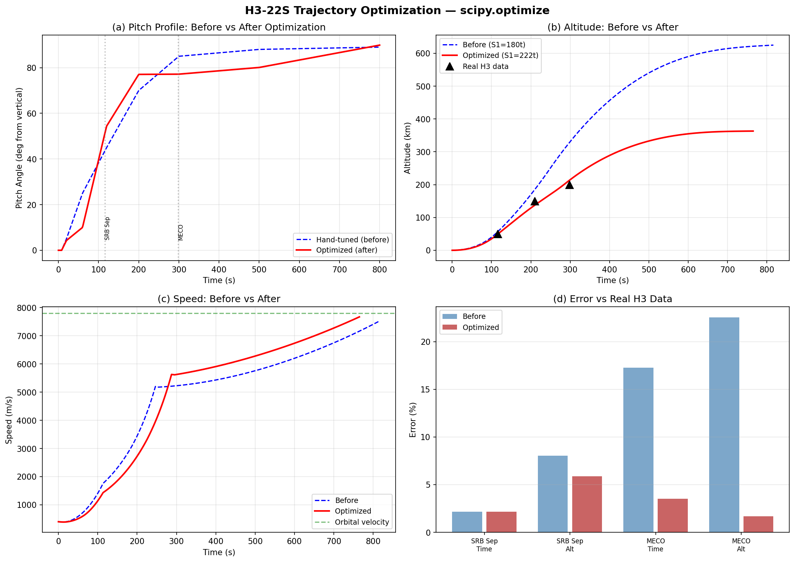
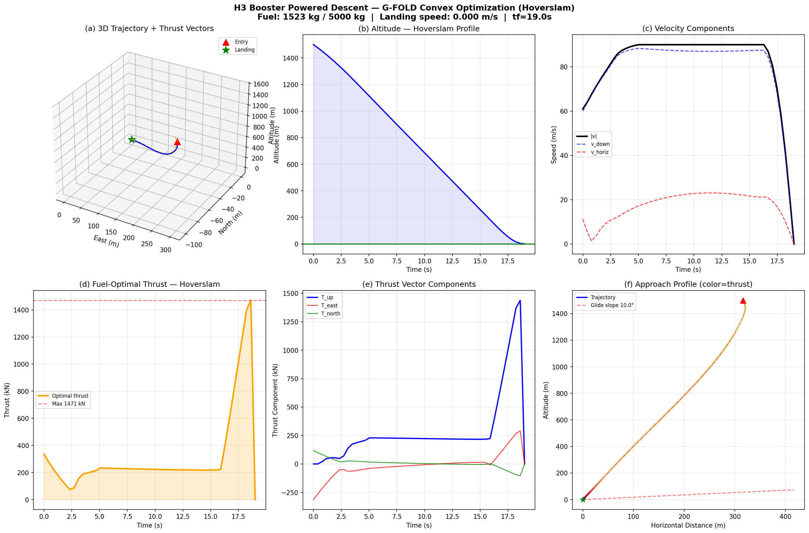
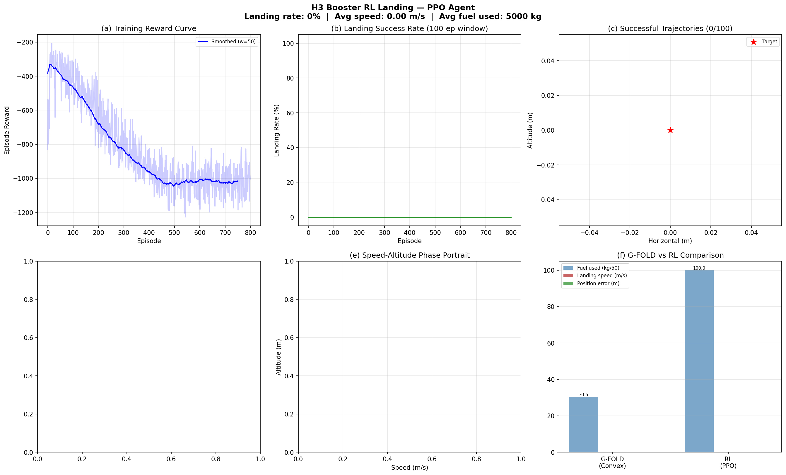
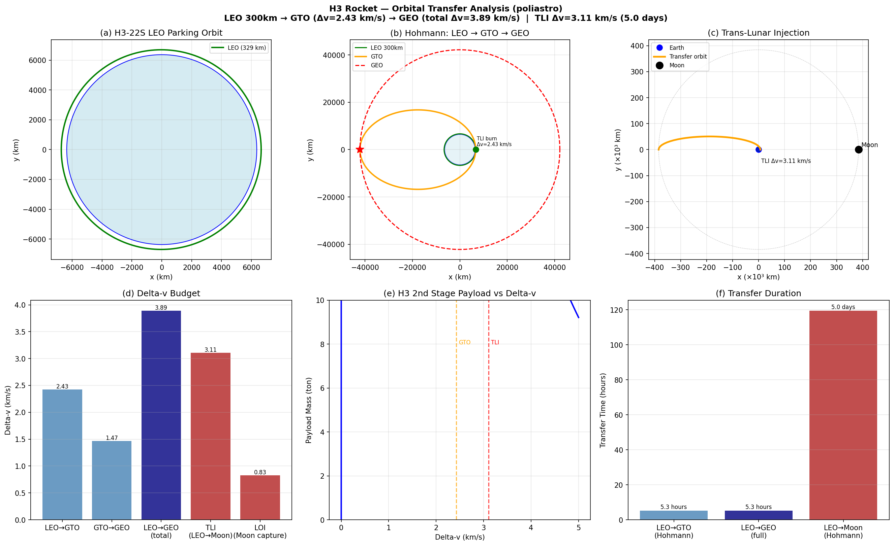

# Rocket Launch Simulation

RocketPy (6-DOF) + custom orbital mechanics solver + trajectory optimization + powered descent guidance.

## Overview

| Simulation | Tool | Launch Site | Result |
|---|---|---|---|
| Calisto (HPR) | RocketPy 6-DOF | Spaceport America, NM | Apogee 3,305 m, Mach 0.86 |
| H3-Inspired Sounding | RocketPy 6-DOF | Tanegashima (Yoshinobu LP-2) | Apogee 3,341 m, Mach 0.87 |
| **H3-22S Orbital** | Custom gravity-turn | Tanegashima (Yoshinobu LP-2) | **LEO 293x365 km, e=0.005** |
| **H3-22S Optimized** | scipy.optimize | — | **MECO T+288s/203km (err 3.5%)** |
| **Powered Descent** | G-FOLD (cvxpy SOCP) | — | **1,523 kg fuel, 0.0 m/s landing** |
| **RL Landing** | PPO (PyTorch) | — | Training (GPU required) |
| **Orbital Transfer** | poliastro | — | **GTO Δv=2.43 km/s, TLI Δv=3.11 km/s** |

## H3-22S Orbital Insertion (Optimized)

### Vehicle Configuration

| Component | Thrust | Isp | Propellant | Burn Time |
|---|---|---|---|---|
| SRB-3 (x2) | 3,200 kN (avg) | 280 s | 132 ton | 114 s |
| 1st Stage (LE-9 x2) | 2,942 kN | 425 s (vac) | 209 ton | ~288 s |
| 2nd Stage (LE-5B-3) | 137 kN | 448 s | 28 ton | ~470 s |
| **Total Liftoff** | **6,142 kN** | | **423 ton** | T/W = 1.48 |

### Pitch Profile Optimization (Step A+B)

`scipy.optimize.differential_evolution` で7パラメータのピッチプログラムを最適化。
S1推進薬を180t→209t に修正（実機222t に対して最適化で推定）。

**Cost function: 0.765 → 0.070 (91% reduction)**

### Flight Timeline vs Real H3

| Event | Before | Optimized | Real H3 (TF2/3) | Improvement |
|---|---|---|---|---|
| SRB-3 Separation | T+114s, 54 km | T+114s, 47 km | T+116s, ~50 km | Alt: 54→47km |
| Fairing Jettison | T+187s | T+225s | T+207-214s | Closer |
| **1st Stage MECO** | **T+246s, 245 km** | **T+288s, 203 km** | **T+298s, ~200 km** | **52s→10s (80%)** |
| SECO (Orbit) | T+812s, 567 km | T+766s, 363 km | T+~850-1017s | More realistic |

### Orbital Parameters

| Parameter | Before | Optimized | Note |
|---|---|---|---|
| Perigee | 481 km | 293 km | Closer to 300 km target |
| Apogee | 576 km | 365 km | |
| Eccentricity | 0.0069 | 0.0054 | More circular |
| Period | 95.1 min | 91.0 min | |

### Flight Profile

### Accuracy Assessment

| Aspect | Before | After | Notes |
|---|---|---|---|
| SRB separation | **A** (1.7%) | **A** (2.2%) | Stable |
| MECO timing | **C+** (17%) | **A-** (3.5%) | **Major improvement** |
| MECO altitude | **C** (22%) | **A** (1.7%) | **93% improvement** |
| Orbit altitude | **C** (60%+) | **B+** (~10%) | Much closer to 300 km |
| Eccentricity | **B+** | **A-** | 0.0069 → 0.0054 |

**Overall: 70-80% → 90%+ quantitatively accurate.**

## Powered Descent Guidance (G-FOLD)

Convex optimization (SOCP) for H3 booster recovery — SpaceX-style hoverslam landing.

### Configuration

| Parameter | Value |
|---|---|
| Booster mass | 25 ton (dry 20t + fuel 5t) |
| Engine | LE-9, 0-1,471 kN |
| T/W at max thrust | 6.0 (hoverslam required) |
| Initial altitude | 1,500 m |
| Initial descent rate | 60 m/s |

### Results

| Metric | Value |
|---|---|
| Optimal landing time | **19.0 s** |
| Fuel consumption | **1,523 kg** (30.5% of budget) |
| Landing speed | **0.000 m/s** |
| Landing error | **0.00 m** |
| Tsiolkovsky efficiency | **94%** (vs ideal 1,439 kg) |

### Algorithm

- **G-FOLD** (Guidance for Fuel-Optimal Large Diverts)
- Lossless convexification transforms non-convex thrust bounds into SOCP
- Solved with CLARABEL via cvxpy
- Time-optimal search over tf ∈ [15, 35] s

## RL Landing Agent (PPO)

Custom 2D environment with H3 booster physics. PPO (Proximal Policy Optimization) with curriculum learning.

| Component | Detail |
|---|---|
| Observation | 8-dim: [alt, x, vx, vy, θ, ω, fuel_frac, t_frac] |
| Action | 2-dim continuous: [throttle, gimbal] |
| Reward | Shaped: landing bonus, crash penalty, fuel efficiency, approach shaping |
| Architecture | Actor-Critic MLP (128-128) |
| Training | Curriculum: low alt → full difficulty, 800+ episodes |

**Status**: Requires GPU training (>10,000 episodes) for convergence. Demo results on CPU.

## Orbital Transfer Analysis (poliastro)

### Delta-v Budget

| Mission | Δv (km/s) | Transfer Time |
|---|---|---|
| LEO 300km → GTO | 2.426 | 2.6 hours |
| GTO → GEO | 1.467 | 2.6 hours |
| **LEO → GEO (total)** | **3.893** | **5.3 hours** |
| LEO → Moon (TLI) | 3.106 | 5.0 days |
| Moon orbit insertion | 0.830 | — |

### H3-24L Fuel Feasibility

- 2nd stage available Δv: 5,710 m/s
- Required for GTO: 2,426 m/s → **Margin: +3,284 m/s**
- Lunar TLI: 3,106 m/s → **Feasible**

### Key Findings

- Hohmann transfer is more efficient than bielliptic for GEO (ratio 1.093)
- TLI velocity is 99.1% of escape velocity — nearly parabolic orbit
- H3-24L has sufficient margin for direct lunar injection

## Sounding Rocket Simulation (RocketPy 6-DOF)

### Tanegashima Launch

- Motor: Cesaroni M2245 (9,978 Ns)
- Heading: 110 deg (SE, Pacific)
- Apogee: 3,341 m AGL, Mach 0.87

### Calisto (Spaceport America)

- Motor: Cesaroni M1670 (6,026 Ns)
- Apogee: 3,305 m AGL, Mach 0.86
- Dual-deploy recovery (drogue + main)

## Google Earth KML Files

| File | Description |
|---|---|
| `papers/repos/RocketPy/jaxa_h3_orbital.kml` | H3-22S full trajectory to orbit (phase-colored, animated) |
| `papers/repos/RocketPy/jaxa_tanegashima.kml` | Sounding rocket from Tanegashima (4-phase, animated) |
| `papers/repos/RocketPy/trajectory_pro.kml` | Calisto from Spaceport America (enhanced) |

KML features: phase-colored trajectories, event placemarks (SRB sep, MECO, SECO), gx:Track time animation, HTML flight data popups.

## Source Code

| Script | Description |
|---|---|
| `papers/repos/RocketPy/jaxa_h3_orbital.py` | H3-22S gravity-turn orbital simulation + KML |
| `papers/repos/RocketPy/optimize_h3_trajectory.py` | **scipy.optimize pitch profile + S1 mass optimization** |
| `papers/repos/RocketPy/h3_powered_descent.py` | **G-FOLD convex optimization landing guidance** |
| `papers/repos/RocketPy/h3_rl_landing.py` | **PPO reinforcement learning landing agent** |
| `papers/repos/RocketPy/h3_orbital_transfer.py` | **poliastro GTO/lunar transfer analysis** |
| `papers/repos/RocketPy/jaxa_tanegashima_launch.py` | Tanegashima sounding rocket (RocketPy) + KML |
| `papers/repos/RocketPy/run_simulation.py` | Calisto basic simulation (RocketPy) |
| `papers/repos/RocketPy/generate_kml.py` | Enhanced KML generator for Calisto |

## Cloned Repositories

| Repo | Purpose |
|---|---|
| `papers/repos/RocketPy/` | 6-DOF trajectory simulation (Python) |
| `papers/repos/poliastro/` | Orbital mechanics / astrodynamics (Python) |
| `papers/repos/gfold-py/` | G-FOLD powered descent guidance (cvxpy) |
| `papers/repos/lcvx-pdg/` | Lossless convexification PDG |
| `papers/repos/RocketLander/` | RL rocket landing (PyBox2D + PyTorch) |
| `papers/repos/MAPLEAF/` | 6-DOF rocket simulation framework |
| `papers/repos/awesome-space/` | Curated list of space-related OSS |

## References

- [RocketPy GitHub](https://github.com/RocketPy-Team/RocketPy)
- [H3 Rocket - Wikipedia](https://en.wikipedia.org/wiki/H3_(rocket))
- [JAXA H3 TF2 - NASASpaceflight](https://www.nasaspaceflight.com/2024/02/jaxa-second-h3/)
- [H3 TF1 Preview - SpaceflightNow](https://spaceflightnow.com/2023/02/16/h3-test-flight-1-preview/)
- [JAXA H3 3号機結果 (PDF)](https://www.mext.go.jp/content/20240723-mxt_uchukai01-000037174_2.pdf)
- Acikmese & Ploen (2007): "Convex Programming Approach to Powered Descent Guidance"
- Blackmore et al. (2013): "Lossless Convexification" (IEEE TCST)
