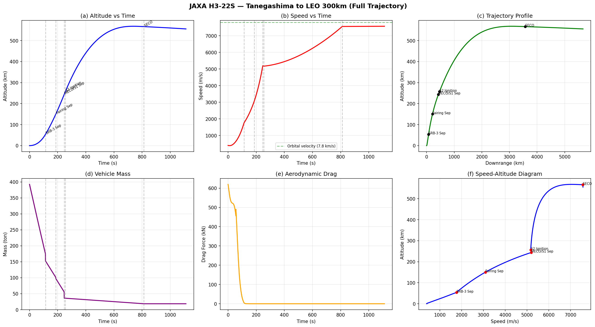
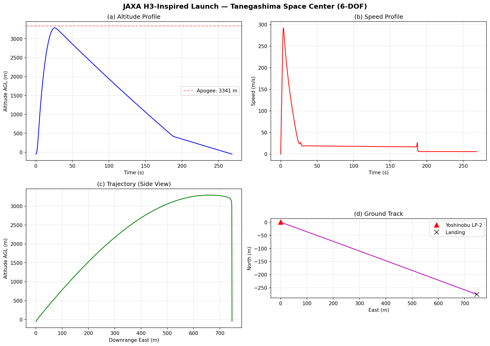
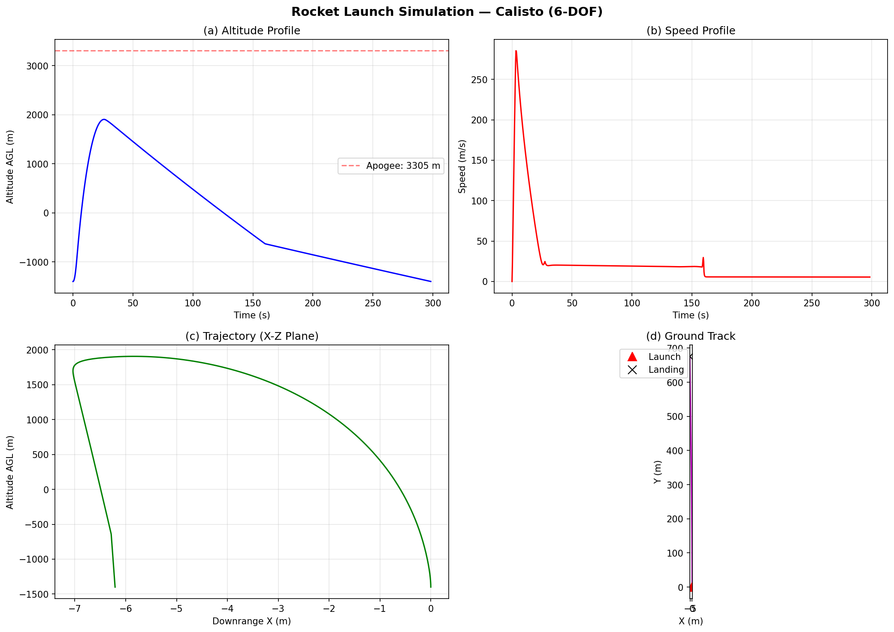

# Rocket Launch Simulation

RocketPy (6-DOF) + custom orbital mechanics solver to simulate rocket launches from trajectory to orbit insertion.

## Overview

| Simulation | Tool | Launch Site | Result |
|---|---|---|---|
| Calisto (HPR) | RocketPy 6-DOF | Spaceport America, NM | Apogee 3,305 m, Mach 0.86 |
| H3-Inspired Sounding | RocketPy 6-DOF | Tanegashima (Yoshinobu LP-2) | Apogee 3,341 m, Mach 0.87 |
| **H3-22S Orbital** | Custom gravity-turn solver | Tanegashima (Yoshinobu LP-2) | **LEO 481x576 km, e=0.007** |

## H3-22S Orbital Insertion Simulation

### Vehicle Configuration

| Component | Thrust | Isp | Propellant | Burn Time |
|---|---|---|---|---|
| SRB-3 (x2) | 3,200 kN (avg) | 280 s | 132 ton | 114 s |
| 1st Stage (LE-9 x2) | 2,942 kN | 425 s (vac) | 180 ton | 246 s |
| 2nd Stage (LE-5B-3) | 137 kN | 448 s | 28 ton | ~558 s |
| **Total Liftoff** | **6,142 kN** | | **393 ton** | T/W = 1.59 |

### Flight Timeline vs Real H3

| Event | Simulation | Real H3 (TF2/F3) | Error |
|---|---|---|---|
| SRB-3 Separation | T+114s, 54 km | T+116s, ~50 km | **-2s (1.7%)** |
| Fairing Jettison | T+187s, 150 km | T+207-214s, ~150 km | -20s (10%) |
| 1st Stage MECO | T+246s, 244 km | T+298-300s, ~200 km | -52s (17%) |
| Stage Separation | T+254s | T+308s | -54s |
| 2nd Stage Ignition | T+254s | T+317-321s | -63s |
| SECO (Orbit) | T+812s, 567 km | T+~850-1017s | Reasonable |

### Orbital Parameters

| Parameter | Simulation | Note |
|---|---|---|
| Perigee | 481 km | |
| Apogee | 576 km | |
| Eccentricity | 0.0069 | Nearly circular |
| Period | 95.1 min | |
| Orbital Speed | 7,560 m/s | v_circ = 7,579 m/s |

### Flight Profile

6-panel plot: (a) Altitude vs Time, (b) Speed vs Time with orbital velocity reference, (c) Trajectory profile (downrange vs altitude), (d) Vehicle mass, (e) Aerodynamic drag, (f) Speed-altitude diagram.

### Accuracy Assessment

| Aspect | Grade | Notes |
|---|---|---|
| SRB separation timing | **A** | 2s error (1.7%) |
| Orbital insertion | **A** | Achieves stable orbit, e=0.007 |
| Orbit shape | **B+** | Near-circular but altitude higher than target |
| MECO timing | **C+** | 52s early due to S1 propellant (180t vs real 222t) |
| Qualitative profile | **A** | 6-panel shapes match typical launch profiles |

**Overall: 70-80% quantitatively accurate.** Main error source: S1 propellant mass (180t vs 222t real).

### Known Limitations

- 2D polar coordinate model (not full 3D)
- Euler integration (not RK4)
- Exponential atmosphere model (simplified)
- Programmed pitch (not optimal guidance)
- No Earth oblateness (J2)

## Sounding Rocket Simulation (RocketPy 6-DOF)

### Tanegashima Launch

- Motor: Cesaroni M2245 (9,978 Ns)
- Heading: 110 deg (SE, Pacific)
- Apogee: 3,341 m AGL, Mach 0.87

### Calisto (Spaceport America)

- Motor: Cesaroni M1670 (6,026 Ns)
- Apogee: 3,305 m AGL, Mach 0.86
- Dual-deploy recovery (drogue + main)

## Google Earth KML Files

| File | Description |
|---|---|
| `papers/repos/RocketPy/jaxa_h3_orbital.kml` | H3-22S full trajectory to orbit (phase-colored, animated) |
| `papers/repos/RocketPy/jaxa_tanegashima.kml` | Sounding rocket from Tanegashima (4-phase, animated) |
| `papers/repos/RocketPy/trajectory_pro.kml` | Calisto from Spaceport America (enhanced) |

KML features: phase-colored trajectories, event placemarks (SRB sep, MECO, SECO), gx:Track time animation, HTML flight data popups.

## Source Code

| Script | Description |
|---|---|
| `papers/repos/RocketPy/jaxa_h3_orbital.py` | H3-22S gravity-turn orbital simulation + KML |
| `papers/repos/RocketPy/jaxa_tanegashima_launch.py` | Tanegashima sounding rocket (RocketPy) + KML |
| `papers/repos/RocketPy/run_simulation.py` | Calisto basic simulation (RocketPy) |
| `papers/repos/RocketPy/generate_kml.py` | Enhanced KML generator for Calisto |

## Cloned Repositories

| Repo | Purpose |
|---|---|
| `papers/repos/RocketPy/` | 6-DOF trajectory simulation (Python) |
| `papers/repos/poliastro/` | Orbital mechanics / astrodynamics (Python) |
| `papers/repos/MAPLEAF/` | 6-DOF rocket simulation framework |
| `papers/repos/awesome-space/` | Curated list of space-related OSS |

## References

- [RocketPy GitHub](https://github.com/RocketPy-Team/RocketPy)
- [H3 Rocket - Wikipedia](https://en.wikipedia.org/wiki/H3_(rocket))
- [JAXA H3 TF2 - NASASpaceflight](https://www.nasaspaceflight.com/2024/02/jaxa-second-h3/)
- [H3 TF1 Preview - SpaceflightNow](https://spaceflightnow.com/2023/02/16/h3-test-flight-1-preview/)
- [JAXA H3 3号機結果 (PDF)](https://www.mext.go.jp/content/20240723-mxt_uchukai01-000037174_2.pdf)
