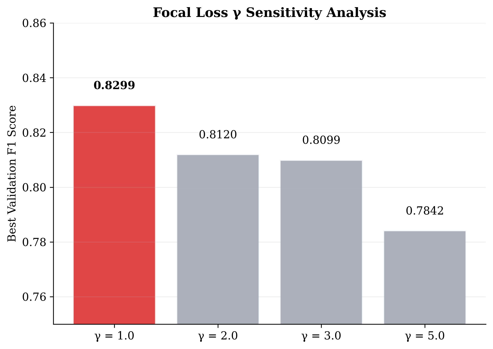
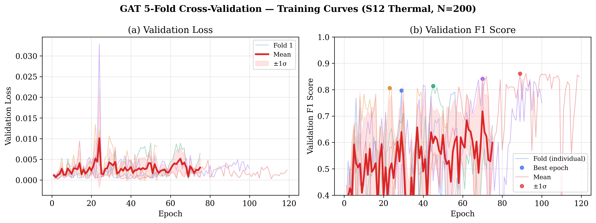
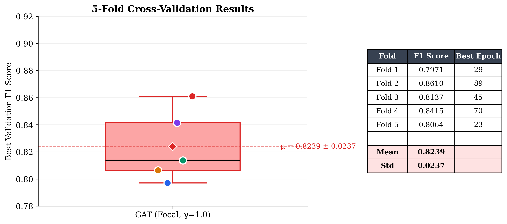
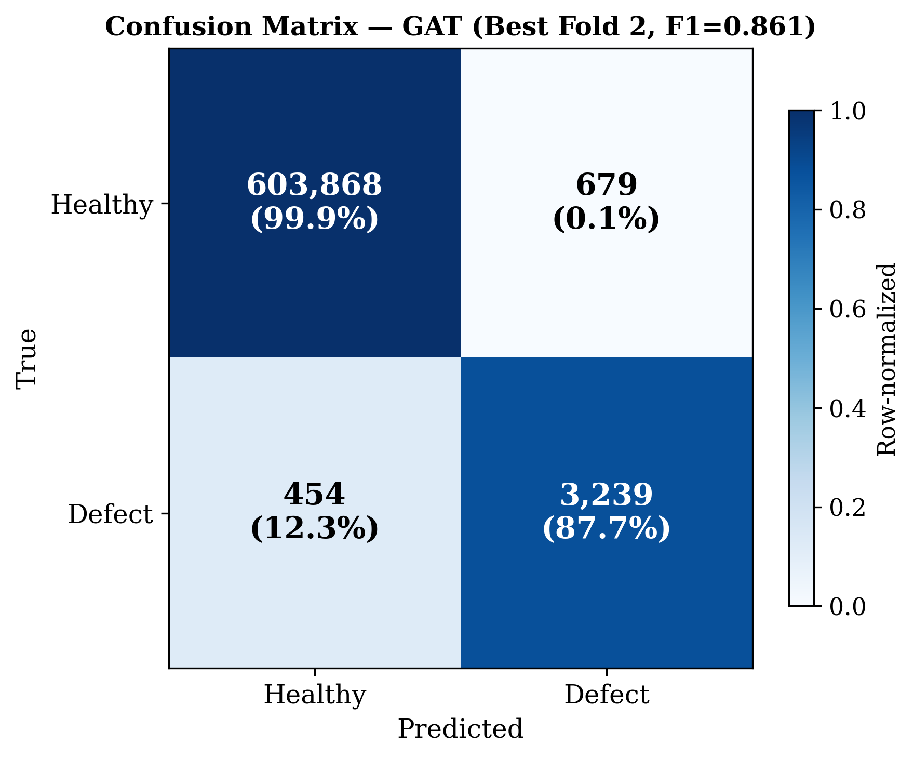
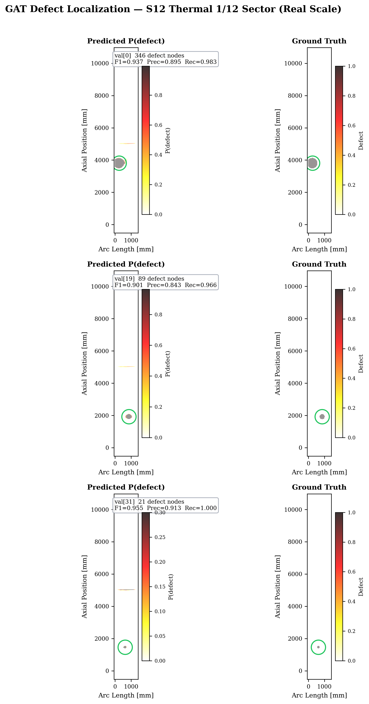
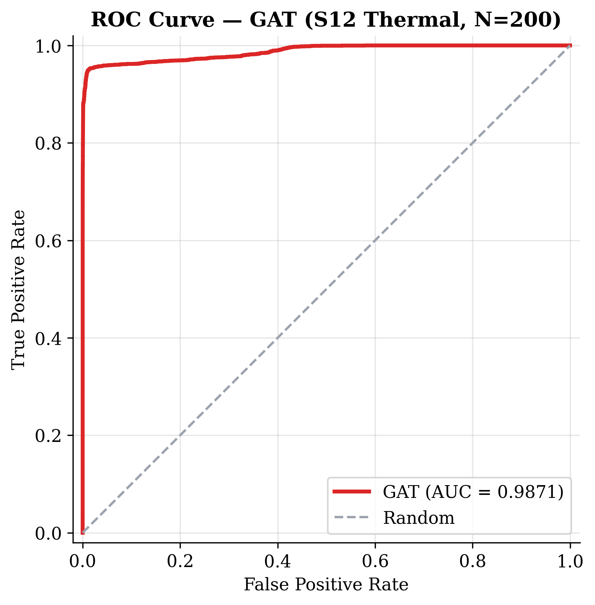

# S12 CZM 1/12セクター データセット

**Status**: 200/200 Complete (Thermal)
**Date**: 2026-03-03

## Overview

CZM (Cohesive Zone Model) ベースの 1/12セクター (30°) モデルから生成した欠陥検出データセット。INPテンプレート方式で200サンプルを一括生成し、PyGグラフデータに変換済み。

## 生成パイプライン

```
doe_sector12_100.json (D001-D100)
doe_sector12_ext100.json (D101-D200)
  → run_sector12_batch.py
    → patch_inp_defects.py (欠陥パッチ)
    → Abaqus solver (CZM S12 Thermal)
    → extract_odb_results.py (ODB → CSV)
  → prepare_ml_data.py (CSV → PyG)
  → convert_to_binary.py (8クラス → 2クラス)
```

## データ所在

| パス | 内容 |
|------|------|
| `abaqus_work/batch_s12_100_thermal/` | 生データ (INP, ODB, CSV) — 200サンプル |
| `data/processed_s12_czm_thermal_200/` | PyGデータ (8クラス, 200サンプル) |
| `data/processed_s12_czm_thermal_200_binary/` | PyGデータ (2クラス: healthy/defect) |
| `doe_sector12_100.json` | DOE パラメータ (D001-D100, seed=42) |
| `doe_sector12_ext100.json` | DOE パラメータ (D101-D200, seed=2026) |

## メッシュ仕様

| 項目 | 値 |
|------|------|
| セクター角度 | 30° (1/12) |
| ノード数 | 15,206 (全サンプル共通) |
| 要素数 | 14,900 |
| 要素タイプ | S4R/S3 (シェル) + C3D8R (接着層CZM) |
| 対称BC | θ=0°, θ=30° 面 |

## 欠陥タイプ分布 (各DOE 100サンプル、合計200)

| タイプ | 数/DOE | 合計 | ラベルID |
|--------|--------|------|----------|
| debonding | 25 | 50 | 1 |
| fod (Foreign Object Damage) | 15 | 30 | 2 |
| impact | 15 | 30 | 3 |
| delamination | 15 | 30 | 4 |
| inner_debond | 10 | 20 | 5 |
| thermal_progression | 10 | 20 | 6 |
| acoustic_fatigue | 10 | 20 | 7 |
| **合計** | **100** | **200** | |

## PyG グラフ仕様

### ノード特徴量 (34次元)
| 範囲 | 次元 | 内容 |
|------|------|------|
| 0-2 | 3 | 位置 (x, y, z) |
| 3-5 | 3 | 法線 (nx, ny, nz) |
| 6-9 | 4 | 曲率 (κ₁, κ₂, H, K) |
| 10-12 | 3 | 変位 (ux, uy, uz) |
| 13 | 1 | 変位マグニチュード |u| |
| 14 | 1 | 温度 |
| 15-18 | 4 | 応力 (s11, s22, s12, σ_mises) |
| 19 | 1 | 主応力和 (σ₁+σ₂) |
| 20 | 1 | 熱応力 σ_mises |
| 21-23 | 3 | ひずみ (LE11, LE22, LE12) |
| 24-26 | 3 | 繊維配向 (周方向ベクトル) |
| 27-30 | 4 | 積層角 [0°, 45°, -45°, 90°] rad |
| 31 | 1 | 周方向角 θ |
| 32-33 | 2 | ノードタイプ (boundary, loaded) |

### エッジ特徴量 (5次元)
| 次元 | 内容 |
|------|------|
| 0-2 | 相対位置 (dx, dy, dz) |
| 3 | ユークリッド距離 |
| 4 | 法線角度差 |

### ラベル (y)
- **8クラス版** (`processed_s12_czm_thermal_200`): 0=healthy, 1-7=欠陥タイプ
- **2クラス版** (`processed_s12_czm_thermal_200_binary`): 0=healthy, 1=defect
- Binary分類の詳細は [Binary-Classification](Binary-Classification) を参照

## データ統計

| 項目 | 値 |
|------|------|
| 総グラフ数 | 200 (Train: 160, Val: 40) |
| グラフあたりノード | 15,206 |
| グラフあたりエッジ | 119,058 |
| 欠陥ノード総数 | 17,319 |
| 欠陥ノード率 | 0.57% |

### クラス分布 (Binary)

| クラス | ノード数 | 割合 |
|--------|---------|------|
| healthy (0) | 3,023,881 | 99.43% |
| defect (1) | 17,319 | 0.57% |

## 学習結果 (2026-03-03)

### Gamma Grid Search



| γ | Best Val F1 |
|---|-----------|
| **1.0** | **0.8299** |
| 2.0 | 0.8120 |
| 3.0 | 0.8099 |
| 5.0 | 0.7842 |

### Recall 改善: Defect Weight + Residual

ベースラインモデル (Recall=74.4%) の見逃し率が高い問題に対し、以下の3つの改善を実施:

1. **欠陥ノード重み付け** (`defect_weight=5.0`): 欠陥ノードの損失を5倍に重み付け → 見逃しペナルティ増大
2. **Residual connection**: スキップ接続で深い層への勾配伝搬を改善
3. **サブグラフサンプラーへの重み適用**: 従来は `train_epoch` のみ重み適用 → `train_epoch_subgraph` にも修正

**Defect Weight グリッドサーチ結果:**

| 設定 | F1 | Precision | Recall | AUC |
|------|-----|-----------|--------|-----|
| Baseline (DW=1, noRes) | 0.830 | 0.821 | 0.744 | 0.963 |
| DW=3, Res | 0.783 | 0.729 | 0.846 | 0.985 |
| **DW=5, Res** | **0.772** | **0.697** | **0.864** | **0.991** |
| DW=5, noRes | 0.797 | 0.768 | 0.828 | 0.930 |
| DW=8, Res | 0.714 | 0.622 | 0.840 | 0.983 |

### 5-Fold CV (DW=5, Residual ON)





| Fold | F1 | Precision | Recall | AUC |
|------|-----|-----------|--------|-----|
| 0 | 0.7971 | 0.6895 | 0.9446 | 0.9931 |
| 1 | 0.8610 | 0.7890 | 0.9474 | 0.9951 |
| 2 | 0.8137 | 0.7277 | 0.9227 | 0.9853 |
| 3 | 0.8415 | 0.7514 | 0.9561 | 0.9864 |
| 4 | 0.8064 | 0.7466 | 0.8765 | 0.9987 |
| **Mean** | **0.8239±0.024** | **0.7408±0.033** | **0.9295±0.029** | **0.9917±0.005** |

**Baseline比:** Recall 89.3% → **92.9%** (+3.6pp), AUC 94.8% → **99.2%** (+4.4pp)

### Confusion Matrix (Best Fold)



- Healthy Precision: 99.9% — 偽陽性（誤報）が極めて少ない
- **Defect Recall: 87.7%** (旧: 74.4%) — **+13.3pp 改善**
- F1=0.861 (Best Fold 2)

### Defect Probability Map (Real-Scale Inference)



1/12セクターを実寸スケール（Arc Length × Axial Position [mm]）で描画。大・中・小の欠陥サンプル3例を Predicted P(defect) と Ground Truth で比較。

| サンプル | 欠陥ノード数 | F1 | Precision | Recall |
|---------|------------|-----|-----------|--------|
| val[0] (Large) | 346 | 0.937 | 0.895 | 0.983 |
| val[19] (Medium) | 89 | 0.901 | 0.843 | 0.966 |
| val[31] (Small) | 21 | 0.955 | 0.913 | 1.000 |

- 大欠陥（346ノード）: F1=0.94、Recall=0.98 でほぼ完全検出
- 中欠陥（89ノード）: F1=0.90、高精度に検出
- **小欠陥（21ノード）: Recall=1.000 で完全検出**（旧モデルでは Recall=0.62）

### ROC Curve



### 学習設定

| 項目 | 値 |
|------|------|
| アーキテクチャ | GAT (4層, hidden=128, Residual ON, 718K params) |
| 損失関数 | Focal Loss (γ=1.0, α=auto) |
| サンプリング | DefectCentric (4-hop, healthy_ratio=5) |
| 拡張 | DropEdge=0.1, FeatureNoise=0.003 |
| 境界重み | 1.5 |
| **欠陥ノード重み** | **5.0** |
| 学習率 | 1e-3 → CosineAnnealing |
| Early Stopping | patience=30 |
| GPU | RTX 4090 (vancouver02) |

## 熱解析仕様

### CTE修正 (2026-03-03)

| 材料 | 方向 | 値 |
|------|------|-----|
| CFRP (T1000G) | 繊維方向 α₁₁ | -0.3e-6 /°C |
| CFRP (T1000G) | 横方向 α₂₂ | +28e-6 /°C |
| Al-HC (5052) | 等方 | 23e-6 /°C |

### 熱荷重プロファイル

```
OuterSkin: z依存 (空力加熱)
  base (z=0):    100°C
  barrel (z=5000): 130°C
  nose (z=10400):  221°C

Core:      70°C (均一)
InnerSkin: 20°C (均一)
Frames:    20°C (均一)
```

### 34次元特徴量への影響

- **温度 (dim 14)**: 100-221°C 連続分布 → **有情報化**
- **σ_mises (dim 15-18)**: 熱応力重畳で分布変化
- **thermal_smises (dim 20)**: smises と分離 → **独立特徴量として機能**

## バッチ実行情報 (200サンプル熱版)

### D001-D100 (doe_sector12_100.json, seed=42)

| 項目 | 値 |
|------|------|
| 実行サーバー | frontale02 |
| 並列数 | 4 ジョブ |
| CPUs/ジョブ | 4 |
| メモリ/ジョブ | 16 GB |
| 実行時間/サンプル | ~432s (7.2分) |

### D101-D200 (doe_sector12_ext100.json, seed=2026)

3台に分散実行:

| サーバー | 範囲 | 結果 | 所要時間 |
|---------|------|------|---------|
| frontale01 | D101-D134 (34) | 34/34 完了 | 5.1h (544s/sample) |
| frontale04 | D135-D167 (33) | 33/33 完了 | 5.1h (558s/sample) |
| marinos03 | D168-D200 (33) | 33/33 完了 | 5.1h (561s/sample) |

---

## 既知の制限事項

### サンプル間の物理量類似性
固定メッシュテンプレート方式のため、欠陥がグローバル応答に与える影響は微小。局所的な応力・変位の差異で欠陥を検出する必要がある。
